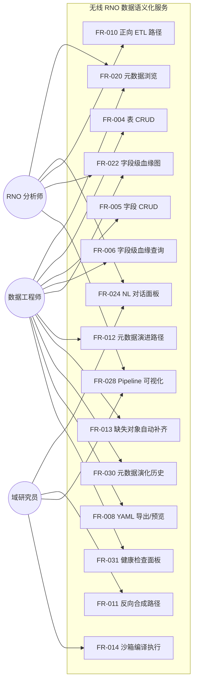
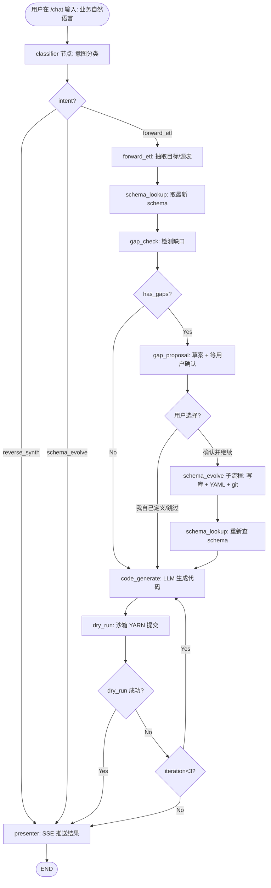
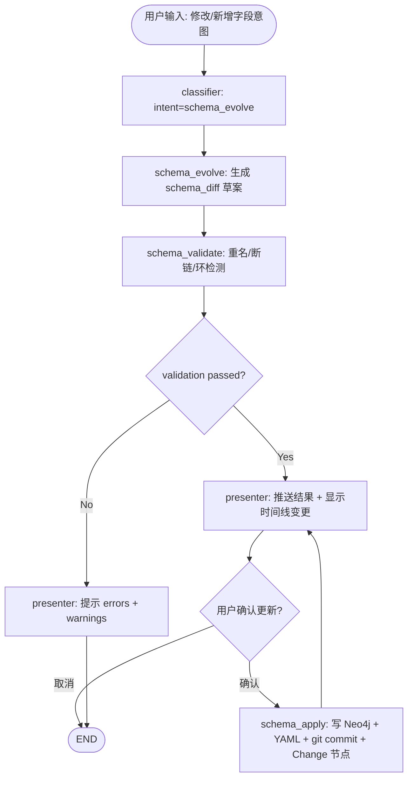
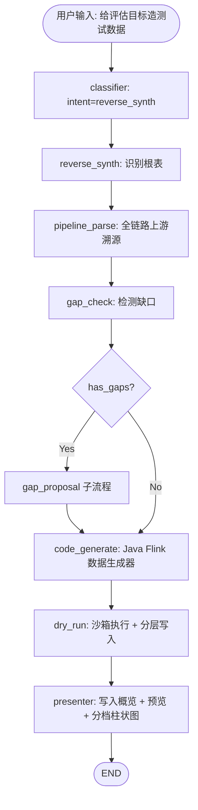

# 无线网络感知数据语义化服务 — 软件需求规格说明书 (SRS)

**Date**: 2026-05-14
**Status**: Draft — Retained (用户选择暂不推进，文档保留以备后续启用)
**Standard**: Aligned with ISO/IEC/IEEE 29148
**Template**: docs/templates/srs-template.md (内置)
**Source SPEC**: `docs/superpowers/specs/2026-05-13-wireless-rno-data-service-design.md`
**Compliance Review**: PASS (Cycle 2, 2026-05-14) — 全部 8 组 (R/A/C/S/D/G/Z/P) 通过

---

## 1. Purpose & Scope

构建面向无线网络优化 (RNO, Radio Network Optimization) 领域的**语义化数据服务平台**。平台以 NL-to-Code Agent 为入口，将业务语言（覆盖强度、掉话率、切换成功率等）自动映射到正确的数据资产（表/字段/血缘），由 LLM 生成可执行 ETL 代码（Spark SQL / Flink SQL / Java Flink）并经沙箱试跑；同时支持反向合成测试数据与基于自然语言的元数据演进。

### 1.1 In Scope

| 子系统 | 范围 |
|---|---|
| 基础设施 | base-compose（HDFS / YARN / Hive / Kafka / StarRocks / Neo4j）与 app-compose（FastAPI / React）一键启停；10 张样例表 + ~70 字段种子初始化 |
| 元数据服务 | 表/字段 CRUD（Neo4j 图持久化）；字段级血缘查询；YAML 副本导出 + git 版本控制；元数据演化审计 |
| 语义检索 | 关键词倒排 + 中文稠密向量的混合检索, 互排融合, 必要时 LLM 兜底；向量索引持久化与增量同步；冷启动与增量 benchmark 门禁 |
| NL Agent | LangGraph 三条主路径：forward_etl / reverse_synth / schema_evolve；gap_check 子流程；沙箱层与 Agent 层双层重试；SSE 流式输出 |
| 沙箱 | Spark SQL / Flink SQL / Java Flink 三种代码类型统一 Maven 编译 → YARN 提交 → HDFS 结果回读；资源与超时限制 |
| Web UI | 6 个核心页面：/metadata, /metadata/lineage, /chat, /pipeline, /schema-evolution, /health；Ant Design + G6 + Monaco + AntV G2 |
| 质量门禁 | 语义检索 benchmark（SPEC §4.7.3 目标 × 90%）+ 后端单测 line coverage ≥ 80% + Phase 1-3 全量 E2E 验收用例（P1-1 … P3-22）通过 |

### 1.2 Out of Scope

| 类别 | 说明 |
|---|---|
| 认证 / 授权 / 操作审计 | API 无鉴权；不做用户体系；不记录操作审计日志（仅记录 schema 变更审计 Change 节点） |
| 高可用 / 容灾 / 多副本 | Neo4j / Kafka / HDFS / StarRocks 均单节点；不做主备 / 多机房；备份限于 YAML + git 自然存档 |
| 生产级监控告警 | 仅提供 /health 同步面板（30s 刷新）；不接 Prometheus / Grafana / Alertmanager；无 SLA 指标输出 |
| 多语言 / 多时区 / 国际化 | 中文 UI、本地时区；前端字符串不做 i18n 外化 |
| 真实生产数据接入 | 仅使用 04_sample_data.py 合成或反向合成数据；不接入真实 RNO 网管/采集系统 |
| 沙箱自动 commit_hash 对账 | git commit 失败后不做自动对账；仅暴露 `/api/admin/reconcile-yaml-git` 手工诊查接口 |
| 多浏览器/移动端适配 | 仅 Chrome / Edge 桌面最新两个版本；不做 Firefox / Safari / 平板 / 手机适配 |
| WCAG 无障碍合规 | 不做对比度、键盘导航、ARIA 标签等无障碍工程 |

> **Deferred Backlog**: 暂无独立 deferred 文件 —— 上述 OOS 条目预期可进入后续增量轮（认证/HA/监控）或由其他系统承接（真实数据接入）。

### 1.3 Problem Statement

**Root Cause (5-Whys)**:
```
Symptom: RNO 工程师与数据团队反复出现以下三类痛点
Why 1:   每出一个新业务指标都要重新读表/写 ETL/造测试数据 → 周期数天
Why 2:   现网数据资产没有集中、语义化的元数据与血缘
Why 3:   缺少把"业务语言"翻译成"表/字段/代码"的桥梁
Root Cause: 缺乏一个把语义化元数据 / NL-to-Code 生成 / 反向合成数据
            一体化的工程平台 —— 三件事彼此依赖，单点工具解决不了
```

**Jobs-to-be-Done**:

- 当我（RNO 工程师）想要"看看每个小区每小时的覆盖强度"时，我希望直接用自然语言描述，由系统找到正确的表/字段并生成可跑通的代码，这样我能在数分钟内拿到结果，而不是花数天读 schema + 写 SQL。
- 当我（数据工程师）需要新增/演进一个指标字段时，我希望平台同时维护字段血缘、版本历史、YAML 副本与图谱视图，下游影响可一键查证。
- 当我（域研究员）做评估模型时，我希望能反向生成覆盖优/良/差三档的测试数据，按表分层写入对应存储，便于压测和算法迭代。

**Pain Map**:

| Pain Point | Current Workaround | Frequency | Severity | Score (F×S) |
|---|---|---|---|---|
| 不知道指标对应哪张表/字段 | 翻 Excel/Wiki、问同事、看历史 SQL | 高 | 高 | 9 |
| 手写 Spark/Flink SQL 慢且易错 | 复制改写历史脚本、本地试错 | 高 | 中 | 6 |
| 字段血缘断/重复造表 | 凭记忆和 PR 检查，常出重复表 | 中 | 高 | 6 |
| 评估算法缺极端用例测试数据 | 手工 case 或线下采集，数据残缺 | 中 | 高 | 6 |
| 元数据变更无审计/无回滚 | 数据库直改、口头通知下游 | 中 | 中 | 4 |

**Alignment Validation**: PASS — 每条 Pain Map 条目均映射到 ≥1 FR（覆盖 NL→Code、元数据/血缘审计、反向合成测试数据三大根因）；三类 JTBD 均有完整 FR 链路：
- RNO 工程师 "用 NL 拿到数据" → FR-009 + FR-010 + FR-014 + FR-024
- 数据工程师 "维护元数据/血缘/审计" → FR-004/005/006 + FR-019 + FR-021/022/030
- 域研究员 "反向生成分档测试数据" → FR-011 + FR-026 + FR-028

无 orphan FR；无 JTBD 出口未被任一 FR 覆盖。

---

## 2. Glossary & Definitions

| 术语 | 定义 | 不要与...混淆 |
|---|---|---|
| RNO | Radio Network Optimization，无线网络优化；涵盖覆盖、容量、切换、掉话等指标 | — |
| RSRP | Reference Signal Received Power，参考信号接收功率，单位 dBm，反映覆盖强度 | RSRQ（信号质量）、SINR（信噪比） |
| SINR | Signal-to-Interference-plus-Noise Ratio，信号与干扰+噪声比 | RSRP、RSRQ |
| Handover (HO) | 切换：用户终端从一个小区切换到另一个小区 | Cell reselection |
| IMSI | International Mobile Subscriber Identity；个人身份标识类数据（PII） | IMEI（设备号） |
| QoE Score | 用户体验质量评分；本期 `eval_user_score` 表中的复合指标 | KPI（网络指标） |
| Layer (L1-L5) | 数据分层：L1-ODS / L2-DWD / L3-DWS / L4-ADS / L5-EVAL | 业务子系统 / 数据库 schema |
| 字段级血缘 | `(Field)-[:DERIVES_FROM]->(Field)` 边，描述字段如何由上游字段计算 | 表级血缘（聚合自字段级） |
| Schema Evolution | 元数据演进：通过 NL 或 UI 增删改表/字段，留下 Change 审计与 git diff | 数据演进 / 数据迁移 |
| Gap Check | NL 路径中检测"用户描述的实体"与"现有元数据"之间的缺口 | 数据质量校验 |
| Sandbox / 沙箱 | 把生成的 SQL/Java 包成 jar、上传 HDFS、提交 YARN、回读 1 行结果的临时执行环境 | 隔离的安全沙箱（安全意义） |
| RRF | Reciprocal Rank Fusion，互排融合，BM25 + Dense 结果融合算法 | RAG / Cross-Encoder |
| YARN | Hadoop 资源调度器，作为本项目唯一作业提交平台（Spark/Flink 统一 -m yarn-cluster） | Kubernetes / Mesos |

---

## 3. Stakeholders & User Personas

| Persona | 技术水平 | 核心需求 | 访问层级 |
|---|---|---|---|
| RNO 分析师 (RNO Engineer) | SQL/Java 不熟练，业务术语熟 | NL 描述指标 → 直接拿到数据；浏览/搜索元数据；查血缘看依赖 | 全部页面（读写） |
| 数据工程师 (Data Engineer) | 熟悉 ETL/Spark/Flink/血缘 | 维护表/字段、编辑表达式、审核 NL 生成代码、确认 schema 演进 | 全部页面（读写） |
| 域研究员 (Domain Researcher) | 算法/统计强，工程一般 | 反向合成测试数据、Pipeline 可视化、约束滑块调节、分档结果对比 | 全部页面（读写） |

> 本期不设运维独立角色：内部小规模试点环境下，启停 Docker、查看 /health 由上述任一角色兼任。

### 3.1 Use Case View



---

## 4. Functional Requirements

> **EARS 模式标记**：U=Ubiquitous, E=Event-driven, S=State-driven, UB=Unwanted behavior, O=Optional。
> 每条 FR 引用对应 SPEC E2E 用例编号便于追溯。

### 4.0 Phase 1 — 基础设施与元数据服务

> **MoSCoW 总览（方案 B 平衡型）**：FR-001 ~ FR-022 / FR-024 / FR-028 / FR-030 / FR-031 = **Must**；FR-023 / FR-025 / FR-026 / FR-027 / FR-029 = **Should**。本期试点 Should 类作为联动交互增强，主线流程不依赖。

#### FR-001: 基础设施容器栈一键启停

**Priority**: Must
**EARS (E)**: When 运维人员执行单一启动命令时, the system shall 以编排好的依赖顺序启动基础设施栈（含分布式存储、资源调度、消息队列、OLAP 存储、元数据图数据库共 10 个服务容器），并将各服务端口暴露至宿主网络。
**Visual output**: N/A — 后端基础设施
**Acceptance Criteria**:
- Given 干净的容器编排环境, when 运维人员执行 base 栈启动命令, then 10 个服务容器进入 `Running (Health: healthy)` 状态。
- Given 全部服务已 healthy, when 用户在浏览器打开 `:9870`（分布式存储 NameNode）与 `:8088`（资源调度器）UI, then 两个 UI 均可访问且不报 5xx。
- Given base 栈已运行, when 运维人员执行 app 栈启动命令, then 应用容器（API 端口 8000）与前端开发服务器（端口 5173）正常启动。
**Trace**: SPEC P1-1
**Note (intentionally bundled)**: base 与 app 双栈作为一个一键启停 FR 聚合管理；运维侧将其视为单一启动操作。

#### FR-002: 初始化脚本批量执行

**Priority**: Must
**EARS (E)**: When 运维人员依次执行编号 01~07 的初始化脚本时, the system shall 在数据仓库、消息队列、OLAP 存储与元数据图数据库内创建样例表与种子记录（10 张表 + ~70 字段 + 字段级血缘 + 中文术语词典），并把元数据副本导出为 YAML 文件到 `metadata-yaml/` 目录。
**Visual output**: N/A
**Acceptance Criteria**:
- Given base 基础设施已 healthy, when 运维人员执行编号 05+06 脚本, then 元数据图查询 "全部表节点计数" 返回 10。
- Given 元数据图已种子化, when 运维人员执行编号 07 脚本, then `metadata-yaml/L1-ODS/`…`/L5-EVAL/` 共生成 10 个 .yaml 文件、内容含 fields/expression/upstream 字段、gate-lint 通过。
- Given 消息队列已启动, when 运维人员执行编号 02 脚本后向 `ods_ue_signal` topic 生产 5 条 JSON, then 消费者从 earliest 消费到 5 条且字段一致。
**Trace**: SPEC P1-3, P1-5

#### FR-003: 元数据图 schema、唯一性与无环约束

**Priority**: Must
**EARS (U)**: The system shall 在元数据图数据库中维护"表 / 字段 / 变更审计"三类节点与"表-字段隶属 / 字段-字段派生"两类关系，并由持久层强制 ID 唯一性与字段血缘无环约束；查询所需索引由数据库层创建。
**Visual output**: N/A
**Acceptance Criteria**:
- Given 编号 05 初始化脚本已执行, when 运维人员通过数据库 CLI 列出唯一性约束, then 返回 ≥ 4 条（覆盖 Table.id / Table.name / Field.id / Change.id）。
- Given 同上, when 列出索引, then 返回 ≥ 3 条（覆盖 Field.name / Change.changed_at / Change.table_name 等支撑查询的索引）。
- Given 同一表已含字段 `cell_id`, when 应用层尝试在该表内再次写入同名字段, then 系统拒绝写入并返回错误码 `DUPLICATE_FIELD_IN_TABLE`。
- Given 新增的字段派生边将形成环, when 调用新增接口, then 系统拒绝并返回错误码 `CYCLE_DETECTED`。
**Trace**: SPEC §2.3, P1-5b

#### FR-004: 表元数据 CRUD HTTP API

**Priority**: Must
**EARS (E)**: When 客户端通过 HTTP 调用 `/api/tables` 资源族的 GET/POST/PUT/DELETE 接口时, the system shall 在元数据图数据库内完成对应读写、维护变更审计节点，并同步重写 YAML 副本文件。
**Visual output**: 该 FR 为 API 层；UI 层引用见 FR-021。
**Acceptance Criteria**:
- Given 元数据已种子化, when 客户端 `POST /api/tables` 提交一张新表（含 5 字段）, then 系统返回 201 + table_id；持久层出现 1 Table + 5 Field + 5 HAS_FIELD + 6 Change 节点。
- Given 同一 name 已存在, when 客户端再次 POST, then 系统返回 409 错误码 `DUPLICATE_TABLE_NAME`。
- Given 表 `dwd_session_qos` 存在下游, when 客户端 `DELETE /api/tables/:id`, then 系统返回 409 + 下游列表, 不删除。
- Given 表无下游, when 客户端 DELETE, then 系统返回 204, 持久层中 Table + HAS_FIELD + Field 全部删除, YAML 文件被删除并触发 1 次 git commit。
- Given 任一 POST/PUT, when YAML 写盘失败, then 系统回滚整事务, 持久层状态不变。
**Trace**: SPEC §6.7, P1-6
**Note (intentionally bundled)**: 表实体的 CRUD 视为一个原子资源族 FR；4 个 HTTP 动作共用同一 service 层、共享审计与 YAML 同步保证一致性，单独拆 FR 会破坏一致性叙述。

#### FR-005: 字段元数据 CRUD HTTP API

**Priority**: Must
**EARS (E)**: When 客户端通过 HTTP 调用 `/api/fields` 资源族的 GET/POST/PUT/DELETE 接口时, the system shall 在元数据图数据库内读写字段及字段血缘关系，维护版本号、历史表达式快照、变更审计与 YAML 同步。
**Visual output**: API 层；UI 层引用见 FR-021。
**Acceptance Criteria**:
- Given 字段存在, when 客户端 `PUT /api/fields/:id` 修改 expression, then 系统将 version +1, 历史表达式追加一条 JSON 快照, 落入一条 UPDATE_FIELD 审计节点, 对应 YAML 更新。
- Given 拟删除的字段被下游引用, when 客户端 DELETE, then 系统返回 409 + 下游引用列表, 不删除。
- Given 字段无下游, when 客户端 DELETE, then 系统从持久层删除字段及其隶属边、所有指向它的派生边, 同步刷新 YAML。
- Given POST 新建字段时指定 upstream, when 系统写入, then 同步创建对应的字段派生边（含 transform_expr 属性）, 并在写入前执行环检测。
**Trace**: SPEC §6.7, P1-6, P3-4
**Note (intentionally bundled)**: 字段实体的 CRUD 视为一个原子资源族 FR；理由同 FR-004。

#### FR-006: 字段级血缘查询 API

**Priority**: Must
**EARS (E)**: When 客户端请求 `GET /api/lineage?table=...&direction=up|down&depth=1..5` 时, the system shall 沿字段派生关系按指定深度遍历并返回字段级 DAG（JSON）。
**Visual output**: API 层；UI 层引用见 FR-022。
**Acceptance Criteria**:
- Given 元数据已种子化, when 客户端 GET `/api/lineage?table=dwd_session_qos&direction=down`, then 系统返回 `dws_cell_hourly`、`dws_area_traffic` 共 ≥ 2 条字段级血缘边。
- Given 不存在的 table 参数, when 客户端 GET, then 系统返回 404 `TABLE_NOT_FOUND`。
- Given depth=0 或 depth>5, when 客户端 GET, then 系统返回 400 `INVALID_DEPTH`。
**Trace**: SPEC §6.7, P1-7

#### FR-007: 反向合成样例数据写入对应存储

**Priority**: Must
**EARS (E)**: When 调用 `generate_fake_data(table, rows)` 或 04_sample_data.py 启动时, the system shall 按目标表元数据中字段类型/值域约束生成合规样例数据并写入对应存储（Kafka / Hive / StarRocks）。
**Visual output**: N/A — 后端
**Acceptance Criteria**:
- Given `dwd_session_qos` 元数据存在, when 调用 `generate_fake_data(table="dwd_session_qos", rows=5)`, then Hive `dwd_session_qos` 表新增 5 行, rsrp ∈ [-140,-44], sinr ∈ [-20,30]。
- Given ads_cell_profile 元数据存在, when 04_sample_data.py 执行, then StarRocks FE 查询 `SELECT COUNT(*) FROM ads_cell_profile` 返回 > 0。
- Given 目标表元数据不存在, when 调用 generate_fake_data 时, then 返回 `TABLE_NOT_FOUND` 错误且不写入任何存储。
**Trace**: SPEC P1-4, P1-8

#### FR-008: YAML 元数据导出与预览

**Priority**: Must
**EARS (E)**: When 客户端调用 `GET /api/yaml/export[?table=]` 或 `GET /api/yaml/preview/:table` 时, the system shall 基于元数据图当前状态生成对应 YAML 文本；导出路径同时落盘到 `metadata-yaml/` 并触发 1 次 git commit；预览路径仅返回内存渲染文本, 不落盘。
**Visual output**: 用户在 /metadata 顶部 [导出 YAML] / 表卡片 [预览 YAML] 按钮触发后, 浏览器看到下载或弹窗（Monaco 高亮）出现新内容。
**Acceptance Criteria**:
- Given 元数据图含 10 张表, when 客户端 `GET /api/yaml/export`（无 table 参数）, then 系统返回 200, `metadata-yaml/` 下 10 个文件被重写, 产生 1 次 git commit。
- Given 表名 dws_cell_hourly 存在, when 客户端 `GET /api/yaml/preview/dws_cell_hourly`, then 系统返回原始 YAML 文本, 文件系统未变化（不产生 git commit）。
- Given 不存在的表名, when 客户端 `GET /api/yaml/preview/non_existing`, then 系统返回 404 `TABLE_NOT_FOUND`。
**Trace**: SPEC §2.5, §6.3
**Note (intentionally bundled)**: 导出与预览为同一资源族的两种读视图（落盘 vs. 内存），共享 YAML 渲染逻辑；单独拆 FR 会导致同一渲染函数被两条 FR 引用，降低 traceability 清晰度。

### 4.1 Phase 2 — NL Agent + 沙箱

#### FR-009: LangGraph 意图分类（classifier 节点）

**Priority**: Must
**EARS (E)**: When 用户在 /chat 发送一条新消息时, the system shall 由 classifier 节点把意图分类为 `forward_etl` / `reverse_synth` / `schema_evolve` 之一; 当置信度 < 0.7 时, the system shall 标记 `needs_clarification=True` 并经 presenter 反问用户。
**Visual output**: 对话面板顶部出现"意图 Badge"（"正向ETL" / "反向合成" / "元数据演进"）, 低置信时显示澄清气泡。
**Acceptance Criteria**:
- Given 用户输入 "用 ods_ue_signal 算每小区小时平均 RSRP", when classifier 运行, then intent = "forward_etl" 且 badge 显示 "正向 ETL"。
- Given 用户输入 "给 dwd_session_qos 加个 jitter 字段", when classifier 运行, then intent = "schema_evolve"。
- Given 用户输入 "造点测试数据", when classifier 置信度 < 0.7, then needs_clarification = True 且 UI 出现澄清气泡。
**Trace**: SPEC §4.1 classifier, P2-1/P2-8

#### FR-010: 正向 ETL 路径主流程

**Priority**: Must
**EARS (S)**: While `intent="forward_etl"` 处于活跃状态时, the system shall 串接 `forward_etl → schema_lookup → gap_check → code_generate → dry_run → presenter` 节点, 输出可执行 Spark SQL / Flink SQL / Java Flink 代码 + dry-run 预览（1 行）。
**Visual output**: 对话面板右侧产出面板出现代码卡片（Monaco 高亮）与 DryRun 预览表格（1 行）。
**Acceptance Criteria**:
- Given 输入 "用 ods_ue_signal 按 cell_id 计算每小区小时平均 RSRP 和 SINR 写入 dws_cell_hourly", when 流程完成, then 返回 Spark SQL, schema_lookup 工具被调用, 代码语法正确, dry_run 成功, preview_row 含 cell_id/hour/avg_rsrp/avg_sinr。
- Given 输入 "从 Kafka ods_gnb_alarm 读告警按 gnb_id 5 分钟滚动 COUNT", when 流程完成, then 返回 Flink SQL 含 Kafka source + TUMBLE 窗口 + sink。
- Given 输入 "Flink DataStream 从 Kafka 读 UE 信号过滤 RSRP<-110 写 HDFS", when 流程完成, then 返回完整 Java main class + dry_run 成功。
**Trace**: SPEC §4.1 forward_etl 路径, P2-1, P2-2, P2-3, P2-4, P2-5, P2-6

#### FR-011: 反向合成路径主流程

**Priority**: Must
**EARS (S)**: While `intent="reverse_synth"` 处于活跃状态时, the system shall 串接 `reverse_synth → pipeline_parse → gap_check → code_generate → dry_run → presenter` 节点, 反推根表的约束并产出 Java Flink 数据生成器代码, 按层分桶写入对应存储, 最终 UI 显示分档柱状图与预览表格。
**Visual output**: 对话面板右侧出现约束反推面板（表格 + 滑块）, 执行后出现"写入概览（各层行数）+ Ant Table 预览 + AntV G2 分档柱状图"。
**Acceptance Criteria**:
- Given 输入 "给定 eval_user_score 评估逻辑生成 10 行测试数据覆盖优/良/差", when 流程完成, then HDFS 沙箱写入成功, 回读校验确实存在 qoe_score >80 / 50-80 / <50 三档行。
- Given pipeline_parse 完成后 source_tables 含 ods_ue_signal, when 生成器代码运行, then 各层表对应存储均被写入对应行数（Kafka topic / Hive 分区 / StarRocks 表）。
- Given pipeline_parse 检测到上游表缺失（断链）, when 流程继续, then 转入 gap_check 标记 missing_table 并由 gap_proposal 提示补齐, 不直接 fail-fast。
**Trace**: SPEC §4.1 reverse_synth 路径, P2-10

#### FR-012: 元数据演进路径主流程

**Priority**: Must
**EARS (S)**: While `intent="schema_evolve"` 处于活跃状态时, the system shall 串接 `schema_evolve → schema_validate → schema_apply → presenter`; schema_validate 不通过则终止并由 presenter 给出 errors; schema_apply 在同一 Neo4j 事务内写入元数据 + Change 节点 + 重写 YAML, 事务外 git commit 并回填 commit_hash。
**Visual output**: 对话面板出现 Diff 对比面板（旧 vs 新）+ 影响下游警告卡片 + [确认更新] / [取消] 按钮; 确认后跳转 /schema-evolution 时间线可见 v1→v2 卡片。
**Acceptance Criteria**:
- Given 输入 "给 dwd_session_qos 加 jitter 字段, 用相邻 latency 标准差", when 流程完成, then schema_diff 显示 1 条新增字段, 用户 [确认] 后 Field/HAS_FIELD/Change 节点写入 Neo4j, dwd_session_qos.yaml 含 jitter, GET /api/fields 可查。
- Given 输入 "删除 ods_ue_signal.rsrp", when schema_validate 检测到下游 dwd_session_qos.avg_rsrp 依赖, then 返回错误不执行, presenter 提示先处理下游。
- Given Neo4j 写入成功但 git commit 失败, when 检查 Change 节点, then `commit_hash` 字段为 NULL, 业务不阻塞, 不自动补齐。
**Trace**: SPEC §4.1 schema_evolve/validate/apply, P2-8, P2-9

#### FR-013: 缺失对象自动补齐子流程

**Priority**: Must
**EARS (E)**: When gap_check 节点检测到 `has_gaps=True` 时, the system shall 进入 `gap_proposal → presenter`（展示补齐草案卡片）, 等待用户选择 [✓ 确认并继续] 后激活 `sub_flow_active=True` 并调用 `schema_evolve → schema_validate → schema_apply → schema_lookup → code_generate` 子流程, 用户选择 [我自己定义] 或 [跳过] 则直接转 code_generate。
**Visual output**: 对话气泡下方出现"补齐建议卡片"（含建议表名 / 字段 / 层级 / 存储 + 三个动作按钮）。
**Acceptance Criteria**:
- Given 输入 "我要每个小区每小时的平均基站负载和信号质量"（基站负载缺失）, when gap_check 完成, then UI 展示补齐建议含 `ods_gnb_load` 表 + 字段 + 层级 + 存储建议。
- Given 用户点击 [✓ 确认并继续], when 子流程结束, then Neo4j 出现新表 ods_gnb_load + 字段 + Change 节点, schema_lookup 取到新 schema, code_generate 输出含基站负载的 SQL。
- Given 人为删除 dwd_session_qos.avg_sinr 后输入 "查信噪比分布", when gap_check, then 标记 missing_field, 建议在 dwd_session_qos 补回 avg_sinr。
- Given 用户点击 [跳过], when 流程继续, then code_generate 在当前 schema 下尝试生成代码（可能失败由 dry_run 反馈）。
**Trace**: SPEC §4.1 gap_check/gap_proposal/sub_flow, P2-11, P2-12, P2-13

#### FR-014: 沙箱编译执行（统一集群提交）

**Priority**: Must
**EARS (E)**: When Agent 工具 `dry_run_<spark_sql|flink_sql|java_flink>` 被调用时, the system shall 按对应代码类型把用户代码注入受控骨架模板、调用编译工具产出可执行包、把包上传至分布式存储、通过受控子进程把作业提交至资源调度集群、轮询作业状态、从分布式存储回读 1 行结果, 并在结束时清理临时目录。
**Visual output**: 对话面板右侧出现 "DryRun 结果" 卡片：✅ 成功 + 耗时 + 1 行 Ant Table 预览；失败时显示 ❌ + 错误日志摘要。
**Acceptance Criteria**:
- Given P2-1 生成的 Spark SQL, when 系统执行 dry_run, then 返回 `DryRunResult(success=True, preview_row={...})`, 含 cell_id/hour/avg_rsrp/avg_sinr。
- Given P2-2 的 Flink SQL, when 系统执行 dry_run, then 分布式存储 sink 写入成功, 回读 1 行字段匹配。
- Given P2-3 的 Java Flink 代码, when 系统执行 dry_run, then 编译成功 → 包上传 → 作业提交 → 终态 FINISHED → 回读 1 行弱覆盖 IMSI 列表。
- Given 临时目录 `/tmp/sandbox/{uuid}`, when 执行完成（成功或失败）, then 系统清理该目录。
**Trace**: SPEC §5.1-§5.5, P2-4, P2-5, P2-6
**Note (intentionally bundled)**: 编译/上传/提交/回读/清理为单次沙箱执行的不可分原子序列；具体命令、客户端工具与端点详见后续 design 阶段的接口契约。

#### FR-015: 沙箱编译失败自动重试

**Priority**: Must
**EARS (UB)**: If 沙箱编译失败或 YARN 执行失败, then the system shall 通过 `execute_with_retry` 解析 maven / YARN 错误日志 → 调 LLM 修正代码 → 重新提交, 最多 2 轮; 沙箱层重试不计入 Agent 层 `iteration_count`。
**Visual output**: 重试期间对话面板状态条显示"沙箱重试 1/2"; 成功后正常展示结果, 仍失败则进入 Agent 层重试。
**Acceptance Criteria**:
- Given 注入语法错误的 Flink SQL（如 `SLECT`）, when execute_with_retry 触发, then 第 1 轮编译失败 → 解析 maven 错误 → LLM 修正 → 第 2 轮成功, 返回 `DryRunResult(success=True)`, Agent 层 `iteration_count = 1`。
- Given 2 轮重试均失败, when 控制器结束, then 返回 `DryRunResult(success=False, error_log=...)`, Agent 层接管。
**Trace**: SPEC §4.5, §5.4, P2-7

#### FR-016: schema 一致性校验（重名/断链/循环依赖/类型）

**Priority**: Must
**EARS (E)**: When schema_validate 节点收到 schema_diff 时, the system shall 对每条 op 执行以下检测：ADD_FIELD 重名、DELETE_FIELD 下游断链、新增 DERIVES_FROM 后是否成环、UPDATE_FIELD 的新类型与下游兼容性; 任一 error 阻止 apply。
**Visual output**: 对话面板出现"校验失败"卡片, 列出 errors（每条含 op + 原因）+ warnings。
**Acceptance Criteria**:
- Given 拟删除 ods_ue_signal.rsrp（被下游引用）, when schema_validate, then errors 含 `BREAK_DOWNSTREAM` + 下游列表, `passed=False`。
- Given 新增 DERIVES_FROM 形成 A→B→A, when schema_validate, then errors 含 `CYCLE`, `passed=False`。
- Given 重名 ADD_FIELD（同表同名字段已存在）, when schema_validate, then errors 含 `DUPLICATE`, `passed=False`。
- Given 无 errors, when schema_validate, then `passed=True` 且仅 warnings 透传给 presenter。
**Trace**: SPEC §4.1 schema_validate, P2-9

#### FR-017: 业务语义到元数据的混合检索

**Priority**: Must
**EARS (E)**: When Agent 工具 `search_tables_by_keyword(query)` 或 HTTP `GET /api/search?q=` 被调用时, the system shall 并行执行"关键词倒排检索"（含中文分词与自定义 RNO 术语词典）与"稠密向量检索"（含中文语义嵌入与向量数据库），经互排融合算法合并 Top-10 候选；当 Top-1 融合得分低于既定置信阈值时, the system shall 调用 LLM 重排作为兜底；当稠密向量组件不可用时, the system shall 自动降级为仅关键词检索路径并产出告警日志。
**Visual output**: 在 /chat 与 /metadata 搜索框, 用户看到候选表/字段列表（按 score 排序）。
**Acceptance Criteria**:
- Given 用户输入 "每个小区每小时信号覆盖强度", when 系统执行检索, then Top-1 命中 `dws_cell_hourly`, Top-3 命中 `avg_rsrp` 字段。
- Given 用户输入 "网络状况怎么样"（极模糊）, when 融合 Top-1 得分低于置信阈值, then 系统触发 LLM 重排, 最终 Top-1 命中 `eval_net_health.health_index`。
- Given 稠密向量嵌入模型加载失败, when 用户检索, then 系统降级为纯关键词模式 + 日志告警, 检索仍可用。
**Trace**: SPEC §4.6, §4.7

#### FR-018: SSE 流式对话输出

**Priority**: Must
**EARS (E)**: When 客户端 `POST /api/chat/message` 提交一条消息时, the system shall 通过 SSE 长连接逐 chunk 推送 Agent 输出（含中间节点的 status / 代码 / dry_run 结果）, 完成后发送 `event: done`。
**Visual output**: 用户在 /chat 对话气泡看到逐字流式打字效果, 右侧产出面板逐步显示代码 → DryRun 结果。
**Acceptance Criteria**:
- Given 用户输入 "计算每小区小时平均覆盖强度", when 流式输出进行中, then 浏览器开发者工具 Network 标签可见持续 SSE 数据帧, 首帧延迟 ≤ NFR-001 指定阈值。
- Given Agent 流程执行完毕, when 服务端推送 done 事件, then 客户端关闭 SSE 流, UI 状态变为 "完成"。
- Given SSE 连接中途断开（如网络抖动）, when 客户端 SSE 流抛出错误, then 客户端显示 "连接已断开, 请重试" 提示, 不冻结界面。
**Trace**: SPEC §6.6, NFR-001

#### FR-019: 元数据演进审计记录

**Priority**: Must
**EARS (E)**: When 系统的 schema_apply 节点写入任一元数据变更时, the system shall 在同一持久层事务内创建变更审计节点（含 operation / table_name / field_name / version / old_value / new_value / changed_at），并在事务提交后向版本控制系统发起 commit、把 commit hash 回填到该审计节点；当 commit 发起失败时, the system shall 保持 commit hash 为 NULL 而不阻塞业务返回。
**Visual output**: 用户在 /schema-evolution 页面看到变更时间线卡片, 含 操作 icon + 表.字段 + 版本号 + diff。
**Acceptance Criteria**:
- Given schema_apply 成功且 commit 成功, when 客户端查询审计节点, then commit hash 字段非空且与版本控制系统中 hash 一致。
- Given schema_apply 成功但 commit 失败, when 客户端查询审计节点, then commit hash 为 NULL, 业务数据已落库。
- Given 含多条 ops 的 schema_diff, when 系统 apply, then 每条 op 对应一个独立审计节点。
**Trace**: SPEC §2.3 Change node, §2.4, P3-17

### 4.2 Phase 3 — Web UI

#### FR-020: 元数据浏览页（/metadata 浏览）

**Priority**: Must
**EARS (S)**: While 用户停留在 /metadata 页面时, the system shall 提供分层 radio button 过滤、顶部模糊搜索框、左侧表列表、右侧表信息卡片 + 字段列表 + 字段上游 tooltip。
**Visual output**: 三栏布局：左侧"分层过滤 + 表列表"、右侧"表信息卡片 + 字段列表"; hover 字段行弹出 tooltip 显示上游引用。
**Acceptance Criteria**:
- Given 10 张表已种子化, when 打开 /metadata, then 表列表显示 10 张表分组（L1×2 / L2×2 / L3×2 / L4×2 / L5×2）。
- Given 用户切换至 L1 过滤, when 渲染, then 表列表仅显示 ods_ue_signal + ods_gnb_alarm 2 张。
- Given 搜索框输入 "会话", when 输入完成, then 列表过滤为 dwd_session_qos。
- Given 用户点击 dws_cell_hourly 行, when 右侧渲染, then 系统显示该表信息卡片 + 字段列表（至少包含 avg_rsrp 与 avg_sinr 两条字段）, hover avg_rsrp 显示 tooltip "上游: dwd_session_qos.avg_rsrp, 表达式: AVG(rsrp)"。
**Trace**: SPEC §6.3, P3-1, P3-2

#### FR-021: 元数据维护（新建/编辑/删除表与字段 UI）

**Priority**: Must
**EARS (E)**: When 用户在 /metadata 触发新建表 / 编辑表 / 删除表 / 新建字段 / 编辑字段 / 删除字段任一操作时, the system shall 弹出对应弹窗 / 抽屉, 接收输入后调 FR-004 / FR-005 API, 成功后刷新 UI; 删除带下游引用时弹出二次确认 + 影响列表并默认拒绝。
**Visual output**: 新建表弹窗 / 字段编辑右侧抽屉（含 Monaco 表达式编辑器）/ 二次确认对话框。
**Acceptance Criteria**:
- Given 用户点击 [+ 新建表], when 填写表名/层/存储 + 5 字段并保存, then Neo4j 出现 1 Table + 5 Field + 5 HAS_FIELD + 6 Change 节点, /metadata 列表新增 1 条, metadata-yaml/ 下生成对应 .yaml。
- Given 用户点击 dws_cell_hourly.drop_rate 行 → 抽屉打开, when Monaco 编辑表达式并保存, then Field.expression 更新, version+1, previous_expr 追加历史。
- Given 用户点击删除 ods_ue_signal.rsrp, when UI 调 DELETE /api/fields, then 弹出下游影响警告（dwd_session_qos.avg_rsrp）, 默认拒绝, 用户无法强制删除。
**Trace**: SPEC §6.3, P3-3, P3-4, P3-5

#### FR-022: 字段级血缘图渲染与交互

**Priority**: Must
**EARS (S)**: While 用户停留在 /metadata/lineage?table=X 页面时, the system shall 渲染以 X 为中心的字段级 DAG，节点含字段标记；交互能力封闭于以下列表：双击节点展开/折叠、画布拖拽、滚轮缩放、点击边查看 transform_expr、Mini-map 导航、[正向/反向] 模式切换、[展开层级 1~5] 滑块、[全屏] 切换。
**Visual output**: 主区为 DAG 画布，节点为表块 + 字段标记 + 派生边；右下角 Mini-map；右侧 320px 信息面板显示选中边/节点详情。
**Acceptance Criteria**:
- Given 用户在 /metadata 表详情点击 [查看血缘], when URL 跳转到 /metadata/lineage?table=dws_cell_hourly, then 系统渲染含 ods → dwd → dws → ads → eval 五层完整上下游, 节点带字段标记。
- Given 用户双击节点, when 操作发生, then 系统展开/折叠该节点上下游。
- Given 用户点击边, when 右侧面板渲染, then 系统显示 "源: ods_ue_signal.rsrp, 目标: dwd_session_qos.avg_rsrp, 转换: AVG(rsrp)"。
- Given URL 含 `?table=dws_cell_hourly`, when 加载完成, then 该节点高亮且自动居中。
**Trace**: SPEC §6.4, P3-6, P3-7
**Note (intentionally coarse — UI container)**: 本 FR 表征"血缘图渲染 + 列出的封闭交互集"作为单一 UI 容器；多 AC 对应不同交互入口，但共享同一 G6 渲染层与状态，单独拆分会破坏组件级测试边界。

#### FR-023: 血缘图右键上下文菜单与跳转 /chat 联动

**Priority**: Should
**EARS (E)**: When 用户在 /metadata/lineage 上右键节点 / 边 / 空白画布时, the system shall 弹出对应上下文菜单（[编辑] / [新建字段] / [创建下游表] / [删除] / [新建血缘边（拖拽）] / [用 NL 修改]）; 选择 [用 NL 修改] 时, the system shall 携带 `context=lineage&table=X&field=Y` 跳转 /chat 并把上下文注入 Agent State 作为 system message（用户不可见）。
**Visual output**: 右键浮出菜单卡; 跳转 /chat 后对话面板可见但 context_prompt 注入对用户隐藏。
**Acceptance Criteria**:
- Given 右键 dwd_session_qos 节点, when 选择 [✚ 在此表上加字段], then 弹出字段编辑抽屉, 预填 table=dwd_session_qos。
- Given 右键 dws_cell_hourly.drop_rate 字段 ● 点, when 选择 [💬 用 NL 修改], then 路由跳转 /chat?context=lineage&table=dws_cell_hourly&field=drop_rate, Agent State 注入当前表达式 + 上游信息。
- Given 在 /chat 内进行 NL 修改并完成 schema_evolve, when 用户回到 /metadata/lineage, then 血缘图自动刷新显示新边/新字段。
**Trace**: SPEC §6.5, P3-8, P3-10

#### FR-024: NL 对话面板（/chat）

**Priority**: Must

**Note (intentionally coarse — UI container)**: /chat 作为 NL 体验的统一容器，将"对话流 + 意图 Badge + 代码卡片 + DryRun 预览 + 多种动态产出面板"聚合在同一页面；多 AC 覆盖不同 intent 下的渲染分支，共享 SSE 连接与 React Query 缓存，单独拆 FR 会破坏会话生命周期叙述。

**EARS (S)**: While 用户停留在 /chat 页面时, the system shall 提供左侧对话流（含意图 Badge / SSE 流式气泡 / 选项按钮）+ 右侧产出面板（代码卡片 + DryRun 预览表格 + 反向合成约束滑块 / 分档柱状图 / Diff 对比 / 影响警告 / 缺失补齐卡片）+ 底部输入框 + 顶部新建对话 / 历史会话列表。
**Visual output**: 双栏布局；左侧 flex:1 对话流；右侧 400px 产出面板按意图变化（正向 ETL 展示代码+预览, 反向合成展示约束+柱状图, 演进展示 Diff+警告）。
**Acceptance Criteria**:
- Given 新建对话并输入 "计算每小区小时平均覆盖强度", when SSE 流式输出, then 对话气泡逐字呈现, 顶部 badge 显示 "正向ETL", 右侧依次出现 [血缘 mini 图推荐] → [代码卡片 Monaco 高亮] → [▶ 沙箱试跑 / ✎ 编辑代码] 按钮。
- Given 用户点击 [▶ 沙箱试跑], when dry_run 完成, then 右侧 DryRun 结果卡片显示 ✅ 成功 + 耗时 + Ant Table 1 行。
- Given Agent 给出多选方案, when 渲染, then 对话流出现按钮组 [✓ 直接用 dws_cell_hourly] [▸ 从明细自己聚合]。
**Trace**: SPEC §6.6, P3-11, P3-12

#### FR-025: 缺失补齐建议卡片 UI

**Priority**: Should
**EARS (E)**: When Agent 在 gap_proposal 节点完成草案生成时, the system shall 在 /chat 对话气泡下方渲染补齐建议卡片, 包含建议表名 / 字段 / 层级 / 存储 + 三个按钮 `[✓ 确认并继续]` / `[✎ 我自己定义]` / `[⊘ 跳过]`。
**Visual output**: 对话气泡下方插入一张卡片, 含字段名 + 类型 + 表达式建议 + 三个按钮。
**Acceptance Criteria**:
- Given 输入 "按基站负载和信号质量做评估" 触发 gap_check has_gaps=True, when gap_proposal 返回草案, then UI 出现补齐建议卡片, 含 `ods_gnb_load` + 5 字段 + 层级 ODS + 存储 Kafka。
- Given 用户点击 [✓ 确认并继续], when 子流程结束, then 卡片折叠显示 "✅ 已补齐", 对话继续 code_generate。
- Given 用户点击 [⊘ 跳过], when 子流程结束, then 卡片折叠显示 "⊘ 已跳过", code_generate 在原 schema 下尝试。
**Trace**: SPEC §6.6, P3-13

#### FR-026: 反向合成约束面板与分档结果展示

**Priority**: Should

**Note (intentionally coarse — UI container)**: 约束反推表 + 分档柱状图 + 写入概览 + 1 行预览构成反向合成产出面板的整体；AC 覆盖正常路径与值域非法边界，共享同一沙箱回调与 G2 图表渲染。

**EARS (S)**: While `intent="reverse_synth"` 且对话进入约束阶段时, the system shall 在右侧产出面板展示约束反推表格（每行：变量 + 值域 Slider + 行数 InputNumber）, 用户调整后点击 [生成数据]; 完成后展示 写入概览 + Ant Table 预览 + AntV G2 分档柱状图。
**Visual output**: 三段展示：(1) 反推约束表格 + 滑块; (2) 写入概览（按层各 N 行）; (3) 1 行预览 Ant Table; (4) 分档柱状图（如 优/良/差 三档）。
**Acceptance Criteria**:
- Given 输入 "给用户评分流程造测试数据", when 反推完成, then 约束表格出现 qoe_score 0-100 / cov 0-100 / cap 0-100 / stab 0-100 四行, 每行 Slider 可拖拽。
- Given 用户调整后点击 [生成数据], when 沙箱完成, then 出现写入概览, 预览 Ant Table 1 行, AntV G2 柱状图显示 优/良/差 三档分布。
- Given 用户拖动 Slider 使值域为空（max < min）, when 点击 [生成数据], then UI 阻止提交并提示 "值域非法"。
**Trace**: SPEC §6.6, P3-14, P3-15

#### FR-027: 元数据演进 Diff 与影响警告

**Priority**: Should
**EARS (S)**: While `intent="schema_evolve"` 且 schema_validate `passed=True` 但 warnings 非空时, the system shall 在右侧产出面板渲染 Diff 对比面板（左旧右新）+ 影响下游警告卡片 + `[✓ 确认更新] / [✗ 取消]` 按钮。
**Visual output**: 左右对比面板, 旧公式 vs 新公式; 下方 ⚠ 警告卡片列出受影响下游表/字段。
**Acceptance Criteria**:
- Given 输入 "把 qoe_score 公式权重改成 0.6/0.4", when Diff 渲染, then 左侧显示旧公式 `0.5×cov + 0.3×cap + 0.2×stab`, 右侧显示新公式 `0.6×signal_quality + 0.4×mobility_score`, 下方 ⚠ 警告 `eval_net_health`。
- Given 用户点击 [✓ 确认更新], when schema_apply 成功, then 跳转至 /schema-evolution 时间线显示 v1→v2 卡片。
- Given 用户点击 [✗ 取消], when 流程结束, then schema_diff 被丢弃, Neo4j 未变更, 时间线无新增记录。
**Trace**: SPEC §6.6, P3-16, P3-17

#### FR-028: Pipeline 可视化页面（/pipeline）

**Priority**: Must

**Note (intentionally coarse — UI container)**: /pipeline 把表级 DAG 渲染 + 正向/反向 toggle + 节点搜索 + 节点详情面板聚合在一个页面；AC 覆盖两种模式的主路径与未匹配边界，共享同一 G6 实例。

**EARS (S)**: While 用户停留在 /pipeline 页面时, the system shall 渲染表级 DAG（节点 = 表）, 节点颜色按层（ODS绿 / DWD蓝 / DWS橙 / ADS紫 / EVAL红）, 节点大小映射字段数; 支持 [正向 ETL / 反向合成] toggle、表名搜索、层级滑块、悬浮节点表信息卡片、点击节点右侧详情 + [💬 NL 查询] 按钮; 反向模式下显示约束气泡 + 数据生成器入口。
**Visual output**: G6 DAG 图; 左侧图例（5 层颜色映射）; 右侧节点详情面板 + [💬 NL 查询] 按钮; 反向模式图方向反转。
**Acceptance Criteria**:
- Given /pipeline 正向模式, when 加载, then G6 渲染完整 DAG: ods_ue_signal → dwd_session_qos → dws_cell_hourly → ads_cell_profile → eval_user_score。
- Given 切换反向模式选 eval_user_score, when 渲染, then 逆向图: eval → 约束推断 → 逐层回溯 → 数据生成器入口。
- Given 搜索框输入不存在的表名, when 输入完成, then UI 显示 "未找到对应表", DAG 不做高亮变化。
**Trace**: SPEC §6.8, P3-18, P3-19

#### FR-029: Pipeline → /chat 联动

**Priority**: Should
**EARS (E)**: When 用户在 /pipeline 选中节点并点击 [💬 NL 查询] 时, the system shall 携带 `context=pipeline&table=X&mode=forward|reverse` 跳转 /chat, Agent State 注入当前表 + 上下游 + 模式上下文。
**Visual output**: 右侧详情面板 [💬 NL 查询] 按钮; 跳转后 /chat 输入框可见, context_prompt 隐式注入。
**Acceptance Criteria**:
- Given 正向模式选中 dws_cell_hourly, when 点击 [💬 NL 查询], then 跳转 /chat?context=pipeline&table=dws_cell_hourly&mode=forward, 用户输入 "加一个切换成功率过滤" 走正向 ETL 流程。
- Given 反向模式选中 eval_user_score, when 跳转, then mode=reverse 传入。
- Given URL 携带 `context=pipeline` 但 `table` 参数不存在 Neo4j 中, when /chat 加载, then 上下文注入跳过, 对话仍正常显示且无 system message。
**Trace**: SPEC §6.8, P3-20

#### FR-030: 元数据演化历史页（/schema-evolution）

**Priority**: Must
**EARS (S)**: While 用户停留在 /schema-evolution 页面时, the system shall 渲染时间倒序的变更时间线，每条卡片显示 操作 icon + 表.字段 + 版本号 + 旧→新 diff + 影响下游 + `[查看 YAML diff]` + `[查看血缘]` 按钮；顶部提供按表 / 操作 / 关键词三种过滤；点击 [查看 YAML diff] 时, the system shall 调用版本控制系统返回对应历史版本的 YAML 文本。
**Visual output**: 主时间线列表 + 顶部 3 个过滤控件 + 卡片内 inline diff（左旧右新）+ YAML diff 弹窗。
**Acceptance Criteria**:
- Given 已有多条变更, when 用户加载 /schema-evolution, then 系统按时间倒序渲染时间线, 按 dwd_session_qos 过滤后仅显示该表相关卡片。
- Given 用户点击 v1→v2 卡片, when 系统渲染, then 显示左右 diff（字段新增详情）, 点击 [查看 YAML diff] 弹窗显示从版本控制取回的历史 YAML 内容。
- Given URL 含 `?table=xxx`, when 页面加载, then 系统自动应用按表过滤。
**Trace**: SPEC §6.9, P3-22
**Note (intentionally coarse — UI container)**: 时间线 + 过滤 + 卡片 diff + YAML diff 弹窗构成演化历史的单一聚合页面；AC 覆盖列表/过滤/diff 三种主要交互，共享版本控制读接口。

#### FR-031: 健康检查面板（/health）

**Priority**: Must
**EARS (S)**: While 用户停留在 /health 页面时, the system shall 调用 `GET /api/health` 每 30s 一次, 渲染 Ant Design Card + Badge 网格, 每个组件一张状态卡片显示 status / latency / 关键指标; 异常组件红色高亮; FastAPI 本身的状态由顶层 status 反映。
**Visual output**: 网格布局, 9 个组件卡片（Neo4j / HDFS / YARN / Hive / Kafka / StarRocks / ChromaDB / DeepSeek / FastAPI 隐式）; 异常者背景红色 + ❌ icon。
**Acceptance Criteria**:
- Given 全部组件健康, when /health 加载, then 顶部 status="healthy", 9 个组件卡片均显示绿色 ✓ + status="ok"。
- Given Neo4j 容器停止, when 自动刷新, then Neo4j 卡片红色 + status="error" + 错误原因, 顶部 status="degraded"。
- Given 页面停留时间 > 30s, when 计时到, then 自动重发 GET /api/health 并刷新卡片。
**Trace**: SPEC §3.6, §6.7

### 4.3 Process Flows

#### Flow: 正向 ETL 主路径（FR-010 + FR-013 + FR-014 + FR-015）



#### Flow: 元数据演进路径（FR-012 + FR-016 + FR-019）



#### Flow: 反向合成路径（FR-011 + FR-013）



---

## 5. Non-Functional Requirements

| ID | Category (ISO 25010) | Requirement | Measurable Criterion | Measurement Method |
|----|---|---|---|---|
| NFR-001 | Performance Efficiency | NL 对话首字延迟 | p95 ≤ 2s（不含沙箱试跑触发） | 在 /chat 输入 30 条样例消息，统计 SSE 首帧到达时间 |
| NFR-002 | Performance Efficiency | NL 对话全轮延迟（含沙箱试跑） | p95 ≤ 90s | 同上场景，统计 done 事件到达时间 |
| NFR-003 | Performance Efficiency | 语义检索响应延迟（无 LLM rerank 路径） | p95 < 50ms | benchmark_semantic_search.py 60 条 query 的 latency_ms 分布 |
| NFR-004 | Performance Efficiency | 沙箱总超时 | 单次 dry_run ≤ 60s | SandboxController 内部计时器 |
| NFR-005 | Performance Efficiency | Spark Job 沙箱时长上限 | ≤ 30s | Spark 提交子进程超时强制终止；统计 30 次试跑的 max 与 p95 |
| NFR-006 | Performance Efficiency | Flink Job 沙箱时长上限 | ≤ 45s | Flink 提交子进程超时强制终止；统计 30 次试跑的 max 与 p95 |
| NFR-007 | Performance Efficiency | Maven 编译沙箱时长上限 | ≤ 20s | mvn package 进程超时 kill |
| NFR-008 | Functional Suitability | 语义检索 Table Recall@1 | ≥ 0.85 × 0.9 = 0.765 | benchmark_semantic_search.py 60 条 query 全量跑 |
| NFR-009 | Functional Suitability | 语义检索 Table Recall@3 | ≥ 0.95 × 0.9 = 0.855 | 同上 |
| NFR-010 | Functional Suitability | 语义检索 Table MRR | ≥ 0.90 × 0.9 = 0.81 | 同上 |
| NFR-011 | Functional Suitability | 语义检索 Field Recall@3 | ≥ 0.80 × 0.9 = 0.72 | 同上 |
| NFR-012 | Functional Suitability | 语义检索 Hard Recall@1 | ≥ 0.65 × 0.9 ≈ 0.585 | 同上（hard 子集） |
| NFR-013 | Maintainability | 后端 Python 单元测试 line coverage | ≥ 80% | pytest --cov；CI 门禁 |
| NFR-014 | Functional Correctness | Phase 1-3 全量 E2E 验收用例 PASS 率 | 100%（P1-1 … P3-22 共 33 条全部通过） | CI 末段调用 pytest + Playwright E2E 套件；CI 报告 PASS 行数 == 33，否则构建标 FAIL |
| NFR-015 | Capacity | 元数据规模设计上限 | ≤ 100 表 / ~1000 字段 | 在 ≤100 表场景下所有性能 NFR 仍达标；超过 50 表时 GET /api/tables / /api/fields 必须接受 `?page=&size=` 分页参数 |
| NFR-016 | Compatibility | 浏览器支持 | Chrome / Edge 桌面最新两个 release | 在两款浏览器最新两个 release 全量 E2E 用例通过 |
| NFR-017 | Reliability | 沙箱编译/执行失败自动修复 | 沙箱层最多 2 轮自动修复，自动通过率 ≥ 70% | 注入 20 条故意写错的 SQL/Java 样本，由 CI 跑 `execute_with_retry` 统计自动通过率，阈值 < 70% 构建标 FAIL |
| NFR-018 | Reliability | Agent 层重试上限 | iteration_count 上限 3（含首次） | dry_run 失败后由 code_generate 重新生成，超出则 presenter 返回 fatal |
| NFR-019 | Reliability | Neo4j + YAML 写入一致性 | 单事务原子提交；任一失败回滚 | 注入 YAML 写盘失败用例，验证 Neo4j 节点未变化 |
| NFR-020 | Security | 项目机密管理 | `.env` 必须在 `.gitignore`，启动时缺失关键变量直接 fail-fast | 检查 .gitignore + main.py 启动逻辑 |
| NFR-021 | Usability | 健康面板自动刷新间隔 | 30s ± 2s | 浏览器 Network 标签观察请求间隔 |
| NFR-022 | Maintainability | 后端 / 前端代码风格 | 后端 ruff format / lint 错误数 = 0；前端 prettier + eslint 错误数 = 0 | PR pre-commit 钩子或 PR check：执行 `ruff check . && eslint src --max-warnings 0`，非 0 退出码即阻塞合并 |

> 关于沙箱并发：本期不在 FastAPI 层做并发控制，所有提交直推 YARN，由 YARN 调度器排队（参见 ASM-002）。

---

## 6. Interface Requirements

| ID | External System | Direction | Protocol | Data Format |
|----|---|---|---|---|
| IFR-001 | Neo4j (Bolt) | Outbound | Bolt 5 / Cypher | Neo4j 节点 / 关系 |
| IFR-002 | HDFS NameNode | Outbound | WebHDFS + native client | 二进制（JAR / Parquet / JSON 结果） |
| IFR-003 | YARN ResourceManager REST | Outbound | HTTPS REST :8088 | JSON（application status / logs） |
| IFR-004 | Hive Metastore | Outbound | Thrift :9083 | Hive metastore objects |
| IFR-005 | Kafka Broker | Outbound | Kafka native protocol :9092 | JSON messages |
| IFR-006 | StarRocks FE | Outbound | MySQL wire protocol :9030 | SQL / result set |
| IFR-007 | ChromaDB | Outbound | HTTP / Python SDK (PersistentClient) | 向量 + metadata |
| IFR-008 | DeepSeek API | Outbound | HTTPS REST | JSON（OpenAI-compatible chat completion） |
| IFR-009 | Git CLI | Outbound | local subprocess | `git commit / git show / git log` 文本输出 |
| IFR-010 | FastAPI ↔ React Dev Server | Inbound | HTTP / SSE | JSON + text/event-stream |
| IFR-011 | Spark-submit / Flink CLI | Outbound | local subprocess | 命令行 stdout/stderr 文本 |
| IFR-012 | bge-small-zh-v1.5 模型 | Outbound (first-load) | HuggingFace HTTPS | safetensors / pytorch_model.bin |

---

## 7. Constraints

| ID | Constraint | Rationale |
|----|---|---|
| CON-001 | 后端运行时 Python 3.11+ | FastAPI / pyspark / langgraph 依赖；SPEC §3.3 Dockerfile 已指定 python:3.11-slim |
| CON-002 | FastAPI 容器内必须含 OpenJDK 17 + Maven | 沙箱需 Maven 编译 Java/Scala 代码、Spark/Flink CLI 提交 |
| CON-003 | Spark/Flink 提交统一走 `yarn-cluster` 模式 | 与基础设施容器化部署一致；本地模式排除 |
| CON-004 | Neo4j 5 Community + APOC 插件 | SPEC §3.1 已锁定镜像 neo4j:5-community |
| CON-005 | 前端运行时 Node 18+ / Vite 5 | React 18 + Vite + AntV G6 v4 |
| CON-006 | LLM 端必须兼容 OpenAI Chat Completion 接口 | LangChain ChatOpenAI 仅需 base_url + api_key + model；DeepSeek 已兼容 |
| CON-007 | 所有元数据变更必须经持久层事务封装 | 保证 Table / Field / Change 三件一致性；写盘失败时整事务回滚 |
| CON-008 | YAML 文件须按 layer 分目录 `metadata-yaml/L{1..5}-{ODS,DWD,DWS,ADS,EVAL}/` | 与 SPEC §2.5 一致；导出脚本依据此路径定位 |
| CON-009 | 中文分词必须配置自定义术语词典，至少包含 RSRP / SINR / 掉话率 / 切换成功率 / 覆盖强度 / 信噪比 共 6 个无线网络术语，且词频权重高于默认 | 保证关键词检索质量 |
| CON-010 | `.env` 文件不允许提交到 git | `.gitignore` 已含；启动检查 |

---

## 8. Assumptions & Dependencies

| ID | Assumption | Impact if Invalid |
|----|---|---|
| ASM-001 | imsi/ue 数据仅作调试样例（合成），不接入真实用户身份信息 | 若接入真实数据必须新增 PII 脱敏 NFR + CON，本期 SRS 失效需走增量 |
| ASM-002 | 沙箱并发不在 FastAPI 层管控，YARN 调度器具备排队/资源分配能力 | 若 YARN 资源不足导致大量队头阻塞，需要补加 FastAPI 层队列 / 拒绝策略 |
| ASM-003 | 本地开发机 / 试点节点具备 16GB+ 内存与 4+ vCPU 以承载 Docker 全栈 | 资源不足将导致 base-compose 启动失败或性能 NFR 不达标 |
| ASM-004 | Git 工作目录可写、`git commit` 不需要交互式凭据 | 否则 schema_apply 路径的 commit_hash 总为 NULL |
| ASM-005 | DeepSeek API 网络可达 + API key 有效 | 若不可达则降级：classifier 走关键词路径、code_generate 路径不可用 |
| ASM-006 | bge-small-zh-v1.5 模型首次下载或预先离线缓存可用 | 否则触发 FR-017 降级条款（纯 BM25） |
| ASM-007 | 试点用户人数 ~10，预期同时在线对话会话 ≤ 3，不做并发 NFR 硬指标 | 若同时会话上升，需补加 NFR-X 并发指标 |
| ASM-008 | Phase 1-3 在同一仓库内顺序交付，无跨仓库依赖 | 否则 Phase 间集成依赖需额外接口约定 |

---

## 9. Acceptance Criteria Summary

| FR ID | 关键验收要点 | 对应 SPEC E2E 用例 |
|---|---|---|
| FR-001 | base-compose up 后 10 个容器健康 | P1-1 |
| FR-002 | 所有 init scripts 执行后 Neo4j 10 表/~70 字段 + YAML 文件齐全 | P1-3, P1-5 |
| FR-003 | constraints/indexes ≥ 4/3 条，环 + 重名拒写 | P1-5b |
| FR-004 / FR-005 | CRUD 200/201/204/409/404 行为符合规范，YAML 与 Neo4j 双写一致 | P1-6 |
| FR-006 | /api/lineage 返回 ≥2 条下游字段血缘 | P1-7 |
| FR-007 | 反向合成 5 行入 Hive，值域合法 | P1-4, P1-8 |
| FR-008 | export 落盘 + git commit；preview 不落盘 | SPEC §2.5 |
| FR-009 ~ FR-013 | NL 三条路径 + gap 子流程通过 P2-1 ~ P2-13 | P2-1..13 |
| FR-014 / FR-015 | 沙箱 P2-4/5/6 试跑成功；P2-7 自动修复通过 | P2-4..7 |
| FR-016 | 一致性校验阻止破坏性变更 | P2-9 |
| FR-017 | benchmark 60 条 query 全量通过 NFR-008..012 | NFR-008..012 |
| FR-018 | SSE 流式可见，首帧 ≤ NFR-001 | NFR-001 |
| FR-019 | 每条 schema 变更产生独立 Change 节点；git commit 失败时 commit_hash NULL | P3-17 |
| FR-020 ~ FR-031 | Phase 3 UI E2E 用例 P3-1 ~ P3-22 全部通过 | P3-1..22 |

---

## 10. Traceability Matrix

| Req ID | Source (stakeholder need / SPEC) | Pain Point Addressed | Verification Method |
|---|---|---|---|
| FR-001 | SPEC §3 / P1-1 | "环境难搭" | E2E 自动化（P1-1） |
| FR-002 | SPEC §3.5 / P1-3, P1-5 | "样例数据缺" | E2E 自动化 |
| FR-003 | SPEC §2.3 / P1-5b | "元数据缺失难复用" | 数据库层约束/索引断言（CLI 查询） |
| FR-004 | SPEC §6.7 / P1-6 | "元数据缺失难复用" | API 集成测试 |
| FR-005 | SPEC §6.7 / P1-6, P3-4 | "字段血缘断" | API + UI E2E |
| FR-006 | SPEC §6.7 / P1-7 | "字段血缘断" | API 集成测试 |
| FR-007 | SPEC §3.5, P1-4/P1-8 | "测试数据匮乏" | E2E 自动化 |
| FR-008 | SPEC §2.5 | "元数据缺失难复用" | API + 文件断言 |
| FR-009 | SPEC §4.1 classifier / P2-1, P2-8 | "RNO 手写 ETL 慢" | Agent 单元测试 + E2E |
| FR-010 | SPEC §4.1 / P2-1..P2-6 | "RNO 手写 ETL 慢" | E2E 自动化 |
| FR-011 | SPEC §4.1 / P2-10 | "测试数据匮乏" | E2E 自动化 |
| FR-012 | SPEC §4.1 / P2-8, P2-9 | "元数据变更无审计/无回滚" | E2E 自动化 |
| FR-013 | SPEC §4.1 / P2-11..P2-13 | "字段血缘断/重复造表" | E2E 自动化 |
| FR-014 | SPEC §5 / P2-4..P2-6 | "RNO 手写 ETL 慢" | E2E 自动化 |
| FR-015 | SPEC §4.5 / P2-7 | "RNO 手写 ETL 慢" | E2E 自动化 |
| FR-016 | SPEC §4.1 schema_validate / P2-9 | "字段血缘断/重复造表" | 单元 + E2E |
| FR-017 | SPEC §4.6, §4.7 | "RNO 手写 ETL 慢" | benchmark 套件 |
| FR-018 | SPEC §6.7 | "对话体验" | 浏览器 E2E |
| FR-019 | SPEC §2.3, §2.4 / P3-17 | "元数据变更无审计/无回滚" | 数据库层 + 版本控制系统断言 |
| FR-020 | SPEC §6.3 / P3-1, P3-2 | "元数据缺失难复用" | UI E2E |
| FR-021 | SPEC §6.3 / P3-3, P3-4, P3-5 | "字段血缘断/重复造表" | UI E2E |
| FR-022 | SPEC §6.4 / P3-6, P3-7 | "字段血缘断" | UI E2E |
| FR-023 | SPEC §6.5 / P3-8, P3-10 | "字段血缘断 + 业务语言桥梁" | UI E2E |
| FR-024 | SPEC §6.6 / P3-11, P3-12 | "RNO 手写 ETL 慢" | UI E2E |
| FR-025 | SPEC §6.6 / P3-13 | "字段血缘断/重复造表" | UI E2E |
| FR-026 | SPEC §6.6 / P3-14, P3-15 | "测试数据匮乏" | UI E2E |
| FR-027 | SPEC §6.6 / P3-16, P3-17 | "元数据变更无审计/无回滚" | UI E2E |
| FR-028 | SPEC §6.8 / P3-18, P3-19 | "字段血缘断" | UI E2E |
| FR-029 | SPEC §6.8 / P3-20 | "业务语言桥梁" | UI E2E |
| FR-030 | SPEC §6.9 / P3-22 | "元数据变更无审计/无回滚" | UI E2E |
| FR-031 | SPEC §3.6 | "试点环境运维" | UI E2E |
| NFR-001..022 | 用户澄清问答 + SPEC §4.6.8 / §5.5 / §4.7.3 | 各类性能/质量/稳定性 | benchmark + 性能套件 |

---

## 11. Open Questions

| ID | 问题 | 影响 / 待决期 |
|----|---|---|
| OQ-001 | 反向合成生成数据写入 Kafka 时是否需要发布到独立 topic（隔离生产 topic 命名）以避免污染？ | Phase 1 沙箱实施细化阶段 |
| OQ-002 | benchmark 测试集 60 条 query 在元数据演进后如何快速增量；本 SRS 假定 SPEC §4.7.4 增量回归脚本足够。 | Phase 2 测试设计阶段 |
| OQ-003 | LLM rerank 触发率超 20% 时是否要降级（如直接返回 RRF Top-1 + 警告标记）？ | Phase 2 上线后观测决定 |
| OQ-004 | gap_proposal 自动推断 storage_type（Kafka/Hive/StarRocks）的决策规则在 SRS 内是否需要进一步显式化？目前依赖 LLM JSON 输出。 | Phase 2 设计阶段 |
| OQ-005 | YAML 历史回滚（人工 git revert 之后是否需要从 git 反向同步回 Neo4j）本期不做，是否需要明确写入 OOS？已记在 §1.2，但回滚工具需求未定义。 | 增量轮决定 |
| OQ-006 | /health 面板异常状态是否需要邮件/消息通知？目前明确 OOS，但试点期是否能接受全人工巡检？ | 试点期收尾时决定 |

---

## 12. Additional Notes

- **SPEC 中 §4.1 LangGraph 节点定义详尽** 已被 SRS FR-009..FR-019 抽象为 NL Agent 主路径与子流程级 FR；具体节点函数签名 / prompt 模板 / iteration_count 阈值等实现细节交由后续 design / feature-design 文档承接。
- **设计选择回顾**：本 SRS 严格遵守 ISO/IEC/IEEE 29148 形式（EARS / 可验证 / 可追溯）。SPEC 的代码片段、Cypher 示例、Mermaid 节点图等 HOW 内容不在 SRS 内重复，作为下游 design 文档引用源。
- **下一阶段衔接**：由于 SPEC 已有详尽 UI 草图（§6.3 ~ §6.9 ASCII 布局），UCD 阶段可直接以 SPEC 文本 + SRS 用户画像 + Use Case View 为输入，输出色板 / 排版 / 组件 token 等 style guide。

---

_End of SRS_
