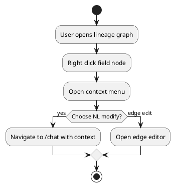

# Phase 3 Design Gap Closure Implementation Plan

> **For agentic workers:** REQUIRED SUB-SKILL: Use superpowers:subagent-driven-development (recommended) or superpowers:executing-plans to implement this plan task-by-task. Steps use checkbox (`- [ ]`) syntax for tracking.

**Goal:** 对照 `docs/superpowers/specs/2026-05-13-wireless-rno-data-service-design.md` 逐章节补齐当前实现差异，优先关闭 Web UI 交互与后端 API 契约之间的 GAP，使 Phase 3 的 P3-1 到 P3-22 验收用例可自动或半自动验证。

**Architecture:** 保持现有 FastAPI + Neo4j + React 18 + Ant Design + AntV G6 架构；先补足后端字段级血缘、Pipeline、演化历史和 Chat payload 契约，再复用现有页面与组件扩展交互。基础设施继续复用 `../shared-data-infra`，本计划不新增 HDFS/YARN/Hive/Kafka/StarRocks/Spark/Neo4j 等服务。

**Tech Stack:** Python 3.11, FastAPI, Neo4j, pytest, React 18, TypeScript, Vite, Ant Design, AntV G6, AntV G2, Monaco Editor, Playwright.

---

## 逐章节 GAP 审视

| 章节 | 设计要求 | 当前实现 | GAP | 优先级 |
|---|---|---|---|---|
| 1. 概述/功能树 | 6 个用户可用子系统，Phase 3 覆盖元数据、血缘、Chat、Pipeline、演化历史、健康检查。 | 路由已覆盖 `/metadata`、`/metadata/lineage`、`/chat`、`/pipeline`、`/schema-evolution`、`/health`。 | 基础页面有了，但 P3-8 到 P3-17 的图维护、gap proposal、反向合成、影响分析交互未闭环。 | P0 |
| 2. 元数据设计 | Neo4j 是权威源，字段级 `DERIVES_FROM` 带 `transform_expr`，变更写 Change 节点并留版本。 | 表/字段 CRUD、上游引用、删除依赖校验已具备；`DERIVES_FROM.transform_expr` 写入时保存。 | `get_lineage()` 返回的 `transform_expr` 为空；缺少一等血缘边 CRUD API；循环检测、断链预检查和影响分析的 UI 契约不足。 | P0 |
| 3. Docker 一体化验证栈 | 基础设施在 base/shared infra，应用层为 FastAPI + React。 | 已回到 pre-Spring 状态，`app-compose.yml` 使用外部 `shared-data-infra` 网络。 | 本计划无基础设施变更；若后续改 Compose，必须先跑 shared infra config 校验。 | P2 |
| 4. NL-to-Code Agent | 三路径：正向 ETL、反向合成、元数据演进；Chat 要渲染 classifier、gap proposal、schema diff、dry-run、约束反推。 | 后端有 LangGraph 节点和 SSE；Chat 页面能启动会话、接 node_complete、渲染 code/schema/error/clarification。 | SSE 不是逐字输出；UI 缺 classifier badge/步骤条/候选方案/缺失补齐按钮；反向约束和影响分析只是占位或 JSON。 | P0 |
| 5. 沙箱 | 代码提交 YARN、结果回读 1 行、失败重试。 | 后端沙箱测试存在；Chat 可展示 `DryRunPreview`，`CodeCard` 为可编辑 Monaco。 | UI 的 dry-run 按钮没有独立调用/重跑链路；失败行定位和重试过程展示缺失。 | P1 |
| 6. Web UI | 设计详见 6.1 到 6.9，重点是页面交互完整性。 | 页面和核心组件已存在，基础浏览/编辑/图渲染/对话/时间线可用。 | 见下方“界面交互差异矩阵”。这是本计划主体。 | P0 |
| 7. 项目结构 | backend/api、metadata、agent、sandbox、frontend/pages/components/api 分层。 | 基本符合；但前端测试目录和 Playwright 配置缺失。 | 需要新增 `frontend/tests/e2e` 和测试脚本；新增交互组件时保持 `components` 分层。 | P1 |
| 8. 实施阶段 & E2E | P3-1 到 P3-22 验收用例。 | 后端 pytest 覆盖较多；前端没有仓库内 E2E 测试配置。 | P3 用例大多只能人工验证；需要把关键交互转为 Playwright 测试。 | P0 |
| 9. 非功能要求 | 本地验证、安全、调试、清理、文档。 | `.env` 未纳入提交；健康检查页面存在。 | 新增交互后需补本文档对应 UI/API 章节；不能新增 Mermaid。 | P1 |

## 界面交互差异矩阵

| 页面 | 已满足 | 差异/风险 | 完善目标 |
|---|---|---|---|
| `/metadata` | 分层过滤、搜索、表详情、字段表、表/字段 CRUD、YAML 预览、血缘/演化跳转。 | 顶部缺全量/单表 YAML 导出按钮；字段表达式仍是 `Input.TextArea`；上游引用是手填 `table.field`；“保存”新建表不会创建初始字段；缺创建下游表；删除影响只在后端报错后提示。 | 新增 YAML 导出操作、Monaco 字段编辑、上游选择器、预检查影响弹窗、创建下游表入口；保存新表时字段与表一并落库或明确禁用字段区。 |
| `/metadata/lineage` | G6 渲染字段边、方向切换、层级滑块、拖拽缩放、点击边看详情、跳 `/chat`。 | URL `?table=` 未自动居中/高亮；没有 Mini-map/全屏/双击展开；没有节点详情；没有右键菜单；不能拖拽新建边；边表达式来自后端为空。 | 补图工具栏、节点/边/画布右键菜单、边 CRUD、节点详情、字段级上下文注入和图刷新。 |
| `/chat` | 会话启动、SSE 事件消费、代码卡片、DryRun 预览、schema diff/error/clarification 初步渲染。 | 缺会话列表；SSE 不是逐字；缺意图 badge、Agent stepper、候选方案按钮、gap proposal 三按钮、反向约束表格/滑块、G2 分档柱状图、影响分析警告；dry-run 按钮未接 API。 | 定义 presenter payload union，按 payload 类型渲染完整交互，并将上下文来源隐藏注入而不是只显示 JSON。 |
| `/pipeline` | 正向/反向切换、搜索表、G6 表级 DAG、节点详情、跳 `/chat`。 | 后端 reverse 只是翻转全图；没有按选中表裁剪上下游；没有层级滑块、路径高亮、hover 信息卡、约束气泡、图上约束调整、字段数以外的边信息。 | 后端返回 selected neighborhood + constraint summary；前端支持高亮路径、层级控制、hover/side panel、反向约束面板。 |
| `/schema-evolution` | 时间线、按表/操作/关键词过滤、YAML diff modal、血缘跳转。 | `yamlDiff` 固定请求 version 1；Change 列表缺 version/old_value/new_value/warnings/downstream；卡片不展示旧新公式 inline diff；commit 映射弱。 | 扩展 Change DTO，按 change.version 请求 diff，卡片内显示旧→新、影响下游、commit/YAML 路径。 |
| `/health` | 健康卡片、30s 刷新已基本符合。 | 只需确认异常状态样式和组件详情字段。 | 保持轻量，加入 E2E smoke。 |

## File Structure

Modify:

- `backend/metadata/models.py` - 补 `LineageEdge`/边 CRUD/影响分析 DTO。
- `backend/metadata/service.py` - 补血缘边查询表达式、边 CRUD、循环检测、下游影响分析、表级 pipeline neighborhood。
- `backend/api/metadata.py` - 新增 `/api/lineage/edges` create/update/delete 与 `/api/metadata/impact` 预检查接口。
- `backend/api/pipeline.py` - 扩展 Pipeline DTO，支持 `depth`、selected path、upstream/downstream、reverse constraints。
- `backend/api/schema_evolution.py` - Change 列表返回 version、old/new snapshot、downstream impact；`yaml-diff` 使用 change version/commit。
- `backend/api/chat.py` - 明确 SSE/presenter payload union，补 gap proposal action 和 dry-run rerun 所需端点或事件。
- `frontend/src/api/client.ts` - 同步新增 DTO 与 API 方法。
- `frontend/src/pages/Metadata.tsx` - 补 YAML 导出、Monaco 字段编辑、上游选择器、影响预检查、创建下游表。
- `frontend/src/pages/Lineage.tsx` - 补节点/边选择状态、右键菜单、全屏、Mini-map、字段级 Chat 上下文。
- `frontend/src/pages/Chat.tsx` - 补 intent badge、stepper、payload 分发、gap proposal、reverse constraints、dry-run action。
- `frontend/src/pages/Pipeline.tsx` - 补层级滑块、路径高亮、反向约束面板、hover/side panel。
- `frontend/src/pages/SchemaEvolution.tsx` - 补版本选择、inline diff、影响分析、commit 信息。
- `frontend/src/components/LineageGraph.tsx` - 增加 node/edge/contextmenu/dblclick/fullscreen/minimap hooks。
- `frontend/src/components/PipelineDAG.tsx` - 增加 selected path、hover card、reverse constraint edge labels。
- `frontend/src/components/CodeCard.tsx` - 接入复制、dry-run、错误行高亮和只读/编辑切换。
- `frontend/src/components/ConstraintSlider.tsx` - 改为受控组件，支持值域和行数回调。
- `frontend/src/components/DiffPanel.tsx` - 修正文案编码，支持公式 diff 和 YAML diff 标题。
- `frontend/src/components/EvolutionTimeline.tsx` - 渲染版本、旧新值、影响下游、操作按钮。
- `frontend/src/components/graphShared/graphData.ts` - 统一 graph node/edge data，支持 field/table node 和 edge id。
- `frontend/src/styles.css` - 补图工具栏、右键菜单、全屏、响应式稳定尺寸。
- `frontend/package.json` - 增加 E2E 测试脚本和 Playwright 依赖。

Create:

- `frontend/src/components/FieldUpstreamEditor.tsx`
- `frontend/src/components/GraphToolbar.tsx`
- `frontend/src/components/LineageContextMenu.tsx`
- `frontend/src/components/LineageSidePanel.tsx`
- `frontend/src/components/AgentStepper.tsx`
- `frontend/src/components/GapProposalCard.tsx`
- `frontend/src/components/ReverseSynthesisPanel.tsx`
- `frontend/src/components/SchemaChangeCard.tsx`
- `frontend/playwright.config.ts`
- `frontend/tests/e2e/metadata.spec.ts`
- `frontend/tests/e2e/lineage.spec.ts`
- `frontend/tests/e2e/chat.spec.ts`
- `frontend/tests/e2e/pipeline.spec.ts`
- `frontend/tests/e2e/schema-evolution.spec.ts`
- `tests/api/test_lineage_edge_crud.py`
- `tests/api/test_metadata_impact.py`

## API Contract Targets

### Lineage edge operations

Add these endpoints:

```text
POST   /api/lineage/edges
PUT    /api/lineage/edges/{edge_id}
DELETE /api/lineage/edges/{edge_id}
GET    /api/metadata/impact?table=...&field=...
```

`LineageEdge` response shape:

```json
{
  "edge_id": "source_table.source_field->target_table.target_field",
  "from_table": "ods_ue_signal",
  "from_field": "rsrp",
  "to_table": "dwd_session_qos",
  "to_field": "avg_rsrp",
  "transform_expr": "AVG(rsrp)",
  "created_at": "2026-07-02T10:00:00"
}
```

`POST /api/lineage/edges` request:

```json
{
  "from_table": "ods_ue_signal",
  "from_field": "imsi",
  "to_table": "dwd_ho_event",
  "to_field": "imsi",
  "transform_expr": "passthrough"
}
```

Acceptance:

- Direction remains normalized as source/upstream -> target/downstream in API responses.
- Neo4j relationship remains `(target_field)-[:DERIVES_FROM]->(source_field)`.
- Adding an edge that creates a cycle returns 409 with affected path.
- Updating an edge changes only `transform_expr` unless source/target is explicitly changed.

### Pipeline response

Extend `/api/pipeline?mode=forward|reverse&table=...&depth=1..5`:

```json
{
  "mode": "reverse",
  "table": "eval_user_score",
  "depth": 3,
  "nodes": [
    {
      "name": "eval_user_score",
      "layer": "EVAL",
      "field_count": 6,
      "selected": true,
      "upstream_tables": ["ads_cell_profile"],
      "downstream_tables": []
    }
  ],
  "edges": [
    {
      "source": "ads_cell_profile",
      "target": "eval_user_score",
      "weight": 3,
      "fields": ["coverage_score", "capacity_score", "stability_score"],
      "constraint_summary": "qoe_score in [0,100]"
    }
  ],
  "selected_path": ["ods_ue_signal", "dwd_session_qos", "dws_cell_hourly", "ads_cell_profile", "eval_user_score"],
  "constraints": [
    {"field": "qoe_score", "range": [80, 100], "rows": 3, "bucket": "excellent"}
  ]
}
```

### Schema evolution response

Extend `SchemaChange`:

```json
{
  "change_id": "...",
  "operation": "UPDATE_FIELD",
  "table_name": "eval_user_score",
  "field_name": "qoe_score",
  "version": 2,
  "previous_version": 1,
  "old_value": {"expression": "..."},
  "new_value": {"expression": "..."},
  "downstream": [{"table": "eval_net_health", "field": "health_index"}],
  "changed_at": "...",
  "commit_hash": "..."
}
```

## Tasks

### 1. Baseline and failing tests

- [ ] Run `git status --branch --short` and confirm only intentional files will be touched. Ignore `docs/~$HDFS路径透明改写方案.pptx` unless the user explicitly asks to commit it.
- [ ] Add failing backend tests in `tests/api/test_lineage_edge_crud.py`:
  - create edge persists `transform_expr`;
  - lineage query returns `transform_expr`;
  - update edge changes expression;
  - delete edge removes it;
  - cycle attempt returns conflict.
- [ ] Add failing backend tests in `tests/api/test_metadata_impact.py` for table/field downstream impact precheck.
- [ ] Extend `tests/api/test_pipeline.py` to expect `depth`, `selected_path`, node upstream/downstream summary, reverse constraints.
- [ ] Extend `tests/api/test_schema_evolution_list.py` to expect version, old/new snapshots, downstream list.
- [ ] Run:

```powershell
python -m pytest tests/api/test_lineage.py tests/api/test_lineage_edge_crud.py tests/api/test_metadata_impact.py tests/api/test_pipeline.py tests/api/test_schema_evolution_list.py -v
```

Expected result at this point: new tests fail for missing API/fields.

### 2. Backend lineage and impact contract

- [ ] In `backend/metadata/models.py`, add `edge_id`, `created_at`, `LineageEdgeCreateRequest`, `LineageEdgeUpdateRequest`, `ImpactResponse`.
- [ ] In `backend/metadata/service.py`, change lineage Cypher to return relationship properties from each direct edge. For multi-hop, emit each direct relationship in the path instead of only root-to-other pairs, so UI can draw complete field DAG and display the correct expression.
- [ ] Add service functions:
  - `create_lineage_edge(req)`
  - `update_lineage_edge(edge_id, req)`
  - `delete_lineage_edge(edge_id)`
  - `get_downstream_impact(table, field=None)`
  - `assert_no_lineage_cycle(target_field_id, source_field_id)`
- [ ] In `backend/api/metadata.py`, expose edge CRUD and impact routes with 404/409 errors mapped to actionable JSON.
- [ ] Re-run the API test subset from Task 1; it must pass before UI work starts.
- [ ] Commit:

```powershell
git add backend/metadata/models.py backend/metadata/service.py backend/api/metadata.py tests/api/test_lineage.py tests/api/test_lineage_edge_crud.py tests/api/test_metadata_impact.py
git commit -m "api: add lineage edge management"
```

### 3. Backend Pipeline and schema evolution contract

- [ ] In `backend/api/pipeline.py`, add `depth` query param and compute the selected table neighborhood instead of returning an unfiltered global graph when `table` is provided.
- [ ] Include `upstream_tables`, `downstream_tables`, `fields`, `selected_path`, and reverse `constraints`/`constraint_summary`.
- [ ] In `backend/api/schema_evolution.py`, return Change `version`, `old_value`, `new_value`, and downstream impact from Neo4j snapshots. Preserve deleted target names as strings.
- [ ] Change frontend-facing `yaml-diff` usage so callers can pass the selected change version; keep `version >= 1` validation.
- [ ] Run:

```powershell
python -m pytest tests/api/test_pipeline.py tests/api/test_schema_evolution_list.py tests/api/test_yaml_metadata.py -v
```

- [ ] Commit:

```powershell
git add backend/api/pipeline.py backend/api/schema_evolution.py tests/api/test_pipeline.py tests/api/test_schema_evolution_list.py tests/api/test_yaml_metadata.py
git commit -m "api: enrich pipeline and evolution data"
```

### 4. Frontend API types and shared graph model

- [ ] Update `frontend/src/api/client.ts` for new lineage, impact, pipeline, evolution, and Chat presenter payload types. Use discriminated unions for `PresenterPayload`.
- [ ] Update `frontend/src/components/graphShared/graphData.ts` so graph edge IDs match backend `edge_id` and both field-level and table-level edges carry display data.
- [ ] Add `frontend/src/components/GraphToolbar.tsx` with zoom reset, fit view, fullscreen, and direction controls as props.
- [ ] Run:

```powershell
npm.cmd --prefix frontend run build
```

Expected result at this point: build may fail until page call sites are updated; keep failures limited to typed call sites.

### 5. Metadata page interactions

- [ ] Add `FieldUpstreamEditor.tsx`:
  - loads available tables/fields through existing `api.tables` and `api.table`;
  - lets the user add/remove upstream refs without typing raw `table.field`;
  - emits `UpstreamRef[]`.
- [ ] Replace field expression `Input.TextArea` with Monaco in `Metadata.tsx`.
- [ ] Add top-level YAML export actions:
  - selected table export via existing `/api/yaml/export?table=...`;
  - full export via `/api/yaml/export`.
- [ ] Fix new table save semantics:
  - either create table then create each initial field on plain `[保存]`, or disable the initial-field list unless `[保存并导出 YAML]` is used. Preferred: create table then fields, because design says `[保存]` writes Neo4j and immediately usable.
- [ ] Add “创建下游表” that opens the create table modal with upstream refs prefilled from the current table.
- [ ] Add delete precheck: call `/api/metadata/impact` before Popconfirm, show downstream table/field list, then block or continue according to backend response.
- [ ] Run:

```powershell
npm.cmd --prefix frontend run build
```

- [ ] Commit:

```powershell
git add frontend/src/pages/Metadata.tsx frontend/src/components/FieldUpstreamEditor.tsx frontend/src/api/client.ts frontend/src/styles.css
git commit -m "ui: complete metadata management interactions"
```

### 6. Lineage graph interactions

- [ ] Add `LineageSidePanel.tsx` for selected node and selected edge details, including transform expression and action buttons.
- [ ] Add `LineageContextMenu.tsx` for table node, field node, edge, and canvas menu actions from design §6.5.
- [ ] Update `LineageGraph.tsx`:
  - emit `onSelectNode`, `onSelectEdge`, `onContextMenu`, `onCreateEdgeDraft`;
  - support double-click expand/collapse by calling parent with node id and next depth;
  - add Mini-map/fullscreen when supported by G6 v5, otherwise provide toolbar fit/fullscreen and document the Mini-map limitation in a code comment;
  - remove or make clickable the fallback overlay instead of `pointer-events: none`.
- [ ] Update `Lineage.tsx`:
  - keep `table`, `direction`, and `depth` in URL;
  - highlight and fit center node after graph render;
  - wire right-click “用 NL 修改” to `/chat?context=lineage&table=...&field=...`;
  - wire edge create/update/delete APIs and invalidate lineage query after mutation.
- [ ] Add Playwright e2e placeholders that mock API and verify:
  - URL table loads;
  - edge click opens transform expression;
  - right-click menu opens and Chat link includes `field=`.
- [ ] Run:

```powershell
npm.cmd --prefix frontend run build
```

- [ ] Commit:

```powershell
git add frontend/src/pages/Lineage.tsx frontend/src/components/LineageGraph.tsx frontend/src/components/LineageSidePanel.tsx frontend/src/components/LineageContextMenu.tsx frontend/src/components/GraphToolbar.tsx frontend/src/api/client.ts frontend/src/styles.css
git commit -m "ui: add lineage graph maintenance"
```

### 7. Chat interaction payloads

- [ ] In `frontend/src/components/AgentStepper.tsx`, render classifier/forward/reverse/schema/dry_run/presenter steps from SSE `node_complete` events.
- [ ] In `GapProposalCard.tsx`, render gaps and draft schema with buttons:
  - `[确认并继续]` sends action payload to Chat API;
  - `[我自己定义]` opens metadata/schema form or sends action;
  - `[跳过]` resumes code generation.
- [ ] In `ReverseSynthesisPanel.tsx`, render constraint table with controlled `ConstraintSlider`, row count input, and G2 bar chart for generated bucket results.
- [ ] Update `Chat.tsx`:
  - use payload discriminated union;
  - show intent badge;
  - keep context injection internal and user-visible only as concise source tag;
  - support token/chunk text if backend emits it, but still handle current `node_complete` events;
  - wire `CodeCard.onDryRun` to a real dry-run/rerun action or disable button with explanatory tooltip until backend supports rerun.
- [ ] Update `CodeCard.tsx`:
  - implement copy;
  - add readonly/edit toggle;
  - accept error line and highlight it.
- [ ] Run:

```powershell
npm.cmd --prefix frontend run build
```

- [ ] Commit:

```powershell
git add frontend/src/pages/Chat.tsx frontend/src/components/AgentStepper.tsx frontend/src/components/GapProposalCard.tsx frontend/src/components/ReverseSynthesisPanel.tsx frontend/src/components/CodeCard.tsx frontend/src/components/ConstraintSlider.tsx frontend/src/components/DryRunPreview.tsx frontend/src/api/client.ts frontend/src/styles.css
git commit -m "ui: complete chat result interactions"
```

### 8. Pipeline visualization

- [ ] Update `PipelineDAG.tsx` to render selected path and upstream/downstream path emphasis from `selected_path`.
- [ ] Add node hover info using G6 tooltip or a React side panel fallback.
- [ ] Add layer/depth slider to `Pipeline.tsx` and pass `depth` to API.
- [ ] In reverse mode, show `constraint_summary` on edges and a side `ReverseSynthesisPanel` for editable constraints.
- [ ] Keep `/chat?context=pipeline&table=...&mode=...` links and include selected path/constraints in `chatStart` context where available.
- [ ] Run:

```powershell
npm.cmd --prefix frontend run build
```

- [ ] Commit:

```powershell
git add frontend/src/pages/Pipeline.tsx frontend/src/components/PipelineDAG.tsx frontend/src/components/ReverseSynthesisPanel.tsx frontend/src/api/client.ts frontend/src/styles.css
git commit -m "ui: enrich pipeline visualization"
```

### 9. Schema evolution history

- [ ] Update `EvolutionTimeline.tsx` to render `SchemaChangeCard` rather than a single button line.
- [ ] Add `SchemaChangeCard.tsx`:
  - operation tag/icon;
  - table.field;
  - `vN -> vN+1`;
  - inline old/new formula diff;
  - downstream impact tags;
  - `[查看 YAML diff]` and `[查看血缘]`.
- [ ] Update `SchemaEvolution.tsx` to call `api.yamlDiff(selected.table_name, selected.version)` instead of hardcoded `1`.
- [ ] Update `DiffPanel.tsx` titles and encoding text, and support `oldLabel`/`newLabel` props.
- [ ] Run:

```powershell
npm.cmd --prefix frontend run build
```

- [ ] Commit:

```powershell
git add frontend/src/pages/SchemaEvolution.tsx frontend/src/components/EvolutionTimeline.tsx frontend/src/components/SchemaChangeCard.tsx frontend/src/components/DiffPanel.tsx frontend/src/api/client.ts frontend/src/styles.css
git commit -m "ui: show schema evolution details"
```

### 10. Frontend E2E verification

- [ ] Add Playwright:

```powershell
npm.cmd --prefix frontend install --save-dev @playwright/test
npm.cmd --prefix frontend exec playwright install chromium
```

- [ ] Add `frontend/playwright.config.ts` with Vite `webServer`:

```ts
webServer: {
  command: 'npm run dev -- --host 127.0.0.1 --port 5173',
  url: 'http://127.0.0.1:5173',
  reuseExistingServer: true
}
```

- [ ] Add scripts to `frontend/package.json`:

```json
"test:e2e": "playwright test",
"test:e2e:ui": "playwright test --ui"
```

- [ ] Write mocked-route tests:
  - `metadata.spec.ts`: P3-1 to P3-5 plus YAML export button presence.
  - `lineage.spec.ts`: P3-6 to P3-10.
  - `chat.spec.ts`: P3-11 to P3-17 with mocked SSE.
  - `pipeline.spec.ts`: P3-18 to P3-20.
  - `schema-evolution.spec.ts`: P3-22.
- [ ] Run:

```powershell
npm.cmd --prefix frontend run test:e2e
npm.cmd --prefix frontend run build
npm.cmd --prefix frontend run lint
```

- [ ] Commit:

```powershell
git add frontend/package.json frontend/package-lock.json frontend/playwright.config.ts frontend/tests/e2e
git commit -m "test: add phase 3 frontend e2e coverage"
```

### 11. Documentation update

- [ ] Update `docs/superpowers/specs/2026-05-13-wireless-rno-data-service-design.md` only where current implementation intentionally differs from the original design.
- [ ] If adding diagrams, use PlantUML only:



- [ ] Do not add Mermaid diagrams.
- [ ] Commit:

```powershell
git add docs/superpowers/specs/2026-05-13-wireless-rno-data-service-design.md
git commit -m "docs: align phase 3 implementation details"
```

### 12. Full verification and push

- [ ] Run backend tests. If local `.env` points infra URLs to localhost, override them as done in prior verification:

```powershell
$env:YARN_RM_URL='http://resourcemanager:8088'
$env:HDFS_DEFAULTFS='hdfs://namenode:8020'
$env:HIVE_METASTORE_URI='thrift://hive-metastore:9083'
python -m pytest -m "not infra"
```

- [ ] Run frontend checks:

```powershell
npm.cmd --prefix frontend run lint
npm.cmd --prefix frontend run build
npm.cmd --prefix frontend run test:e2e
```

- [ ] If any Compose file changed, run both config checks required by `AGENTS.md`:

```powershell
docker compose -f ../shared-data-infra/compose.yaml --profile data-gov config
docker compose -f app-compose.yml config
```

- [ ] Check final git state:

```powershell
git status --branch --short
git log --oneline -5
```

- [ ] Push:

```powershell
git push origin master
```

## Completion Criteria

- `GET /api/lineage` returns usable `transform_expr` and full direct field edges.
- Lineage graph supports selected node/edge details, right-click maintenance, edge expression edit/delete, Chat field context, and graph refresh.
- Metadata page supports Monaco field expressions, structured upstream refs, full/single YAML export, downstream impact precheck, and create downstream table.
- Chat page renders intent badge, Agent progress, gap proposal actions, schema diff/impact, dry-run preview, and reverse constraints without raw JSON fallback for known payloads.
- Pipeline page highlights selected paths, supports depth control, and shows reverse constraint summaries.
- Schema evolution uses the selected change version for YAML diff and displays old/new values inline.
- P3-1 to P3-22 are covered by Playwright or documented manual checks where browser graph behavior cannot be reliably automated.
- `python -m pytest -m "not infra"`, `npm.cmd --prefix frontend run lint`, `npm.cmd --prefix frontend run build`, and `npm.cmd --prefix frontend run test:e2e` pass.
