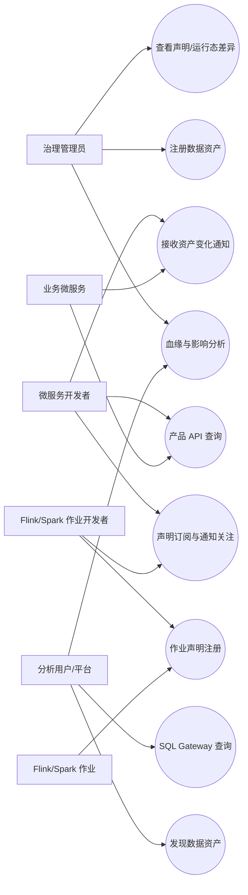
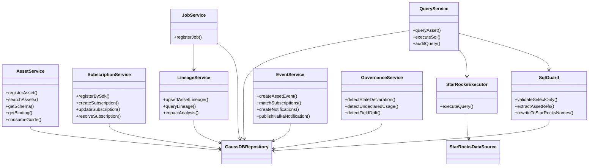
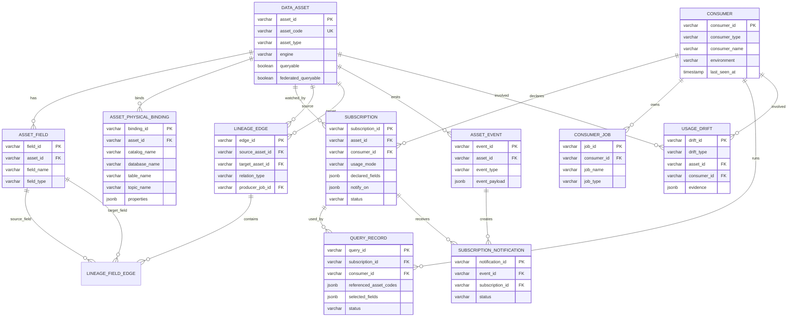
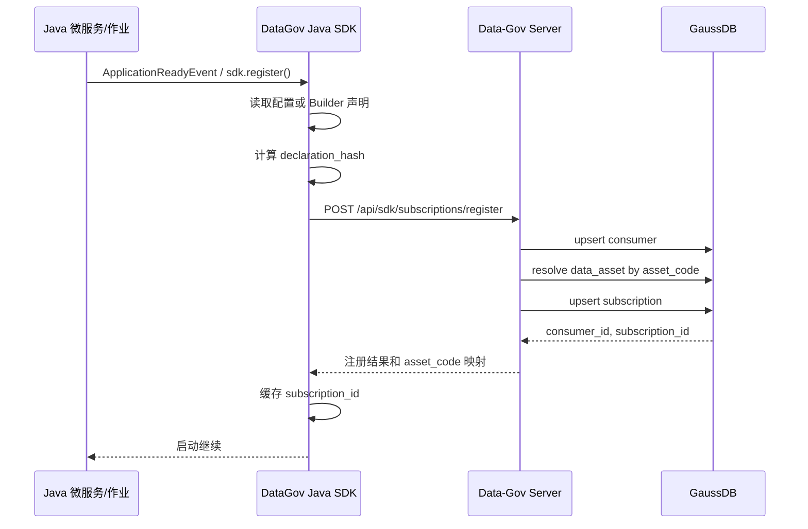
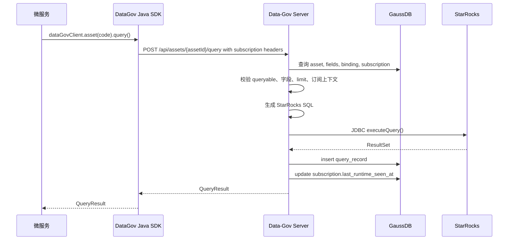
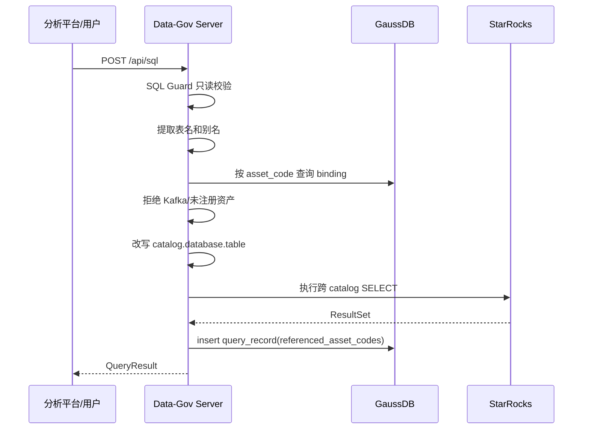
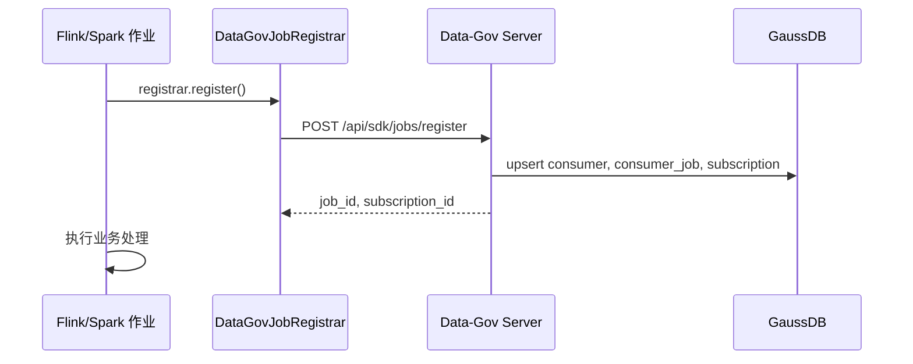
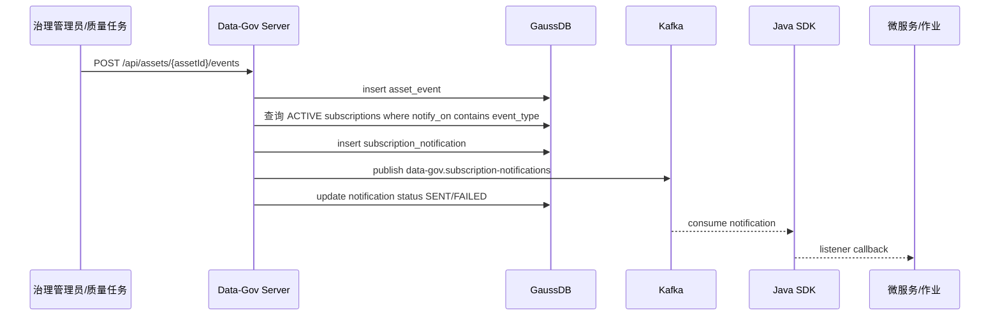
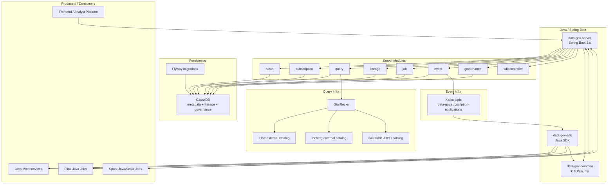
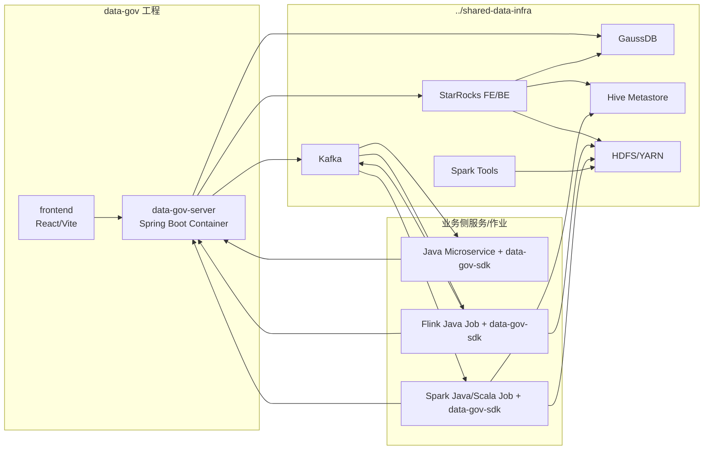

# 数据产品治理、订阅、统一查询与血缘设计

> 2026-06-10 | Status: Draft for review

## 1. 背景与目标

在现有 `data-gov` 项目基础上，新增数据注册、发现、订阅、消费、元数据查询和血缘查询能力。现有技术栈包括 Hive、StarRocks、GaussDB、Iceberg、Flink、Spark SQL 和 Kafka。

本设计确认以下方向：

- 数据治理主服务采用 Java Spring Boot 实现。
- 元数据和血缘主库从 Neo4j 改为 GaussDB。
- StarRocks 作为统一 SQL 查询和基础联邦查询入口。
- 产品 API 优先，SQL Gateway 作为补充查询入口。
- Kafka 进入资产目录和订阅通知体系，但不进入统一查询。
- 订阅不是消费事实，也不是核心血缘；订阅表示使用意图和变化通知关注。
- 运行态消费事实第一期由查询记录表达，Flink/Spark 作业先保留声明态注册。
- Java SDK 用于降低微服务、Flink、Spark 作业接入成本。

## 2. 范围

### 2.1 第一期开启

- 数据资产注册、发现、Schema 查询。
- GaussDB 关系模型承载元数据、血缘、订阅、查询记录、事件和 drift。
- StarRocks 查询网关，支持产品 API 查询和受控 SQL 查询。
- 基础跨源 join：StarRocks 内表、Hive、Iceberg、GaussDB 之间的只读查询。
- Kafka 资产注册、发现、Schema、订阅声明、通知和血缘关系。
- Java SDK 启动注册订阅声明。
- Java SDK 注册 Flink/Spark 作业声明，并监听订阅通知。
- 事件通知和声明态/运行态差异分析。

### 2.2 第一阶段不做

- Python SDK / PySpark SDK。
- CI manifest 同步和 Git webhook。
- 审批流。
- Kafka 统一 SQL 查询。
- 写入类 SQL Gateway。
- 大结果集导出和异步长查询。
- 跨源大表 join SLA。
- 复杂权限、脱敏和 `security_level`。

## 3. 总体架构

```text
上层消费者
  - Java 微服务
  - Flink Java 作业
  - Spark Java/Scala 作业
  - 分析平台 / 前端

Java SDK
  - 启动注册订阅声明
  - 产品 API 查询透传 subscription_id
  - Flink/Spark 作业声明注册
  - Kafka 通知监听回调

Data-Gov Server (Spring Boot)
  - Asset Registry
  - Discovery Service
  - Subscription Service
  - Query Service
  - SQL Gateway
  - Lineage Service
  - Event / Notification Service
  - Governance Drift Service

GaussDB
  - 元数据主库
  - 血缘主库
  - 订阅声明
  - 查询审计
  - 事件、通知、drift

StarRocks
  - 统一 SQL 执行入口
  - internal catalog
  - Hive external catalog
  - Iceberg external catalog
  - GaussDB JDBC external catalog

Kafka
  - STREAM 资产
  - 注册、发现、订阅、通知、血缘
  - 不进入统一查询
```

StarRocks 是默认 SQL 执行入口，但不替代 Flink/Spark 的生产和加工职责。Flink 负责流处理，Spark 负责批处理和复杂离线加工，StarRocks 负责交互式查询、产品 API 查询、基础跨源 join 和 OLAP 加速。

## 4. 核心语义

### 4.1 数据资产

统一资产基类为 `data_asset`：

- `TABLE`：Hive、StarRocks、GaussDB、Iceberg 表。
- `STREAM`：Kafka topic。
- `VIEW`：逻辑视图或查询视图。
- `API`：API 型数据产品。
- `JOB_OUTPUT`：作业产物。

Kafka 不强行抽象成普通表。Kafka 可以统一注册、发现、订阅、通知和参与血缘，但 `queryable=false`。

### 4.2 订阅

订阅定义为：

```text
订阅 = 使用意图声明 + 变化通知关注
```

订阅不承担以下职责：

- 不证明真实消费。
- 不等同于数据血缘。
- 不做审批流。

订阅用于：

- 声明服务/作业关心哪些资产和字段。
- 声明用途和使用模式。
- 声明关心哪些变化事件。
- 支持字段变更、资产下线、质量异常、刷新延迟、血缘变化后的通知。
- 为影响分析提供声明态视角。

### 4.3 运行态

运行态事实由以下记录表达：

- `query_record`：产品 API 和 SQL Gateway 查询。

运行态回答“谁实际使用了什么、什么时候、成功与否、使用了哪些字段”。

Flink/Spark 作业第一期通过 SDK 注册作业声明、输入输出资产和订阅关系，不上报作业开始和完成事件；运行态观测和自动血缘生成后续单独规划。

### 4.4 血缘

血缘只表达生产、派生和作业读写链路：

```text
source asset -> job -> target asset
```

第一期资产级血缘优先，字段级血缘建表保留并支持手工或后续解析。

## 5. GaussDB 表模型

### 5.1 资产

```text
data_asset
- asset_id              varchar primary key
- asset_code            varchar unique not null
- asset_name            varchar
- asset_type            varchar not null
- engine                varchar not null
- domain                varchar
- owner                 varchar
- description           text
- lifecycle_status      varchar not null
- schema_version        integer default 1
- queryable             boolean default false
- federated_queryable   boolean default false
- created_at            timestamp
- updated_at            timestamp
```

建议枚举：

- `asset_type`: `TABLE`, `STREAM`, `VIEW`, `API`, `JOB_OUTPUT`
- `engine`: `STARROCKS`, `HIVE`, `ICEBERG`, `GAUSSDB`, `KAFKA`
- `lifecycle_status`: `DRAFT`, `ACTIVE`, `DEPRECATED`, `OFFLINE`

### 5.2 字段

```text
asset_field
- field_id              varchar primary key
- asset_id              varchar not null references data_asset(asset_id)
- field_name            varchar not null
- field_type            varchar not null
- ordinal_position      integer
- nullable              boolean default true
- partition_key         boolean default false
- primary_key           boolean default false
- event_time            boolean default false
- description           text
- expression            text
- version               integer default 1
- created_at            timestamp
- updated_at            timestamp
```

约束：

```text
unique(asset_id, field_name)
index(asset_id)
index(field_name)
```

Kafka key/value schema 不在第一期拆成 `schema_part` 或 `key_field`，相关细节放入物理绑定扩展信息。

### 5.3 物理绑定

```text
asset_physical_binding
- binding_id            varchar primary key
- asset_id              varchar not null references data_asset(asset_id)
- engine                varchar not null
- catalog_name          varchar
- database_name         varchar
- schema_name           varchar
- table_name            varchar
- topic_name            varchar
- format                varchar
- location_uri          text
- connection_ref        varchar
- query_adapter         varchar
- properties            jsonb
- active                boolean default true
- created_at            timestamp
- updated_at            timestamp
```

`properties` 用于 Kafka retention、partition、bootstrap alias、serialization 等扩展信息。

### 5.4 Consumer 和订阅

```text
consumer
- consumer_id           varchar primary key
- consumer_type         varchar not null
- consumer_name         varchar not null
- owner                 varchar
- environment           varchar
- runtime_version       varchar
- instance_id           varchar
- last_seen_at          timestamp
- created_at            timestamp
- updated_at            timestamp
```

```text
subscription
- subscription_id       varchar primary key
- asset_id              varchar not null references data_asset(asset_id)
- consumer_id           varchar not null references consumer(consumer_id)
- usage_mode            varchar not null
- purpose               text
- source_type           varchar not null
- declaration_hash      varchar
- declared_fields       jsonb
- notify_on             jsonb
- status                varchar not null
- last_registered_at    timestamp
- last_runtime_seen_at  timestamp
- created_at            timestamp
- updated_at            timestamp
```

建议枚举：

- `consumer_type`: `MICROSERVICE`, `FLINK_JOB`, `SPARK_JOB`, `USER`, `BI`
- `usage_mode`: `API_QUERY`, `SQL_QUERY`, `FLINK_CONSUME`, `SPARK_CONSUME`, `MICROSERVICE_READ`, `KAFKA_CONSUME`
- `source_type`: `SDK_STARTUP`, `API`, `RUNTIME_REPORT`, `INFERRED`
- `status`: `ACTIVE`, `STALE`, `PAUSED`, `REVOKED`

第一期不拆 `subscription_field`，字段声明放入 `declared_fields`。

### 5.5 查询记录

```text
query_record
- query_id              varchar primary key
- subscription_id       varchar null references subscription(subscription_id)
- consumer_id           varchar null references consumer(consumer_id)
- query_type            varchar not null
- referenced_asset_ids  jsonb
- referenced_asset_codes jsonb
- selected_fields       jsonb
- sql_text              text
- normalized_sql        text
- query_engine          varchar not null
- status                varchar not null
- row_count             bigint
- elapsed_ms            bigint
- error_message         text
- started_at            timestamp
- finished_at           timestamp
```

第一期不拆 `query_record_asset`，多资产引用放入 JSON。

### 5.6 作业声明

```text
consumer_job
- job_id                varchar primary key
- consumer_id           varchar references consumer(consumer_id)
- job_name              varchar not null
- job_type              varchar not null
- owner                 varchar
- code_ref              text
- runtime_config        jsonb
- status                varchar
- created_at            timestamp
- updated_at            timestamp
```

第一期不建 `job_run_record` 和 `job_io_record`。`consumer_job` 仅表达开发态/启动态声明，运行生命周期、行数统计、错误信息和自动血缘生成不进入第一期。

### 5.7 血缘

```text
lineage_edge
- edge_id               varchar primary key
- source_asset_id       varchar references data_asset(asset_id)
- target_asset_id       varchar references data_asset(asset_id)
- relation_type         varchar not null
- producer_job_id       varchar null references consumer_job(job_id)
- transform_type        varchar
- transform_ref         text
- confidence            numeric
- created_at            timestamp
- updated_at            timestamp
```

```text
lineage_field_edge
- edge_id               varchar primary key
- source_field_id       varchar references asset_field(field_id)
- target_field_id       varchar references asset_field(field_id)
- asset_lineage_edge_id varchar references lineage_edge(edge_id)
- transform_expr        text
- confidence            numeric
```

递归查询使用 GaussDB recursive CTE，默认限制深度。

### 5.8 事件、通知、差异分析

```text
asset_event
- event_id              varchar primary key
- asset_id              varchar references data_asset(asset_id)
- event_type            varchar not null
- event_payload         jsonb
- severity              varchar
- created_at            timestamp
```

```text
subscription_notification
- notification_id       varchar primary key
- event_id              varchar references asset_event(event_id)
- subscription_id       varchar references subscription(subscription_id)
- consumer_id           varchar references consumer(consumer_id)
- status                varchar not null
- kafka_topic           varchar
- created_at            timestamp
- sent_at               timestamp
```

```text
usage_drift
- drift_id              varchar primary key
- drift_type            varchar not null
- asset_id              varchar references data_asset(asset_id)
- consumer_id           varchar references consumer(consumer_id)
- subscription_id       varchar null references subscription(subscription_id)
- evidence              jsonb
- status                varchar not null
- detected_at           timestamp
- resolved_at           timestamp
```

事件类型：

- `SCHEMA_CHANGE`
- `DATA_QUALITY_ALERT`
- `FRESHNESS_DELAY`
- `DEPRECATION`
- `ASSET_OFFLINE`
- `LINEAGE_CHANGE`
- `BINDING_CHANGE`

Drift 类型：

- `STALE_DECLARATION`
- `USED_BUT_UNDECLARED`
- `FIELD_USED_BUT_UNDECLARED`
- `DECLARED_BUT_UNUSED`
- `DECLARED_FIELD_UNUSED`
- `BROKEN_BY_SCHEMA_CHANGE`

## 6. Spring Boot 服务设计

建议新增 Java 多模块工程：

```text
data-gov-platform/
  pom.xml
  data-gov-common/
  data-gov-server/
  data-gov-sdk/
```

`data-gov-server` 模块：

```text
asset                 -- 资产注册、发现、schema、binding
metadata              -- 原 metadata 能力的 GaussDB 实现
subscription          -- 订阅声明、通知偏好
query                 -- 产品 API、SQL Gateway、StarRocks 执行
lineage               -- 血缘、影响分析
sdk                   -- SDK 启动注册、作业声明、通知监听
event                 -- 资产事件、通知
governance            -- usage_drift
job                   -- consumer_job
```

建议技术栈：

- Spring Boot 3.x
- Java 17+
- MyBatis / MyBatis Plus
- Flyway
- HikariCP
- GaussDB PostgreSQL/JDBC driver
- StarRocks MySQL JDBC driver

MyBatis 优先，因为递归 CTE、JSON 查询、复杂 upsert 和 SQL Gateway 审计会比 JPA 更直接。

## 7. API 设计

### 7.1 资产 API

```http
POST /api/assets/register
GET  /api/assets
GET  /api/assets/{assetId}
GET  /api/assets/{assetId}/schema
GET  /api/assets/{assetId}/binding
GET  /api/assets/{assetId}/consume-guide
```

### 7.2 订阅 API

```http
POST /api/assets/{assetId}/subscriptions
GET  /api/subscriptions
GET  /api/subscriptions/{subscriptionId}
PATCH /api/subscriptions/{subscriptionId}
```

### 7.3 SDK API

`/api/sdk/*` 是给 Java SDK 自动调用的内部治理接口，不是普通用户或前端直接调用的业务 API。

```http
POST /api/sdk/subscriptions/register
POST /api/sdk/jobs/register
```

启动注册请求示例：

```json
{
  "consumer": {
    "consumerName": "rno-dashboard",
    "consumerType": "MICROSERVICE",
    "owner": "network-team",
    "environment": "prod",
    "runtimeVersion": "1.8.3",
    "instanceId": "pod-rno-dashboard-7d8f"
  },
  "declarationHash": "sha256:xxx",
  "subscriptions": [
    {
      "assetCode": "ads_cell_profile",
      "usageMode": "API_QUERY",
      "purpose": "展示小区画像指标",
      "fields": ["cell_id", "coverage_score"],
      "notifyOn": ["SCHEMA_CHANGE", "DATA_QUALITY_ALERT", "DEPRECATION"]
    }
  ]
}
```

### 7.4 查询 API

```http
POST /api/assets/{assetId}/query
POST /api/sql
```

产品 API 查询仅查询单个资产，字段和过滤条件必须来自 `asset_field`。

SQL Gateway 支持只读 `SELECT` 和基础跨源 join，要求引用已注册资产，禁止 Kafka 和未注册表。

### 7.5 血缘、影响分析、通知和治理

```http
GET  /api/assets/{assetId}/lineage?direction=up&depth=5
GET  /api/assets/{assetId}/impact
POST /api/assets/{assetId}/events
POST /api/governance/drift-check
GET  /api/governance/drifts
PATCH /api/governance/drifts/{driftId}
```

## 8. StarRocks 查询网关

### 8.1 Catalog 规划

```text
default_catalog.data_gov.*        -- StarRocks 本地表
hive_catalog.data_gov.*           -- Hive 表
iceberg_catalog.data_gov.*        -- Iceberg 表
gaussdb_catalog.public.*          -- GaussDB 表
```

`asset_physical_binding` 保存资产到 StarRocks 三段名的映射。

### 8.2 产品 API 查询

请求：

```json
{
  "select": ["cell_id", "coverage_score"],
  "filters": [
    {"field": "date", "op": "=", "value": "2026-06-10"}
  ],
  "limit": 100
}
```

服务端流程：

```text
查资产和 binding
-> 校验 queryable=true
-> 拒绝 Kafka
-> 校验字段
-> 生成参数化 StarRocks SQL
-> 执行
-> 写 query_record
```

### 8.3 SQL Gateway

SQL Gateway 流程：

```text
SQL Guard 校验只读
-> 提取表名
-> 映射 asset_code 到 binding
-> 拒绝未注册资产和 Kafka
-> 改写为 catalog.database.table
-> 执行 StarRocks
-> 写 query_record
```

第一期限制：

- 只允许 `SELECT` / `WITH SELECT`。
- 禁止 `INSERT`, `UPDATE`, `DELETE`, `CREATE`, `DROP`, `ALTER`。
- 默认要求或自动补充 `LIMIT`。
- 查询超时默认 30 秒。
- 返回行数上限默认 5000。
- 不承诺跨源大表 join SLA。

## 9. Java SDK

第一期只做 Java SDK，不做 Python。

### 9.1 Spring Boot 微服务集成

```yaml
data-gov:
  enabled: true
  endpoint: http://data-gov-server:8080
  consumer:
    name: rno-dashboard
    type: MICROSERVICE
    owner: network-team
    environment: prod
    version: 1.8.3
  subscriptions:
    - asset-code: ads_cell_profile
      usage-mode: API_QUERY
      purpose: 展示小区画像指标
      fields: [cell_id, coverage_score]
      notify-on: [SCHEMA_CHANGE, DATA_QUALITY_ALERT, DEPRECATION]
```

SDK 在 `ApplicationReadyEvent` 自动注册：

```text
读取配置
-> 计算 declaration_hash
-> POST /api/sdk/subscriptions/register
-> 缓存 asset_code -> subscription_id
```

业务查询：

```java
QueryResult result = dataGovClient.asset("ads_cell_profile")
    .select("cell_id", "coverage_score")
    .where("date", "=", LocalDate.now())
    .limit(100)
    .query();
```

### 9.2 Flink/Spark Java 作业集成

```java
DataGovJobRegistrar registrar = DataGovJobRegistrar.builder()
    .endpoint("http://data-gov-server:8080")
    .jobName("cell-hourly-agg")
    .jobType(JobType.FLINK)
    .owner("network-team")
    .inputAsset("ods_ue_signal")
    .outputAsset("dwd_session_qos")
    .build();

registrar.register();
```

作业注册只写入 `consumer_job`、输入输出资产声明和订阅声明，不自动写入 `lineage_edge`。第一期血缘由资产注册、导入或手工维护接口进入治理库。

### 9.3 SDK 错误处理

默认不阻断业务启动：

- 注册失败：记录 warning，业务继续。
- 作业声明注册失败：记录 warning，可重试。
- 查询失败：作为业务查询异常抛出。

可配置：

```yaml
data-gov:
  fail-fast: false
  register-timeout-ms: 3000
  retry:
    max-attempts: 3
```

## 10. 事件通知与 Drift

资产变化写入 `asset_event`，再根据 `subscription.notify_on` 匹配订阅，生成 `subscription_notification` 并异步发送 Kafka 消息。

第一期通知通道使用 Kafka：

```text
topic: data-gov.subscription-notifications
key: consumer_name + environment
payload:
  notificationId
  eventId
  subscriptionId
  assetCode
  eventType
  severity
  eventPayload
  createdAt
```

服务端只负责将匹配到的通知投递到 Kafka，并记录 `PENDING`、`SENT`、`FAILED` 等平台发送状态；不提供通知拉取和业务处理回执 API。消费方通过 Java SDK 内置 Kafka listener 订阅通知 topic，SDK 收到消息后触发业务侧回调：

```java
dataGovClient.onNotification(notification -> {
    log.info("data asset event: {}", notification.eventType());
});
```

业务侧是否重试、告警或记录处理结果由消费方自行决定；第一期不在治理服务中维护消费者业务处理回执。

Drift 检测第一期实现：

- `STALE_DECLARATION`
- `USED_BUT_UNDECLARED`
- `FIELD_USED_BUT_UNDECLARED`

订阅负责声明和通知，运行态记录负责证明真实使用，drift 负责发现两者不一致。

## 11. 迁移和实施

### 阶段 1：Spring Boot 服务骨架

- 新建 Java 多模块工程。
- 接入 GaussDB、StarRocks。
- Flyway 建表。
- 健康检查。

### 阶段 2：GaussDB 元数据替换 Neo4j

- 实现资产、字段、物理绑定、血缘。
- 现有样例表迁移为 GaussDB seed。
- Spring Boot 提供 `/api/assets/*`。
- 如前端短期依赖旧接口，可提供兼容 `/api/tables`、`/api/fields`、`/api/lineage`。

### 阶段 3：订阅和 Java SDK

- 实现 SDK 启动注册。
- 实现 job 声明注册。
- 支持 `declaration_hash`、`last_registered_at`。
- 实现 SDK Kafka listener 和通知回调。

### 阶段 4：StarRocks 查询网关

- 实现产品 API 查询。
- 实现 SQL Gateway。
- 验证 StarRocks 本地表、Hive、Iceberg、GaussDB catalog。
- 验证基础跨源 join。

### 阶段 5：事件、通知、影响分析和 drift

- 实现资产事件。
- 实现 Kafka 异步通知投递。
- 实现影响分析。
- 实现第一批 drift 检测。

## 12. 验收标准

- 现有 10 张样例表可注册到 GaussDB。
- Kafka topic 可注册为 `STREAM` 资产，查询时返回明确错误。
- 资产发现、Schema 查询、上下游血缘查询可用。
- Java 微服务启动后可自动注册订阅。
- Flink/Spark Java 作业可通过 SDK 注册 job 声明、输入输出资产和订阅关系。
- 产品 API 可通过 StarRocks 查询表型资产。
- SQL Gateway 可执行只读查询并改写已注册资产为 StarRocks 三段名。
- 至少验证一个基础跨源 join。
- 查询写入 `query_record`。
- Schema 变化事件能生成订阅通知并投递到 Kafka。
- 未声明使用或字段超声明能生成 drift。

## 13. 基础设施约束

遵守项目 `AGENTS.md`：

- 新增或修改 Docker Compose 基础设施前，必须先检查 `../shared-data-infra`。
- 如果 shared infra 已定义 GaussDB、HDFS、Hive、Spark、YARN、Kafka、StarRocks、Prometheus、Grafana 等能力，不在本工程重复新增。
- 修改基础设施后至少运行：

```bash
docker compose -f ../shared-data-infra/compose.yaml --profile data-gov config
docker compose -f app-compose.yml config
```

本设计倾向复用 shared infra，本工程只保留治理服务、前端和必要应用级资源。

## 14. 架构视图

本节按用例视图、逻辑视图、数据模型、运行时序、技术视图和部署视图描述系统。

### 14.1 用例视图



关键用例说明：

- 治理管理员负责资产注册、元数据维护、事件发布、影响分析和 drift 处理。
- 微服务通过 Java SDK 启动注册订阅声明，并通过产品 API 查询资产。
- Flink/Spark 作业通过 Java SDK 注册作业，并声明输入输出资产和通知关注。
- 分析用户和平台通过发现能力查找数据产品，通过 SQL Gateway 做受控查询。

### 14.2 逻辑视图



逻辑边界：

- `AssetService` 管资产主数据，不处理运行态事实。
- `SubscriptionService` 管声明态，不把订阅写成核心血缘。
- `QueryService` 管同步查询和审计。
- `JobService` 管作业定义和运行事实。
- `LineageService` 管生产、派生、读写链路。
- `EventService` 将资产事件转换为订阅通知。
- `GovernanceService` 比对声明态和运行态，生成 drift。

### 14.3 数据模型视图



模型取舍：

- `subscription_field` 合并到 `subscription.declared_fields`，降低第一期表数量。
- `query_record_asset` 合并到 `query_record.referenced_asset_codes`，适配跨源 join 的多资产引用。
- 第一期不建 `job_run_record` 和 `job_io_record`；Flink/Spark 只注册作业声明，长期血缘仍由 `lineage_edge` 表达。
- Kafka key/value schema 不拆分字段表结构，第一期通过 `asset_physical_binding.properties` 承载扩展信息。

### 14.4 运行时序视图

#### 14.4.1 SDK 启动注册订阅



#### 14.4.2 产品 API 查询



#### 14.4.3 SQL Gateway 跨源查询



#### 14.4.4 Flink/Spark 作业声明注册



#### 14.4.5 资产事件通知



### 14.5 技术视图



技术选择：

- 服务端采用 Spring Boot 3.x 和 Java 17+。
- 数据访问优先 MyBatis / MyBatis Plus。
- 数据库迁移使用 Flyway。
- 元数据、血缘、订阅、事件和审计存储在 GaussDB。
- 查询执行通过 StarRocks JDBC，不直接暴露 Hive/GaussDB/Iceberg 给上层。
- Java SDK 提供 Spring Boot 自动配置、Flink/Spark 作业声明注册器和 Kafka 通知 listener。

### 14.6 部署视图



部署约束：

- 本工程不重复部署 GaussDB、Hive、HDFS/YARN、Kafka、StarRocks、Spark 工具容器。
- 这些基础设施优先复用 `../shared-data-infra`。
- 本工程保留治理服务、前端和必要应用级资源。
- StarRocks external catalog 指向 shared infra 中的 Hive、Iceberg、GaussDB 等数据源。

## 15. 架构决策与权衡分析

本节记录讨论过程中形成的重点架构决策，以及对应取舍。

### 15.1 使用 Java Spring Boot 实现治理主服务

决策：数据治理主服务采用 Java Spring Boot，而不是继续在现有 Python FastAPI 后端中扩展。

理由：

- 使用方主要是 Java 微服务、Flink Java 作业、Spark Java/Scala 作业，Java 服务和 Java SDK 更容易统一模型和类型。
- SDK、服务端 DTO、枚举和错误码可以通过多模块工程共享。
- Spring Boot 更适合承载企业内部平台服务、JDBC、多数据源、Flyway、Actuator 和治理后台 API。

代价：

- 当前仓库已有 Python FastAPI 能力，新增 Java 服务会引入双后端并存阶段。
- 前端和旧 API 需要迁移或兼容。

结论：

- 治理主链路直接进入 Java Spring Boot。
- Python 部分可暂时保留 Agent、Sandbox、Search 等既有能力，后续按价值迁移。

### 15.2 元数据和血缘从 Neo4j 改为 GaussDB

决策：元数据、血缘、订阅、运行态记录、事件和 drift 主库存储在 GaussDB。

理由：

- 需求已经从纯图查询扩展到资产、订阅、查询审计、作业声明、事件通知和 drift，关系模型更直接。
- GaussDB 更容易和企业业务系统、报表、审计和平台服务集成。
- 递归 CTE 可以覆盖第一期上下游血缘展开。

代价：

- 字段级复杂血缘图遍历不如图数据库天然。
- 深层血缘和复杂路径分析需要索引、深度限制和后续缓存/物化视图优化。

结论：

- 第一期开资产级血缘，字段级血缘建表保留。
- 默认血缘查询限制深度，必要时后续增加物化视图或图分析缓存。

### 15.3 StarRocks 作为统一 SQL 和基础联邦查询入口

决策：统一查询不引入 Trino，优先使用 StarRocks external catalog 和 JDBC catalog。

理由：

- 当前技术栈已有 StarRocks。
- StarRocks 可查询本地 OLAP 表，也可通过 external catalog 访问 Hive、Iceberg 和 JDBC 外部源。
- 产品 API 和 SQL Gateway 可以统一走 StarRocks，减少上层直连多个引擎。
- 可支持基础跨数据源 join。

代价：

- StarRocks 不是完整通用联邦查询治理平台。
- 跨源大表 join、复杂优化、长查询和大结果集导出不在第一期承诺范围。
- GaussDB JDBC catalog 需要通过实际驱动和方言验证。

结论：

- StarRocks 是默认同步查询执行面。
- Flink/Spark 继续负责生产、流处理、批处理和复杂任务。
- SQL Gateway 第一阶段只做受控只读查询。

### 15.4 产品 API 优先，SQL Gateway 补充

决策：上层优先使用 `/api/assets/{assetId}/query`，SQL Gateway 作为补充能力。

理由：

- 产品 API 更适合微服务稳定调用，能控制字段、过滤、limit、订阅上下文和审计。
- SQL Gateway 更适合分析平台、临时查询和少量跨源 join。

代价：

- 产品 API 查询表达能力弱于 SQL。
- 复杂查询仍需 SQL Gateway 或 Spark/Flink 作业。

结论：

- 第一优先级实现产品 API 查询。
- SQL Gateway 支持 `SELECT` / `WITH SELECT`，禁止 DDL/DML。

### 15.5 Kafka 进入资产目录但不进入统一查询

决策：Kafka topic 注册为 `STREAM` 资产，参与发现、订阅、通知和血缘，但 `queryable=false`。

理由：

- Kafka 的语义是事件流，不应硬抽象成普通表。
- Kafka 主要由 Flink/Spark 和微服务消费，不适合作为统一同步查询对象。
- 下游物化到 Hive/Iceberg/StarRocks/GaussDB 后，再以表型资产进入查询体系。

代价：

- 用户不能通过统一 SQL 直接查 Kafka。
- Kafka 采样、schema registry、consumer group 观测需要后续独立增强。

结论：

- Kafka 资产第一期支持注册、发现、schema、订阅通知和血缘。
- Kafka 查询请求返回明确错误。

### 15.6 订阅收窄为使用意图和变化通知关注

决策：订阅不作为真实消费事实，不等同核心血缘，也不做审批流。

理由：

- 如果订阅只是人工登记“谁用什么数据”，长期容易腐烂。
- 真实消费应由运行态记录证明。
- 血缘应表达生产、派生和读写链路。
- 订阅的独特价值在于数据变化后的影响触达。

代价：

- 订阅本身不能回答“谁实际使用了数据”。
- 第一期只能由 `query_record` 和 drift 补齐事实校验；Flink/Spark 作业运行态观测后续再扩展。

结论：

- 订阅用于声明态和通知。
- 运行态用于事实证明。
- Drift 用于发现声明态和运行态不一致。

### 15.7 SDK 启动注册而不是 CI Manifest

决策：第一期订阅声明由 Java SDK 在服务/作业启动时注册，不做静态 manifest 和 CI 集成。

理由：

- 接入成本低，不需要改造 CI。
- 适合先验证跨微服务订阅感知和通知触达闭环。
- Java SDK 可自动携带 subscription_id、declaration_hash、consumer 信息。

代价：

- 服务或作业没有启动时，平台无法提前看到声明。
- 启动注册可能受网络和平台可用性影响。

结论：

- 第一期开 SDK 启动注册。
- 通过 `last_registered_at`、`declaration_hash` 和 `STALE_DECLARATION` drift 缓解声明腐烂。
- CI manifest 可作为后续增强。

### 15.8 第一期只做 Java SDK

决策：第一期不做 Python SDK / PySpark SDK。

理由：

- 当前使用方聚焦 Java 微服务、Flink Java 作业、Spark Java/Scala 作业。
- Java SDK 可同时服务微服务和作业生态。
- 先缩小范围，避免 SDK 多语言模型过早发散。

代价：

- PySpark 或 Python 服务无法享受同等 SDK 自动注册体验。

结论：

- 第一期开 `data-gov-sdk` Java 模块。
- Python 技术栈暂不规划实现。

### 15.9 简化第一期关系模型

决策：第一期取消或合并部分明细表：

- `subscription_field` 合入 `subscription.declared_fields`。
- `query_record_asset` 合入 `query_record.referenced_asset_codes`。
- 第一期不建 `job_run_record` 和 `job_io_record`。
- `consumer_instance` 合入 `consumer`。
- 去掉 `security_level`、`schema_part`、`key_field`、`sdk_version`。

理由：

- 第一阶段目标是跑通治理闭环，不需要过早细粒度建模。
- JSON 字段可承载小规模多值信息。
- 减少实现复杂度和迁移成本。

代价：

- 字段级影响分析和资产访问统计需要 JSON 查询，性能和约束弱于明细表。
- 多实例心跳和 SDK 版本排障能力较弱。

结论：

- 接受第一期简化。
- 当字段级分析、访问统计或实例观测成为刚需时，再拆明细表。

### 15.10 查询事实和作业声明分离

决策：微服务产品 API 和 SQL Gateway 查询进入 `query_record`；Flink/Spark 作业第一期只进入 `consumer_job` 和订阅声明，不建运行生命周期记录。

理由：

- 同步查询可以由平台代理执行，天然能形成可靠消费事实。
- Flink/Spark 作业运行生命周期差异较大，直接上报开始/完成事件容易引入不稳定契约。
- 查询记录主要用于审计和实际访问证明。
- 作业输入输出声明和真实血缘不是同一件事，第一期不在作业完成时自动生成血缘。

代价：

- 第一阶段无法回答 Flink/Spark 每次运行的行数、状态和错误。
- 作业侧真实消费证明弱于查询记录，需要后续通过作业观测或引擎日志补齐。

结论：

- 保持 `query_record` 的事实属性，`consumer_job` 仅表达作业声明。
- `/api/assets/{assetId}/impact` 第一阶段聚合 subscription、query 和 lineage，作业运行事实后续扩展。

### 15.11 事件通知使用 Kafka 异步投递

决策：第一期通知通过 Kafka topic 异步发送，由 Java SDK listener 消费并回调业务代码；不做通知 API 拉取、业务处理回执、邮件、IM、Webhook。

理由：

- Kafka 已在现有技术栈内，适合承载异步事件通知。
- 通知是订阅变化触达，不需要同步阻塞资产变更流程。
- SDK listener 比业务侧定时拉取更自然，也更适合 Flink/Spark 和微服务统一接入。

代价：

- 需要依赖 Kafka topic、consumer group 和 offset 语义。
- 治理服务第一期只记录平台发送状态，不维护消费者业务处理结果。

结论：

- 第一期开 `data-gov.subscription-notifications` Kafka topic。
- SDK 提供通知监听回调，消费方自行处理重试、告警和业务处理记录。
- Webhook、邮件、IM 后续按需要扩展。
