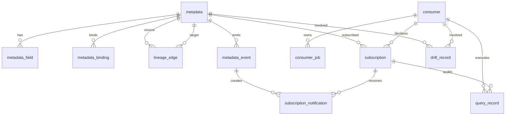

# 数据治理数据模型

本文定义数据治理平台第一期 GaussDB 主数据模型。主键统一使用字符串 ID；接口资源 ID 使用 `metadata_id` / `metadataId`，业务稳定编码使用 `asset_code` / `assetCode`。

## 1. 设计原则

- 元数据、血缘、订阅、查询记录、事件和 drift 主库存储在 GaussDB。
- Kafka topic 可以作为元数据注册和订阅通知对象，但不进入统一查询。
- 订阅是声明态和变化通知关注，不代表真实消费事实。
- 查询事实进入 `query_record`，Flink/Spark 第一阶段只保留作业声明和订阅声明。
- 服务启动时通过元数据注册接口提交微服务级完整元数据快照；服务端按 `service_name + environment` 作用域重建该微服务元数据声明态。
- 单个元数据修改和取消注册只用于运行时动态变更。

## 2. 枚举定义

| 枚举 | 取值 | 说明 |
| --- | --- | --- |
| `metadata_type` | `TABLE`、`VIEW`、`TOPIC` | 元数据逻辑类型。 |
| `source_type` | `HIVE`、`STARROCKS`、`GAUSSDB`、`ICEBERG`、`KAFKA` | 物理来源类型。 |
| `metadata_status` | `ACTIVE`、`REMOVED_BY_SNAPSHOT`、`UNREGISTERED` | 元数据状态。 |
| `producer_type` | `MICROSERVICE`、`FLINK`、`SPARK`、`MANUAL` | 注册方类型。 |
| `consumer_type` | `MICROSERVICE`、`FLINK`、`SPARK` | 消费方类型。 |
| `usage_mode` | `API_QUERY`、`SQL_QUERY`、`FLINK_JOB`、`SPARK_JOB`、`MICROSERVICE_READ` | 订阅使用模式。 |
| `lineage_type` | `TABLE`、`FIELD` | 血缘粒度。 |
| `transform_type` | `DIRECT`、`SQL`、`JOB`、`MANUAL` | 血缘转换来源。 |
| `event_type` | `SCHEMA_CHANGE`、`DATA_QUALITY_ALERT`、`DEPRECATION`、`METADATA_REMOVED` | 数据变化事件类型。 |
| `notification_status` | `PENDING`、`SENT`、`FAILED` | 平台通知发送状态。 |
| `drift_type` | `DECLARED_UNUSED`、`UNDECLARED_USAGE`、`STALE_DECLARATION` | 声明态和运行态差异类型。 |

## 3. 核心表

### 3.1 metadata

数据集元数据主表。

| 字段 | 类型 | 约束 | 说明 |
| --- | --- | --- | --- |
| `metadata_id` | `varchar(64)` | PK | 数据集元数据 ID，对应接口 `metadataId`。 |
| `asset_code` | `varchar(128)` | UK | 数据集业务稳定编码。 |
| `asset_name` | `varchar(256)` | NOT NULL | 数据集展示名称。 |
| `metadata_type` | `varchar(32)` | NOT NULL | `TABLE`、`VIEW`、`TOPIC`。 |
| `domain` | `varchar(128)` | NOT NULL | 业务域。 |
| `owner` | `varchar(128)` | NOT NULL | 责任团队或负责人。 |
| `description` | `text` |  | 数据集说明。 |
| `queryable` | `boolean` | NOT NULL | 是否允许 API / SQL 查询。 |
| `status` | `varchar(32)` | NOT NULL | `ACTIVE`、`REMOVED_BY_SNAPSHOT`、`UNREGISTERED`。 |
| `service_name` | `varchar(128)` | NOT NULL | 归属微服务或作业名称。 |
| `producer_type` | `varchar(32)` | NOT NULL | 注册方类型。 |
| `environment` | `varchar(32)` | NOT NULL | 环境，如 `dev`、`test`、`staging`、`prod`。 |
| `declaration_hash` | `varchar(128)` |  | 元数据声明哈希。 |
| `last_declared_instance_id` | `varchar(256)` |  | 最近一次声明该元数据的运行实例。 |
| `last_synced_at` | `timestamp` |  | 最近一次启动快照同步时间。 |
| `removed_by_snapshot_at` | `timestamp` |  | 被微服务快照缺失判定为下线的时间。 |
| `unregistered_at` | `timestamp` |  | 运行时取消注册时间。 |
| `created_at` | `timestamp` | NOT NULL | 创建时间。 |
| `updated_at` | `timestamp` | NOT NULL | 更新时间。 |

唯一约束建议：

```sql
unique(service_name, environment, asset_code)
```

### 3.2 metadata_field

字段 schema 表。

| 字段 | 类型 | 约束 | 说明 |
| --- | --- | --- | --- |
| `field_id` | `varchar(64)` | PK | 字段 ID。 |
| `metadata_id` | `varchar(64)` | FK | 所属元数据 ID。 |
| `field_name` | `varchar(128)` | NOT NULL | 字段名称。 |
| `field_type` | `varchar(128)` | NOT NULL | 字段类型。 |
| `nullable` | `boolean` | NOT NULL | 是否可为空。 |
| `description` | `text` |  | 字段说明。 |
| `ordinal` | `integer` |  | 字段顺序。 |
| `created_at` | `timestamp` | NOT NULL | 创建时间。 |
| `updated_at` | `timestamp` | NOT NULL | 更新时间。 |

唯一约束建议：

```sql
unique(metadata_id, field_name)
```

### 3.3 metadata_binding

物理绑定表。

| 字段 | 类型 | 约束 | 说明 |
| --- | --- | --- | --- |
| `binding_id` | `varchar(64)` | PK | 绑定 ID。 |
| `metadata_id` | `varchar(64)` | FK | 所属元数据 ID。 |
| `source_type` | `varchar(32)` | NOT NULL | `HIVE`、`STARROCKS`、`GAUSSDB`、`ICEBERG`、`KAFKA`。 |
| `catalog` | `varchar(128)` |  | StarRocks catalog 或等价逻辑目录。 |
| `database_name` | `varchar(128)` |  | 数据库或 schema 名称。 |
| `table_name` | `varchar(256)` | NOT NULL | 物理表、视图或 topic 名称。 |
| `qualified_name` | `varchar(512)` |  | 完整物理名称。 |
| `properties` | `jsonb` |  | Kafka、Iceberg 等扩展属性。 |
| `created_at` | `timestamp` | NOT NULL | 创建时间。 |
| `updated_at` | `timestamp` | NOT NULL | 更新时间。 |

### 3.4 lineage_edge

血缘边表，支持表级和字段级血缘。

| 字段 | 类型 | 约束 | 说明 |
| --- | --- | --- | --- |
| `lineage_id` | `varchar(64)` | PK | 血缘 ID。 |
| `source_metadata_id` | `varchar(64)` | FK | 上游元数据 ID。 |
| `target_metadata_id` | `varchar(64)` | FK | 下游元数据 ID。 |
| `source_field_name` | `varchar(128)` |  | 上游字段名，字段级血缘使用。 |
| `target_field_name` | `varchar(128)` |  | 下游字段名，字段级血缘使用。 |
| `lineage_type` | `varchar(32)` | NOT NULL | `TABLE` 或 `FIELD`。 |
| `transform_type` | `varchar(32)` |  | `DIRECT`、`SQL`、`JOB`、`MANUAL`。 |
| `expression` | `text` |  | 转换表达式或作业标识。 |
| `created_at` | `timestamp` | NOT NULL | 创建时间。 |
| `updated_at` | `timestamp` | NOT NULL | 更新时间。 |

### 3.5 consumer

消费方表，合并原消费方实例概念。

| 字段 | 类型 | 约束 | 说明 |
| --- | --- | --- | --- |
| `consumer_id` | `varchar(64)` | PK | 消费方 ID。 |
| `consumer_name` | `varchar(128)` | NOT NULL | 服务名、作业名或应用名。 |
| `consumer_type` | `varchar(32)` | NOT NULL | `MICROSERVICE`、`FLINK`、`SPARK`。 |
| `owner` | `varchar(128)` | NOT NULL | 责任团队或负责人。 |
| `environment` | `varchar(32)` | NOT NULL | 环境。 |
| `last_declared_at` | `timestamp` |  | 最近一次声明时间。 |
| `created_at` | `timestamp` | NOT NULL | 创建时间。 |
| `updated_at` | `timestamp` | NOT NULL | 更新时间。 |

唯一约束建议：

```sql
unique(consumer_name, environment)
```

### 3.6 subscription

订阅声明表。

| 字段 | 类型 | 约束 | 说明 |
| --- | --- | --- | --- |
| `subscription_id` | `varchar(64)` | PK | 订阅 ID。 |
| `metadata_id` | `varchar(64)` | FK | 被订阅元数据 ID。 |
| `consumer_id` | `varchar(64)` | FK | 消费方 ID。 |
| `usage_mode` | `varchar(32)` | NOT NULL | 使用模式。 |
| `purpose` | `text` | NOT NULL | 订阅用途。 |
| `declared_fields` | `jsonb` |  | 订阅字段范围，空表示全字段。 |
| `notify_on` | `jsonb` |  | 关注的事件类型。 |
| `notification_strategy` | `jsonb` |  | 通知策略。 |
| `status` | `varchar(32)` | NOT NULL | `ACTIVE`、`CANCELLED`、`REMOVED_BY_SNAPSHOT`。 |
| `last_declared_at` | `timestamp` |  | 最近一次声明时间。 |
| `last_runtime_seen_at` | `timestamp` |  | 最近一次运行态使用时间。 |
| `cancelled_at` | `timestamp` |  | 取消订阅时间。 |
| `created_at` | `timestamp` | NOT NULL | 创建时间。 |
| `updated_at` | `timestamp` | NOT NULL | 更新时间。 |

### 3.7 query_record

查询事实记录表。

| 字段 | 类型 | 约束 | 说明 |
| --- | --- | --- | --- |
| `query_record_id` | `varchar(64)` | PK | 查询记录 ID。 |
| `consumer_id` | `varchar(64)` | FK | 消费方 ID。 |
| `subscription_id` | `varchar(64)` | FK nullable | 订阅 ID。 |
| `query_mode` | `varchar(32)` | NOT NULL | `API_QUERY` 或 `SQL_QUERY`。 |
| `referenced_asset_codes` | `jsonb` |  | 查询引用的数据集编码集合。 |
| `selected_fields` | `jsonb` |  | API 查询返回字段集合。 |
| `filter_summary` | `jsonb` |  | 过滤条件摘要。 |
| `sql_text` | `text` |  | SQL Gateway 原始 SQL。 |
| `row_count` | `integer` |  | 返回行数。 |
| `status` | `varchar(32)` | NOT NULL | `SUCCESS` 或 `FAILED`。 |
| `error_message` | `text` |  | 失败原因。 |
| `created_at` | `timestamp` | NOT NULL | 查询发生时间。 |

### 3.8 consumer_job

Flink/Spark 作业声明表。

| 字段 | 类型 | 约束 | 说明 |
| --- | --- | --- | --- |
| `job_id` | `varchar(64)` | PK | 作业 ID。 |
| `consumer_id` | `varchar(64)` | FK | 作业归属消费方。 |
| `job_name` | `varchar(128)` | NOT NULL | 作业名称。 |
| `engine_type` | `varchar(32)` | NOT NULL | `FLINK` 或 `SPARK`。 |
| `input_asset_codes` | `jsonb` |  | 输入数据集编码。 |
| `output_asset_codes` | `jsonb` |  | 输出数据集编码。 |
| `status` | `varchar(32)` | NOT NULL | 声明状态。 |
| `created_at` | `timestamp` | NOT NULL | 创建时间。 |
| `updated_at` | `timestamp` | NOT NULL | 更新时间。 |

### 3.9 metadata_event

元数据变化事件表。

| 字段 | 类型 | 约束 | 说明 |
| --- | --- | --- | --- |
| `event_id` | `varchar(64)` | PK | 事件 ID。 |
| `metadata_id` | `varchar(64)` | FK | 关联元数据 ID。 |
| `event_type` | `varchar(64)` | NOT NULL | 事件类型。 |
| `event_payload` | `jsonb` |  | 事件内容。 |
| `source` | `varchar(64)` | NOT NULL | `SNAPSHOT_SYNC`、`RUNTIME_API`、`ADMIN`。 |
| `created_at` | `timestamp` | NOT NULL | 事件时间。 |

### 3.10 subscription_notification

订阅通知表。

| 字段 | 类型 | 约束 | 说明 |
| --- | --- | --- | --- |
| `notification_id` | `varchar(64)` | PK | 通知 ID。 |
| `subscription_id` | `varchar(64)` | FK | 订阅 ID。 |
| `metadata_id` | `varchar(64)` | FK | 元数据 ID。 |
| `consumer_id` | `varchar(64)` | FK | 消费方 ID。 |
| `event_id` | `varchar(64)` | FK | 事件 ID。 |
| `status` | `varchar(32)` | NOT NULL | `PENDING`、`SENT`、`FAILED`。 |
| `kafka_topic` | `varchar(128)` |  | 通知 topic。 |
| `error_message` | `text` |  | 失败原因。 |
| `created_at` | `timestamp` | NOT NULL | 创建时间。 |
| `sent_at` | `timestamp` |  | 发送时间。 |

### 3.11 drift_record

声明态和运行态差异分析表。

| 字段 | 类型 | 约束 | 说明 |
| --- | --- | --- | --- |
| `drift_id` | `varchar(64)` | PK | Drift ID。 |
| `drift_type` | `varchar(64)` | NOT NULL | 差异类型。 |
| `metadata_id` | `varchar(64)` | FK nullable | 相关元数据。 |
| `consumer_id` | `varchar(64)` | FK nullable | 相关消费方。 |
| `subscription_id` | `varchar(64)` | FK nullable | 相关订阅。 |
| `evidence` | `jsonb` |  | 差异证据。 |
| `status` | `varchar(32)` | NOT NULL | `OPEN`、`IGNORED`、`RESOLVED`。 |
| `created_at` | `timestamp` | NOT NULL | 创建时间。 |
| `resolved_at` | `timestamp` |  | 关闭时间。 |

## 4. 关系摘要


