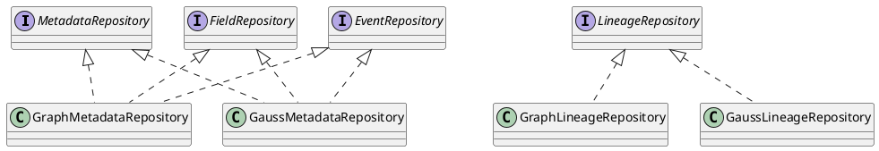
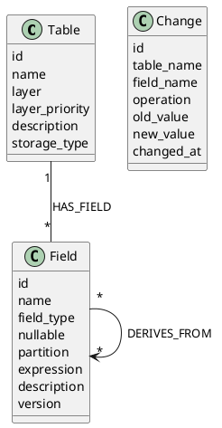

# 00 合并原则与架构决策

## 1. 合并原则

| 原则 | 说明 |
| --- | --- |
| 信息保真 | 保留 5 月文档中的 RNO 域、Agent、沙箱、UI、项目结构和验收细节。 |
| 目标统一 | 采用 Spring Boot governance-server 作为正式治理 API 服务。 |
| 持久化兼容 | 保留原有图数据库持久化层，默认图数据库；新增 GaussDB 兼容实现。 |
| 历史不动 | 不移动、不删除 5 月和 6 月历史文档。 |
| 来源可追溯 | 通过 `14-source-coverage-map.md` 映射历史章节。 |

## 2. 冲突决策

| 冲突点 | 决策 |
| --- | --- |
| FastAPI vs Spring Boot | Spring Boot 是正式治理 API 服务；Python backend 保留 Agent、search、sandbox、LLM 能力。 |
| 图数据库 vs GaussDB | 默认使用图数据库，保留原有图持久化；GaussDB 作为兼容实现，可按部署配置切换。 |
| G6 vs X6 | 目标画布使用 AntV X6；G6 只作为迁移来源。 |
| `/api/...` vs 正式治理 API | 正式治理 API 使用 `/rest/oss/inner/modelengineservice/v1`；`/api/agent` 和 `/api/sandbox` 为平台内部 API。 |
| 本地基础设施 vs shared infra | 共享基础设施由 `../shared-data-infra` 提供，本工程只保留应用层资源。 |

## 3. 持久化适配层

配置项：

| 配置 | 默认 | 说明 |
| --- | --- | --- |
| `GOVERNANCE_PERSISTENCE_MODE` | `graph` | `graph` 或 `gaussdb`。 |
| `GRAPH_DB_URI` | 由环境提供 | 图数据库连接地址。 |
| `GOVERNANCE_DB_URL` | 由环境提供 | GaussDB JDBC URL。 |

## 4. 默认图数据库模型

默认持久化保留原有模型：

## 5. GaussDB 兼容模型

GaussDB 兼容模型用于关系型部署、审计查询和 SQL 友好的治理报表：

- `metadata`
- `metadata_field`
- `metadata_binding`
- `lineage_edge`
- `consumer`
- `subscription`
- `query_record`
- `consumer_job`
- `metadata_event`
- `subscription_notification`
- `drift_record`

详细定义见 `10-data-model-and-persistence.md`。
