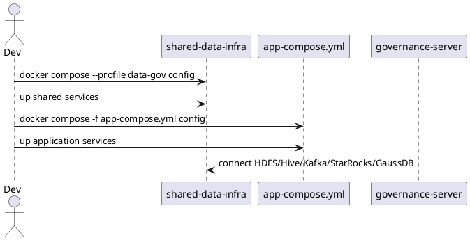
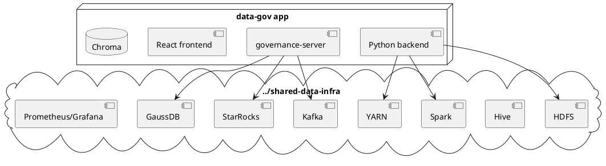
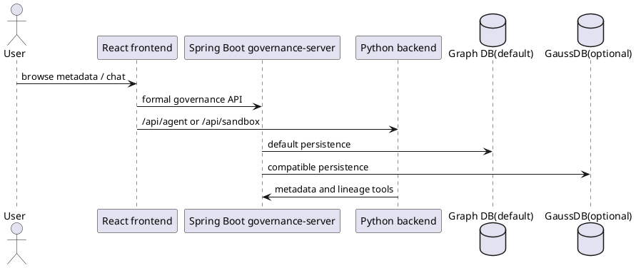
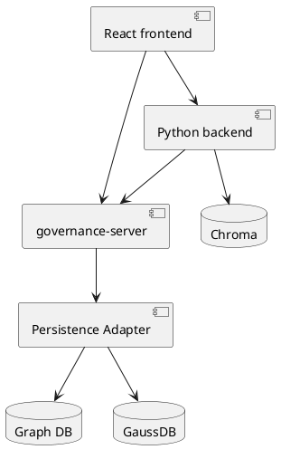
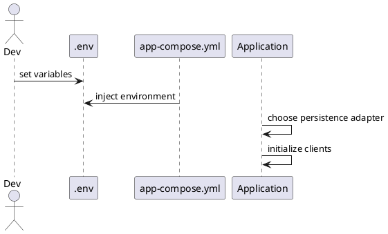
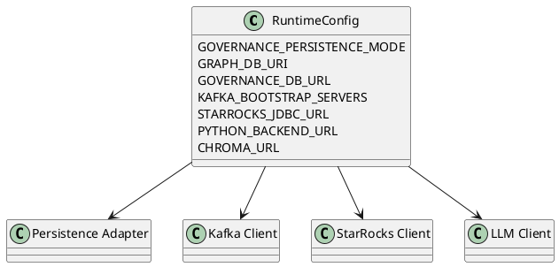
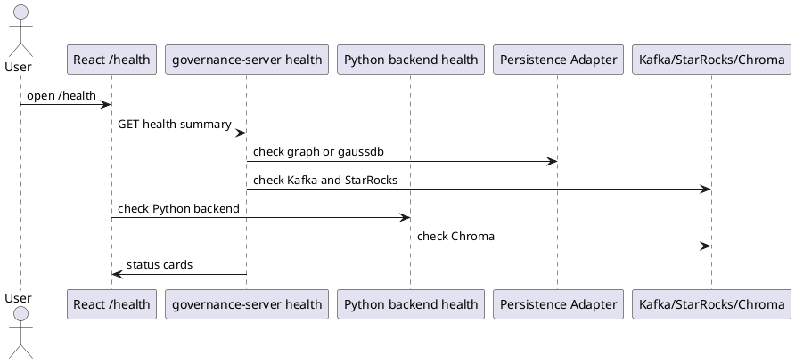
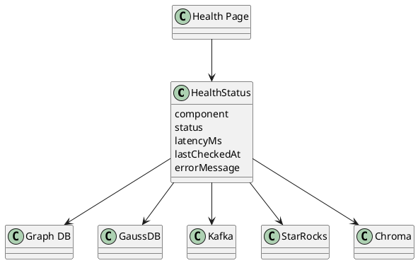

# 01 基础设施与应用运行

## 1.1 复用 shared-data-infra

### 功能描述

本工程不重复定义 HDFS、Hive、Spark、YARN、Kafka、ZooKeeper、StarRocks、Prometheus、Grafana、GaussDB 等共享服务。开发和验证环境通过 `../shared-data-infra` 的 `data-gov` profile、external network 和环境变量复用这些能力。

### 用例

| 用例 | 说明 |
| --- | --- |
| 启动共享基础设施 | 运维或开发者先启动 shared infra，再启动本工程应用层服务。 |
| 校验 compose | 修改基础设施相关配置后运行 shared infra 和 app compose config。 |
| 访问共享组件 | governance-server、Python backend 和 sandbox 通过环境变量访问共享组件。 |

### 主要流程（PlantUML）



### 逻辑图（PlantUML）



### 对外接口

| 方法 | 路径/接口 | 调用方 | 说明 |
| --- | --- | --- | --- |
| CLI | `docker compose -f ../shared-data-infra/compose.yaml --profile data-gov config` | 开发者/CI | 校验共享基础设施配置。 |
| CLI | `docker compose -f app-compose.yml config` | 开发者/CI | 校验应用层配置。 |

### UI 操作流程

不涉及。

### 数据模型

不涉及。

## 1.2 应用层服务

### 功能描述

应用层包含 Spring Boot governance-server、Python backend、React frontend 和 Chroma。governance-server 提供正式治理 API，Python backend 提供 Agent/search/sandbox，frontend 提供用户界面，Chroma 保存语义检索向量。

### 用例

| 用例 | 说明 |
| --- | --- |
| 元数据注册 | Java SDK 或服务调用 governance-server。 |
| 自然语言生成 | frontend 调用 Python backend 的 Agent 内部 API。 |
| 沙箱试跑 | Python backend 使用 shared infra 的 Spark/Flink/YARN/HDFS。 |

### 主要流程（PlantUML）



### 逻辑图（PlantUML）



### 对外接口

| 方法 | 路径/接口 | 调用方 | 说明 |
| --- | --- | --- | --- |
| HTTP | `/rest/oss/inner/modelengineservice/v1/**` | SDK/frontend/Python tools | 正式治理 API。 |
| HTTP | `/api/agent/**` | frontend | Agent 内部 API。 |
| HTTP | `/api/sandbox/**` | frontend/Agent | 沙箱内部 API。 |
| HTTP | `/health` | frontend/运维 | 聚合健康状态。 |

### UI 操作流程

用户通过 React frontend 访问 `/metadata`、`/metadata/lineage`、`/chat`、`/pipeline`、`/schema-evolution`、`/health`。所有正式治理变更经 governance-server；Agent 和沙箱经内部 API。

### 数据模型

应用层数据模型见 `10-data-model-and-persistence.md`。Chroma 保存表级和字段级向量文档。

## 1.3 配置管理

### 功能描述

通过 `.env`、环境变量、external network 和项目命名空间管理运行配置。持久化模式通过 `GOVERNANCE_PERSISTENCE_MODE` 选择，默认 `graph`。

### 用例

| 用例 | 说明 |
| --- | --- |
| 切换持久化 | 设置 `GOVERNANCE_PERSISTENCE_MODE=graph` 或 `gaussdb`。 |
| 接入共享网络 | 设置 `SHARED_INFRA_NETWORK`。 |
| 配置 LLM | 设置 DeepSeek/OpenAI-compatible 配置。 |

### 主要流程（PlantUML）



### 逻辑图（PlantUML）



### 对外接口

| 方法 | 路径/接口 | 调用方 | 说明 |
| --- | --- | --- | --- |
| env | `GOVERNANCE_PERSISTENCE_MODE` | 应用启动 | 选择 `graph` 或 `gaussdb`。 |
| env | `GRAPH_DB_URI` | governance-server | 图数据库连接。 |
| env | `GOVERNANCE_DB_URL` | governance-server | GaussDB 连接。 |
| env | `KAFKA_BOOTSTRAP_SERVERS` | governance-server/Python | Kafka 连接。 |

### UI 操作流程

不涉及。

### 数据模型

不涉及。

## 1.4 健康检查

### 功能描述

`/health` 页面聚合 Spring Boot actuator、Python backend、图数据库、GaussDB、StarRocks、Kafka、Chroma 和 shared infra 依赖状态。页面 30 秒自动刷新，异常组件高亮。

### 用例

| 用例 | 说明 |
| --- | --- |
| 运维巡检 | 打开 `/health` 查看所有依赖状态。 |
| Agent 故障定位 | 检查 Python backend、Chroma、LLM 配置。 |
| 查询故障定位 | 检查 StarRocks、图数据库/GaussDB、Kafka。 |

### 主要流程（PlantUML）



### 逻辑图（PlantUML）



### 对外接口

| 方法 | 路径/接口 | 调用方 | 说明 |
| --- | --- | --- | --- |
| GET | `/health` | frontend/运维 | 应用聚合健康状态。 |
| GET | `/actuator/health` | frontend/运维 | Spring Boot 原生健康。 |
| GET | `/api/agent/health` | frontend/运维 | Python Agent 健康。 |
| GET | `/api/sandbox/health` | frontend/运维 | 沙箱健康。 |

### UI 操作流程

用户打开 `/health`，页面展示组件状态卡片；异常卡片显示错误摘要、最近检查时间和建议检查项。页面自动刷新，也支持手动刷新。

### 数据模型

```json
{
  "component": "graph-db",
  "status": "UP",
  "latencyMs": 12,
  "lastCheckedAt": "2026-06-15T10:00:00Z",
  "errorMessage": null
}
```
