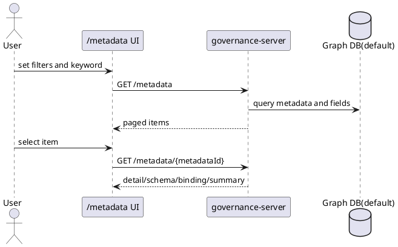
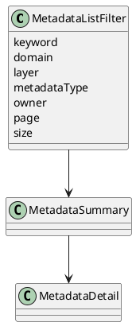
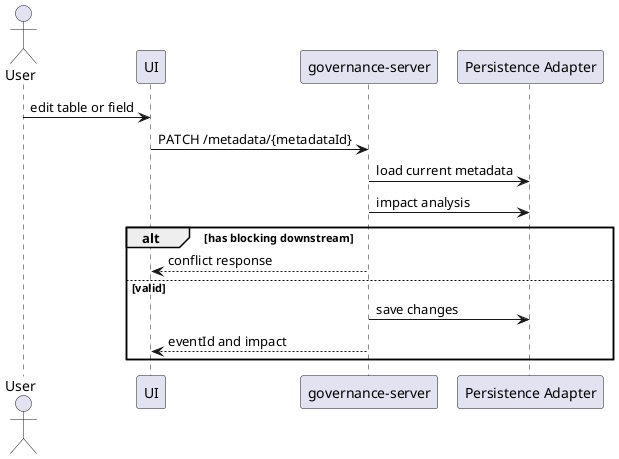
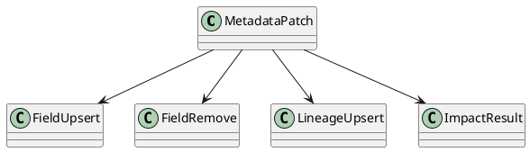
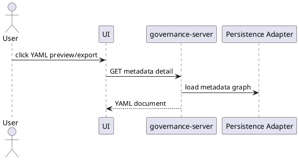
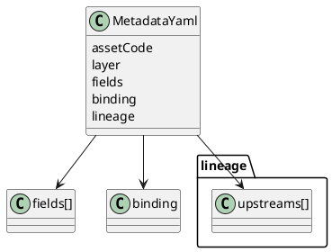
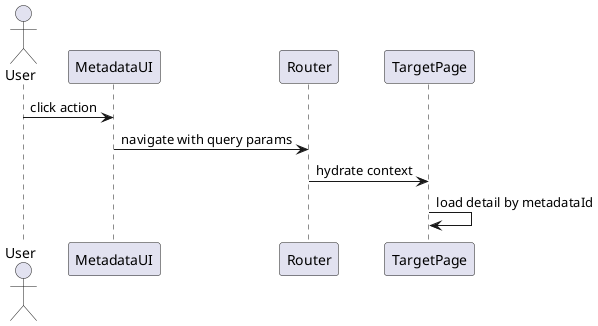
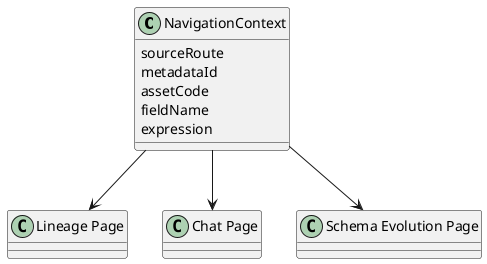

# 02 元数据管理 (/metadata)

## 2.1 浏览

### 功能描述

浏览功能支持按层级、关键词、owner、domain、metadataType、status 检索数据集，展示字段、表达式、上游、物理绑定和订阅状态。RNO 样例域保留 ODS、DWD、DWS、ADS、EVAL 分层。

### 用例

| 用例 | 说明 |
| --- | --- |
| 分层浏览 | 切换 ODS/DWD/DWS/ADS/EVAL 查看不同层表。 |
| 关键词搜索 | 搜索“信噪比”命中 `avg_sinr`。 |
| 查看详情 | 选择 `dws_cell_hourly` 查看字段和绑定。 |

### 主要流程（PlantUML）

### 逻辑图（PlantUML）

### 对外接口

| 方法 | 路径/接口 | 调用方 | 说明 |
| --- | --- | --- | --- |
| GET | `/rest/oss/inner/modelengineservice/v1/metadata` | frontend/Agent | 元数据列表。 |
| GET | `/rest/oss/inner/modelengineservice/v1/metadata/{metadataId}` | frontend/Agent | 元数据详情。 |

### UI 操作流程

打开 `/metadata`，在顶部输入关键词或选择过滤条件；左侧显示表列表，右侧显示详情；点击字段可查看表达式、上游和订阅状态；点击“查看血缘”跳转血缘图。

### 数据模型

涉及 `Table/Field` 图模型或兼容的 `metadata/metadata_field/metadata_binding` 关系模型。

## 2.2 维护

### 功能描述

维护功能支持新建表和字段、编辑表属性、存储绑定、描述、owner、字段类型、nullable、表达式，以及删除前下游影响检查。所有写入经 governance-server 和持久化适配层。

### 用例

| 用例 | 说明 |
| --- | --- |
| 新建表 | 创建 `ods_gnb_load` 并添加 5 个字段。 |
| 编辑字段 | 用 Monaco 修改 `drop_rate` 表达式。 |
| 删除保护 | 删除 `ods_ue_signal.rsrp` 前检测下游依赖并阻止。 |

### 主要流程（PlantUML）

### 逻辑图（PlantUML）

### 对外接口

| 方法 | 路径/接口 | 调用方 | 说明 |
| --- | --- | --- | --- |
| POST | `/rest/oss/inner/modelengineservice/v1/metadata/register` | SDK/admin seed | 完整快照或受控新建。 |
| PATCH | `/rest/oss/inner/modelengineservice/v1/metadata/{metadataId}` | frontend/Agent after confirmation | 修改字段、绑定、血缘。 |
| DELETE | `/rest/oss/inner/modelengineservice/v1/metadata/{metadataId}` | frontend/admin | 取消注册。 |

### UI 操作流程

用户点击“新建表”打开弹窗；字段编辑在右侧抽屉中完成；表达式使用 Monaco；保存前展示影响分析；有下游依赖时要求用户先处理下游。

### 数据模型

图数据库写入 `Table`、`Field`、`HAS_FIELD`、`DERIVES_FROM`、`Change`；GaussDB 兼容写入 `metadata`、`metadata_field`、`lineage_edge`、`metadata_event`。

## 2.3 YAML 副本

### 功能描述

YAML 副本用于人工审阅、版本 diff、Agent 上下文和离线审计。YAML 不是主持久化，主持久化默认图数据库，可兼容 GaussDB。

### 用例

| 用例 | 说明 |
| --- | --- |
| 单表导出 | 导出 `dws_cell_hourly.yaml`。 |
| 全量导出 | 按 RNO 层级导出 10 张样例表。 |
| 版本 diff | 在 `/schema-evolution` 查看 YAML old/new 差异。 |

### 主要流程（PlantUML）

### 逻辑图（PlantUML）

### 对外接口

| 方法 | 路径/接口 | 调用方 | 说明 |
| --- | --- | --- | --- |
| GET | `/rest/oss/inner/modelengineservice/v1/metadata/{metadataId}` | frontend | 获取生成 YAML 所需详情。 |
| GET | `/api/agent/context/metadata-yaml` | Agent | 内部读取 YAML 格式上下文。 |

### UI 操作流程

在表详情点击“YAML 预览”，右侧 Drawer 展示只读 YAML；点击“下载”导出单表；在演进历史中点击“YAML diff”查看版本差异。

### 数据模型

YAML 包含 `assetCode`、`assetName`、`domain`、`layer`、`metadataType`、`binding`、`fields` 和 `lineage`。

## 2.4 跳转

### 功能描述

元数据详情页支持跳转到血缘图、演进历史和 Chat，并携带 metadataId、assetCode、fieldName 和上下文。

### 用例

| 用例 | 说明 |
| --- | --- |
| 查看血缘 | 表详情跳转 `/metadata/lineage?metadataId=...`。 |
| 查看历史 | 表详情跳转 `/schema-evolution?metadataId=...`。 |
| 进入 Chat | 字段详情跳转 `/chat?context=metadata&field=...`。 |

### 主要流程（PlantUML）

### 逻辑图（PlantUML）

### 对外接口

| 方法 | 路径/接口 | 调用方 | 说明 |
| --- | --- | --- | --- |
| URL | `/metadata/lineage?metadataId=...` | frontend router | 血缘图跳转。 |
| URL | `/schema-evolution?metadataId=...` | frontend router | 演进历史跳转。 |
| URL | `/chat?context=metadata&metadataId=...&field=...` | frontend router | Chat 上下文跳转。 |

### UI 操作流程

用户在表或字段详情点击动作按钮，目标页面读取 URL 参数并调用详情 API 补齐上下文。

### 数据模型

使用 `NavigationContext`，不新增持久化模型。
