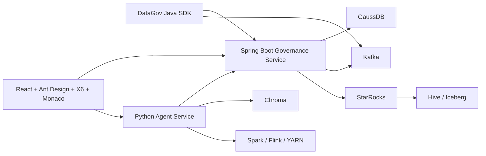

# 03. 目标架构

## 1. 架构总览

## 2. Spring Boot Governance Service

Spring Boot 是治理主服务。它负责：

- `/rest/oss/inner/modelengineservice/v1` 正式 API。
- 元数据、字段、物理绑定、血缘、订阅、查询记录、事件、通知和 drift 的主流程。
- GaussDB 事务、Flyway 迁移、JDBC、多数据源、Actuator。
- StarRocks SQL Gateway。
- Kafka 通知发布。

## 3. DataGov Java SDK

Java SDK 面向 Java 微服务、Flink Java 作业和 Spark Java/Scala 作业，负责：

- 服务启动时组装完整元数据快照并注册。
- 声明订阅和通知关注策略。
- 产品 API 查询和 SQL Gateway 调用封装。
- Kafka notification listener 和业务回调。
- StarRocks / Iceberg 物理表检查和可选自动建表。

## 4. Python Agent Service

Python 服务保留在智能能力边界内，负责：

- LangGraph 编排。
- DeepSeek 或兼容 LLM 调用。
- 语义搜索、embedding、Chroma 检索和 rerank。
- Spark/Flink/Java 沙箱编排辅助。
- 结果解释、gap proposal 和重试诊断。

Python 服务不直接写入 GaussDB 主库。涉及元数据、字段、血缘或订阅变更时，通过 Spring Boot 正式 API 提交。

## 5. Frontend

Frontend 是统一操作台，目标技术栈：

- React + TypeScript + Vite。
- Ant Design 组件体系。
- AntV X6 作为目标图画布，包括血缘图和 Pipeline DAG。
- Monaco 作为代码、表达式和 diff 查看编辑能力。
- Playwright 作为可视化和端到端验收工具。

## 6. Shared Infrastructure

基础设施由 `../shared-data-infra` 提供：

- GaussDB
- Kafka / ZooKeeper
- StarRocks
- Hive Metastore / HiveServer2
- HDFS / YARN / Spark
- Prometheus / Grafana

本工程不重复定义这些基础能力，只通过 external network、环境变量和项目命名空间复用。
