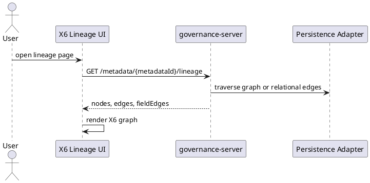
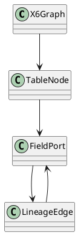
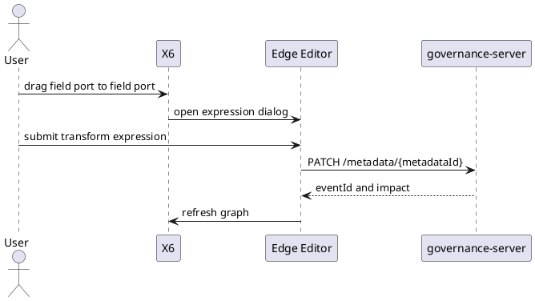
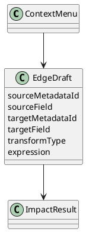
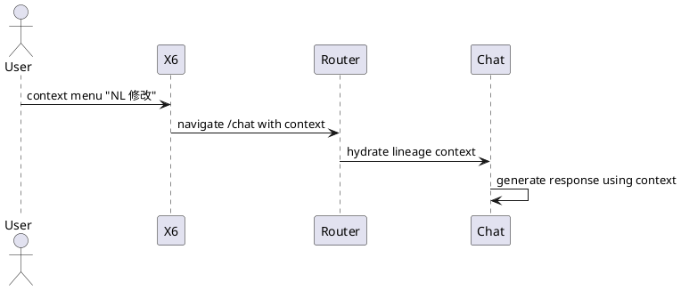
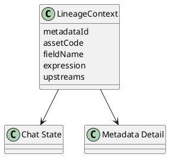

# 03 血缘图 (/metadata/lineage)

## 3.1 可视化

### 功能描述

血缘图使用 AntV X6 展示表级聚合 DAG 和字段级 DAG，支持上游/下游方向、深度 1-10、层级展开/折叠、拖拽、缩放、框选、mini map、全屏和边详情。

### 用例

| 用例 | 说明 |
| --- | --- |
| 字段血缘 | 查看 `dws_cell_hourly.avg_sinr` 的上游字段。 |
| 表级血缘 | 查看 ODS -> DWD -> DWS -> ADS -> EVAL 链路。 |
| 边详情 | 点击边查看 transform type、expression、source/target field。 |

### 主要流程（PlantUML）

### 逻辑图（PlantUML）

### 对外接口

| 方法 | 路径/接口 | 调用方 | 说明 |
| --- | --- | --- | --- |
| GET | `/rest/oss/inner/modelengineservice/v1/metadata/{metadataId}/lineage` | frontend/Agent | 查询血缘图。 |

### UI 操作流程

用户进入页面后选择方向和深度；X6 渲染图；用户可展开字段端口、点击边、拖动画布、缩放、框选和打开 mini map。

### 数据模型

图数据库读取 `DERIVES_FROM`；GaussDB 兼容读取 `lineage_edge`。响应包含 `nodes`、`edges`、`fieldEdges`。

## 3.2 维护

### 功能描述

血缘维护支持节点右键菜单、在表上加字段、编辑字段或表、拖拽新建血缘边、编辑边表达式、删除边或节点前影响检查。

### 用例

| 用例 | 说明 |
| --- | --- |
| 拖拽建边 | 从 `ods_ue_signal.imsi` 拖到 `dwd_ho_event.imsi`。 |
| 编辑边 | 修改 `avg_sinr` 的聚合表达式。 |
| 删除保护 | 删除有下游依赖的边前展示影响。 |

### 主要流程（PlantUML）

### 逻辑图（PlantUML）

### 对外接口

| 方法 | 路径/接口 | 调用方 | 说明 |
| --- | --- | --- | --- |
| PATCH | `/rest/oss/inner/modelengineservice/v1/metadata/{metadataId}` | frontend | 新增/编辑/删除字段或血缘。 |
| GET | `/rest/oss/inner/modelengineservice/v1/metadata/{metadataId}/lineage` | frontend | 保存后刷新图。 |

### UI 操作流程

右键节点或边打开菜单；选择动作后打开对应弹窗或抽屉；保存前展示影响分析；保存成功后刷新 X6 图。

### 数据模型

字段边保存为图关系 `DERIVES_FROM {transform_expr}` 或 GaussDB `lineage_edge`。

## 3.3 联动

### 功能描述

血缘图与 Chat、元数据维护和 gap 补齐联动。右键可跳转 `/chat` 并注入上下文；元数据修改后刷新图；从缺失对象补齐流程提交后也刷新图。

### 用例

| 用例 | 说明 |
| --- | --- |
| 图到 Chat | 右键 `drop_rate` 选择“用自然语言修改”。 |
| 元数据刷新 | PATCH 新增字段后图中出现字段 port。 |
| gap 补齐刷新 | Chat 生成新表后血缘图显示新节点。 |

### 主要流程（PlantUML）

### 逻辑图（PlantUML）

### 对外接口

| 方法 | 路径/接口 | 调用方 | 说明 |
| --- | --- | --- | --- |
| URL | `/chat?context=lineage&metadataId=...&field=...` | frontend router | 血缘到 Chat。 |
| GET | `/rest/oss/inner/modelengineservice/v1/metadata/{metadataId}` | Chat/Lineage | 补齐上下文。 |

### UI 操作流程

用户在血缘图中右键字段，选择 Chat 动作；Chat 页面显示已注入的表、字段、表达式和上游信息。

### 数据模型

使用 `LineageContext`，不新增持久化模型。
