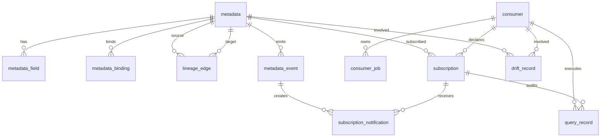

# 04. 数据模型

## 1. 设计原则

- GaussDB 是元数据和治理主库。
- 主键统一使用字符串 ID。
- 接口资源 ID 使用 `metadataId`，业务稳定编码使用 `assetCode`。
- 订阅是声明态和通知关注，不代表真实消费事实。
- 查询记录是运行态消费事实。
- 血缘主存储在关系表中，前端图形展示由 API 查询结果渲染。

## 2. 核心枚举

| 枚举 | 取值 |
| --- | --- |
| `metadata_type` | `TABLE`, `VIEW`, `TOPIC` |
| `source_type` | `HIVE`, `STARROCKS`, `GAUSSDB`, `ICEBERG`, `KAFKA` |
| `metadata_status` | `ACTIVE`, `REMOVED_BY_SNAPSHOT`, `UNREGISTERED` |
| `producer_type` | `MICROSERVICE`, `FLINK`, `SPARK`, `MANUAL` |
| `consumer_type` | `MICROSERVICE`, `FLINK`, `SPARK` |
| `usage_mode` | `API_QUERY`, `SQL_QUERY`, `FLINK_JOB`, `SPARK_JOB`, `MICROSERVICE_READ` |
| `lineage_type` | `TABLE`, `FIELD` |
| `transform_type` | `DIRECT`, `SQL`, `JOB`, `MANUAL` |
| `event_type` | `SCHEMA_CHANGE`, `DATA_QUALITY_ALERT`, `DEPRECATION`, `METADATA_REMOVED` |
| `notification_status` | `PENDING`, `SENT`, `FAILED` |
| `drift_type` | `DECLARED_UNUSED`, `UNDECLARED_USAGE`, `STALE_DECLARATION` |

## 3. 核心表

| 表 | 责任 |
| --- | --- |
| `metadata` | 数据集主表，保存 `metadata_id`、`asset_code`、名称、类型、领域、负责人、状态、归属服务和声明哈希。 |
| `metadata_field` | 字段 schema，保存字段名、类型、可空、描述、顺序。 |
| `metadata_binding` | 物理绑定，保存来源类型、catalog、database、table、qualified name 和扩展属性。 |
| `lineage_edge` | 表级和字段级血缘边，保存源/目标 metadata、源/目标字段、粒度、转换类型和表达式。 |
| `consumer` | 消费方主表，保存消费方名称、类型、负责人和环境。 |
| `subscription` | 订阅声明，保存 metadata、consumer、usage mode、字段范围、notify_on、策略和状态。 |
| `query_record` | 查询事实，保存 API/SQL 查询引用对象、字段、过滤摘要、SQL 文本、行数和状态。 |
| `consumer_job` | Flink/Spark 作业声明，保存输入输出资产编码和声明状态。 |
| `metadata_event` | 元数据变化事件，保存事件类型、来源和载荷。 |
| `subscription_notification` | 订阅通知发送记录，保存事件、订阅、Kafka topic、状态和错误信息。 |
| `drift_record` | 声明态和运行态差异记录。 |

## 4. 关系摘要

## 5. Neo4j 迁移口径

旧 Neo4j `Table`、`Field`、`DERIVES_FROM` 和 `Change` 模型不再作为目标态主存储。迁移关系：

| Neo4j 元素 | GaussDB 目标 |
| --- | --- |
| `Table` | `metadata` + `metadata_binding` |
| `Field` | `metadata_field` |
| `DERIVES_FROM` | `lineage_edge` with `lineage_type=FIELD` |
| `Change` | `metadata_event` + schema evolution 查询视图 |

如果需要图遍历，由 Spring Boot 服务在应用层基于 `lineage_edge` 查询构造图响应。
