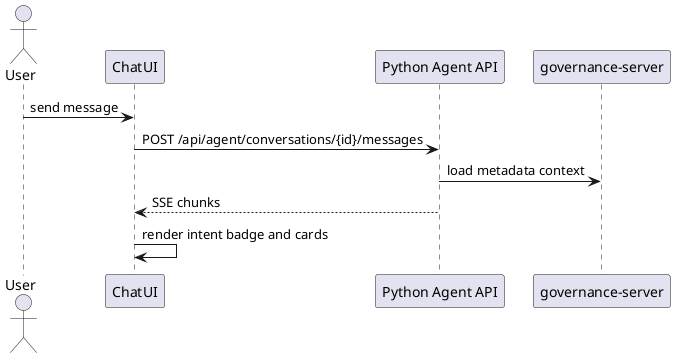
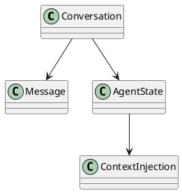
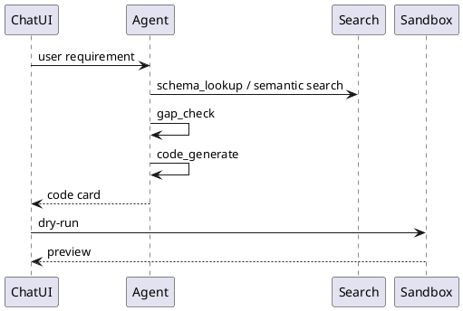
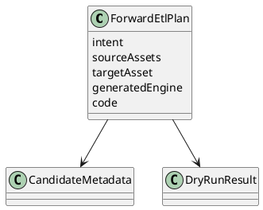
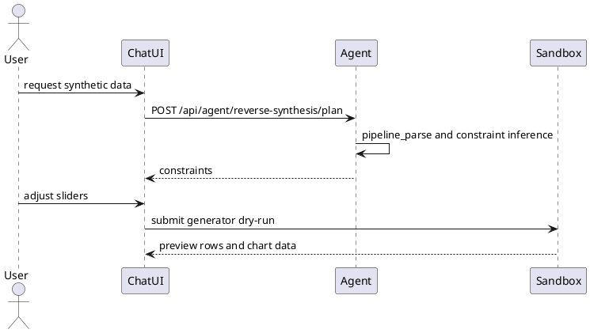
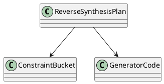
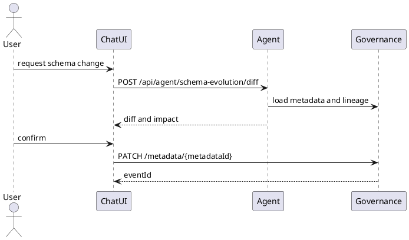
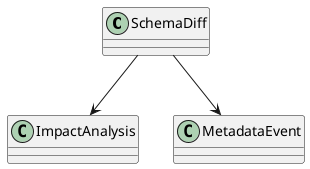

# 04 自然语言对话 (/chat)

## 0. Agent 全局能力

Agent 运行在 Python backend 中，采用 LangGraph StateGraph 组织流程。核心节点保留：

```text
classifier -> forward_etl -> schema_lookup -> gap_check -> gap_proposal -> code_generate -> dry_run -> presenter
classifier -> reverse_synth -> pipeline_parse -> gap_check -> code_generate -> dry_run -> presenter
classifier -> schema_evolve -> schema_lookup -> schema_validate -> schema_apply -> presenter
```

Agent State 至少包含 `conversationId`、`intent`、`context`、`candidateMetadata`、`selectedMetadata`、`gaps`、`schemaDiff`、`generatedCode`、`dryRunResult`、`iterationCount` 和 `errors`。

Agent Tools 包括：

| Tool | 说明 |
| --- | --- |
| `search_tables_by_keyword` | BM25 + dense vector + RRF + LLM rerank 检索表字段。 |
| `get_metadata_detail` | 调正式治理 API 获取 metadata 详情。 |
| `get_lineage` | 调正式治理 API 获取血缘。 |
| `propose_schema_change` | 生成元数据变更草案。 |
| `validate_schema_change` | 校验 diff 和影响。 |
| `apply_schema_change` | 用户确认后调用正式治理 API。 |
| `generate_code` | 生成 Spark SQL、Flink SQL、Java Flink 或数据生成器。 |
| `execute_dry_run` | 调 `/api/sandbox/dry-runs`。 |

DeepSeek 通过 OpenAI-compatible API 接入，配置包括 `DEEPSEEK_API_KEY`、`DEEPSEEK_BASE_URL`、`DEEPSEEK_MODEL`、`LLM_TIMEOUT_SECONDS` 和 `LLM_MAX_RETRIES`。

语义检索保留 5 月设计：jieba 技术术语保护、BM25、bge-small-zh-v1.5 或等价中文 embedding、Chroma、RRF 融合、低置信时 LLM rerank。RNO 术语包括 RSRP、RSRQ、SINR、IMSI、gNB、QoS、handover、throughput、latency、drop rate。

自动重试分两层：Agent 层处理计划错误和 LLM 输出解析失败，sandbox 层处理编译失败、SQL 语法错误和 YARN 提交失败。

## 4.1 对话管理

### 功能描述

对话管理支持新建对话、对话历史、SSE 流式输出、intent badge 和从 metadata、lineage、pipeline 注入上下文。Agent API 是平台内部 API。

### 用例

| 用例 | 说明 |
| --- | --- |
| 新建对话 | 用户打开 `/chat` 并创建会话。 |
| 流式输出 | 用户发送问题后 Agent 通过 SSE 返回。 |
| 上下文注入 | 从血缘图跳转时自动带入字段和表达式。 |

### 主要流程（PlantUML）



### 逻辑图（PlantUML）



### 对外接口

| 方法 | 路径/接口 | 调用方 | 说明 |
| --- | --- | --- | --- |
| POST | `/api/agent/conversations` | frontend | 创建对话。 |
| GET | `/api/agent/conversations` | frontend | 查询对话历史。 |
| POST | `/api/agent/conversations/{conversationId}/messages` | frontend | 发送消息，返回 SSE。 |
| POST | `/api/agent/context/resolve` | frontend | 根据 URL 上下文解析 Agent 上下文。 |

### UI 操作流程

用户打开 `/chat`，新建或选择历史对话，输入消息；消息流式输出；右侧显示上下文、候选表、代码卡、diff 或 dry-run 结果。

### 数据模型

```json
{
  "conversationId": "conv-001",
  "intent": "FORWARD_ETL",
  "context": {
    "sourceRoute": "/metadata/lineage",
    "metadataId": "m_dws_cell_hourly",
    "fieldName": "avg_sinr"
  }
}
```

## 4.2 正向 ETL

### 功能描述

正向 ETL 将业务语义转换为表字段匹配、候选表推荐、血缘预览、Spark SQL/Flink SQL/Java Flink 代码、Monaco 代码卡、沙箱 dry-run、preview、gap_check 和自动重试。

### 用例

| 用例 | 说明 |
| --- | --- |
| Spark SQL | “按 cell_id 计算每小时平均 RSRP 和 SINR”。 |
| Flink SQL | “从 Kafka 告警做 5 分钟窗口计数”。 |
| Java Flink | “过滤 RSRP<-110 的弱覆盖写入 HDFS”。 |

### 主要流程（PlantUML）



### 逻辑图（PlantUML）



### 对外接口

| 方法 | 路径/接口 | 调用方 | 说明 |
| --- | --- | --- | --- |
| POST | `/api/agent/etl/plan` | frontend | 生成正向 ETL 计划和代码卡。 |
| POST | `/api/sandbox/dry-runs` | frontend/Agent | 提交 dry-run。 |
| GET | `/rest/oss/inner/modelengineservice/v1/metadata` | Agent | 查找元数据。 |
| GET | `/rest/oss/inner/modelengineservice/v1/metadata/{metadataId}/lineage` | Agent | 血缘上下文。 |

### UI 操作流程

用户输入需求；Chat 显示 intent badge、候选表和代码卡；用户可编辑代码；点击 dry-run 后展示状态、日志和 preview 表格。

### 数据模型

涉及 `AgentState`、`ForwardEtlPlan`、`CodeCard`、`DryRunResult`。

## 4.3 反向合成

### 功能描述

反向合成从目标评估 pipeline 反推输入约束，展示约束面板、分档滑块、行数和值域调整，生成 Java Flink 或 Spark 数据生成器，提交沙箱并预览结果。

### 用例

| 用例 | 说明 |
| --- | --- |
| 用户评分造数 | 给 `eval_user_score` 生成优秀/良好/差三档数据。 |
| 网络健康造数 | 给 `eval_net_health` 生成不同告警强度数据。 |

### 主要流程（PlantUML）



### 逻辑图（PlantUML）



### 对外接口

| 方法 | 路径/接口 | 调用方 | 说明 |
| --- | --- | --- | --- |
| POST | `/api/agent/reverse-synthesis/plan` | frontend | 生成反向合成计划。 |
| POST | `/api/agent/reverse-synthesis/code` | frontend | 根据约束生成代码。 |
| POST | `/api/sandbox/dry-runs` | frontend/Agent | 执行生成器。 |

### UI 操作流程

Chat 展示约束表格和滑块；用户调整值域和行数；点击生成数据；结果区展示写入概览、预览表格和分档柱状图。

### 数据模型

`ConstraintBucket` 包含 bucketName、field、min、max、rows、distribution。

## 4.4 元数据演进

### 功能描述

元数据演进支持业务语义到目标表字段匹配、变更一致性校验、diff 面板、下游影响分析、用户确认后提交正式治理 API 和变更历史记录。

### 用例

| 用例 | 说明 |
| --- | --- |
| 新增字段 | “给 `dwd_session_qos` 加 `jitter` 字段”。 |
| 修改公式 | “把 `qoe_score` 权重改为 0.6/0.4”。 |
| 删除保护 | “删除 `rsrp`”时显示下游影响。 |

### 主要流程（PlantUML）



### 逻辑图（PlantUML）



### 对外接口

| 方法 | 路径/接口 | 调用方 | 说明 |
| --- | --- | --- | --- |
| POST | `/api/agent/schema-evolution/diff` | frontend | 生成 diff 和影响分析。 |
| POST | `/api/agent/schema-evolution/validate` | frontend | 校验 diff。 |
| PATCH | `/rest/oss/inner/modelengineservice/v1/metadata/{metadataId}` | frontend | 用户确认后提交。 |

### UI 操作流程

Chat 展示 diff、影响警告和确认按钮；用户确认后提交正式治理 API；成功后跳转或提示可在 `/schema-evolution` 查看历史。

### 数据模型

涉及 `SchemaDiff`、`ImpactAnalysis`、图数据库 `Change` 或 GaussDB `metadata_event`。
