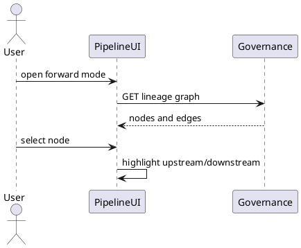
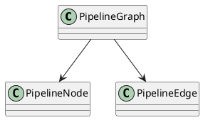
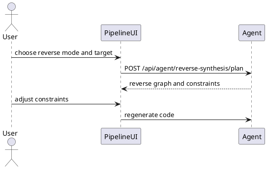
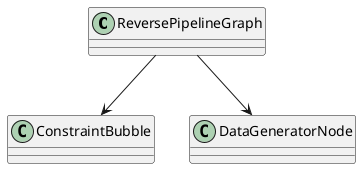
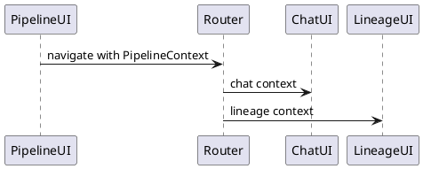
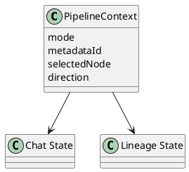

# 05 Pipeline 可视化 (/pipeline)

## 5.1 正向 ETL DAG

### 功能描述

正向 ETL DAG 展示 ODS -> DWD -> DWS -> ADS -> EVAL 的链路，支持选中表上下游突出、层级滑块、节点 hover 字段/存储/表达式、右键或按钮跳转 `/chat`。

### 用例

| 用例 | 说明 |
| --- | --- |
| 查看主链路 | `ods_ue_signal -> dwd_session_qos -> dws_cell_hourly -> ads_cell_profile -> eval_user_score`。 |
| 聚焦节点 | 选中 `dws_cell_hourly` 高亮上下游。 |
| 发起 NL 查询 | 从节点跳转 Chat 并注入上下文。 |

### 主要流程（PlantUML）

### 逻辑图（PlantUML）

### 对外接口

| 方法 | 路径/接口 | 调用方 | 说明 |
| --- | --- | --- | --- |
| GET | `/rest/oss/inner/modelengineservice/v1/metadata/{metadataId}/lineage` | frontend | 获取正向 DAG。 |
| URL | `/chat?context=pipeline&metadataId=...` | frontend router | 跳转 Chat。 |

### UI 操作流程

打开 `/pipeline` 选择正向模式；通过层级滑块控制展示范围；hover 节点查看字段、存储、表达式；点击 Chat 动作跳转对话。

### 数据模型

使用血缘响应 `nodes`、`edges`、`fieldEdges`，不新增持久化模型。

## 5.2 反向合成 DAG

### 功能描述

反向合成 DAG 从目标表出发展示约束推断、逐层回溯和数据生成器入口。每层显示约束气泡，支持图上直接调整约束值域。

### 用例

| 用例 | 说明 |
| --- | --- |
| 评分造数 | 选择 `eval_user_score` 反推输入数据约束。 |
| 调整分档 | 图上调整优秀/良好/差的 qoe_score 值域。 |

### 主要流程（PlantUML）

### 逻辑图（PlantUML）

### 对外接口

| 方法 | 路径/接口 | 调用方 | 说明 |
| --- | --- | --- | --- |
| POST | `/api/agent/reverse-synthesis/plan` | frontend | 生成反向 DAG 与约束。 |
| POST | `/api/agent/reverse-synthesis/code` | frontend | 生成数据生成器代码。 |

### UI 操作流程

切换反向模式，选择目标表；页面显示目标表、约束推断、逐层回溯和数据生成器；用户调整约束后生成代码并进入沙箱。

### 数据模型

使用 `ReverseSynthesisPlan`、`ConstraintBucket`，详见 `04-natural-language-chat.md`。

## 5.3 联动

### 功能描述

Pipeline 与 `/chat` 共享上下文，与 `/metadata/lineage` 共享 X6 能力，支持正向/反向一键切换。

### 用例

| 用例 | 说明 |
| --- | --- |
| Pipeline 到 Chat | 选中 `dws_cell_hourly` 后发起自然语言查询。 |
| Pipeline 到血缘 | 在 DAG 节点上查看字段级血缘。 |
| 模式切换 | 正向 ETL 图切换为反向合成图。 |

### 主要流程（PlantUML）

### 逻辑图（PlantUML）

### 对外接口

| 方法 | 路径/接口 | 调用方 | 说明 |
| --- | --- | --- | --- |
| URL | `/chat?context=pipeline&metadataId=...` | frontend | Pipeline 到 Chat。 |
| URL | `/metadata/lineage?metadataId=...` | frontend | Pipeline 到血缘。 |

### UI 操作流程

用户在 Pipeline 图上选择节点，点击 Chat 或 Lineage 动作；目标页面读取上下文并加载详情。

### 数据模型

使用 `PipelineContext`，不新增持久化模型。
