# 06 元数据演进历史 (/schema-evolution)

## 6.1 变更时间线

### 功能描述

按时间倒序展示图数据库 `Change` 节点或 GaussDB `metadata_event`，覆盖新增表、字段变更、血缘变更、快照下线和运行时取消注册。

### 用例

| 用例 | 说明 |
| --- | --- |
| 查看最近变更 | 打开页面查看最近元数据事件。 |
| 回看 Agent 修改 | 找到由 schema_evolve 触发的字段变更。 |

### 主要流程（PlantUML）

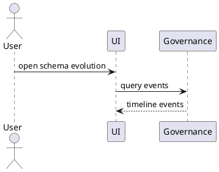

### 逻辑图（PlantUML）

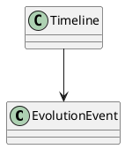

### 对外接口

| 方法 | 路径/接口 | 调用方 | 说明 |
| --- | --- | --- | --- |
| GET | `/rest/oss/inner/modelengineservice/v1/metadata/events` | frontend | 查询元数据事件。 |

### UI 操作流程

用户打开页面，左侧时间线展示事件卡片，点击卡片右侧显示详情和 diff。

### 数据模型

图数据库 `Change` 或 GaussDB `metadata_event`。

## 6.2 按表、字段、操作类型过滤

### 功能描述

支持按 metadata、field、operation、source、date range 和 keyword 过滤事件。

### 用例

| 用例 | 说明 |
| --- | --- |
| 按表过滤 | 查看 `dwd_session_qos` 的变更。 |
| 按字段过滤 | 查看 `avg_sinr` 的表达式变更。 |
| 按来源过滤 | 查看 Agent 触发的变更。 |

### 主要流程（PlantUML）

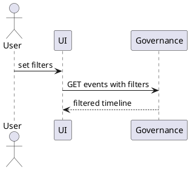

### 逻辑图（PlantUML）

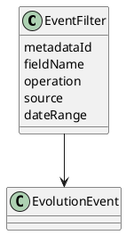

### 对外接口

| 方法 | 路径/接口 | 调用方 | 说明 |
| --- | --- | --- | --- |
| GET | `/rest/oss/inner/modelengineservice/v1/metadata/events?metadataId=&fieldName=&operation=` | frontend | 事件过滤。 |

### UI 操作流程

用户在顶部过滤条选择条件，时间线实时刷新。

### 数据模型

使用事件过滤 DTO，不新增持久化模型。

## 6.3 变更详情: old/new diff

### 功能描述

展示字段、表属性、绑定或血缘的 old/new 对比，支持表达式差异和下游影响摘要。

### 用例

| 用例 | 说明 |
| --- | --- |
| 字段新增 | 查看 `jitter` 字段新增详情。 |
| 公式修改 | 对比 `qoe_score` 旧/新权重。 |

### 主要流程（PlantUML）

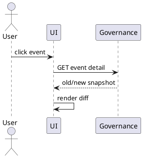

### 逻辑图（PlantUML）

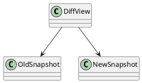

### 对外接口

| 方法 | 路径/接口 | 调用方 | 说明 |
| --- | --- | --- | --- |
| GET | `/rest/oss/inner/modelengineservice/v1/metadata/events/{eventId}` | frontend | 事件详情。 |

### UI 操作流程

点击时间线事件，在右侧展示 old/new diff 和影响信息。

### 数据模型

事件 payload 保存 oldSnapshot、newSnapshot、changedFields、impact。

## 6.4 YAML diff

### 功能描述

展示 YAML 副本的版本差异，方便人工审阅和审计。

### 用例

| 用例 | 说明 |
| --- | --- |
| 表 YAML 对比 | 查看 `dws_cell_hourly.yaml` 变更。 |
| 字段 YAML 对比 | 查看新增字段在 YAML 中的差异。 |

### 主要流程（PlantUML）

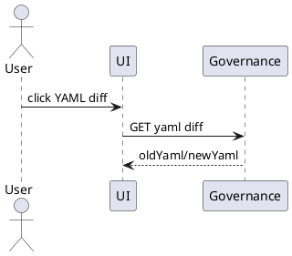

### 逻辑图（PlantUML）

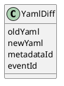

### 对外接口

| 方法 | 路径/接口 | 调用方 | 说明 |
| --- | --- | --- | --- |
| GET | `/rest/oss/inner/modelengineservice/v1/metadata/events/{eventId}/yaml-diff` | frontend | YAML diff。 |

### UI 操作流程

点击事件中的 YAML diff 按钮，右侧打开只读对比面板。

### 数据模型

YAML diff 来自事件 payload 或副本生成器。

## 6.5 从 /metadata 跳转并预过滤

### 功能描述

从 `/metadata` 表详情跳转时携带 metadataId，演进页面自动按该表预过滤。

### 用例

| 用例 | 说明 |
| --- | --- |
| 表详情查历史 | 从 `dwd_session_qos` 跳转查看历史。 |

### 主要流程（PlantUML）

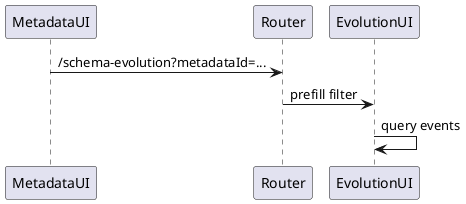

### 逻辑图（PlantUML）

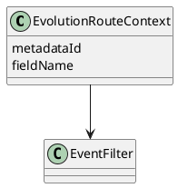

### 对外接口

| 方法 | 路径/接口 | 调用方 | 说明 |
| --- | --- | --- | --- |
| URL | `/schema-evolution?metadataId=...` | frontend router | 预过滤跳转。 |

### UI 操作流程

用户在 `/metadata` 点击“演进历史”，跳转后过滤条件自动填充。

### 数据模型

不涉及。

## 6.6 回看影响分析和操作者

### 功能描述

事件详情展示操作者、来源、影响的下游 metadata、订阅和查询事实。

### 用例

| 用例 | 说明 |
| --- | --- |
| 查操作者 | 查看某字段是谁修改。 |
| 查影响 | 查看修改影响哪些订阅方。 |

### 主要流程（PlantUML）

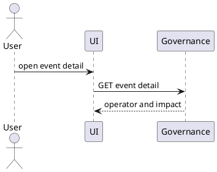

### 逻辑图（PlantUML）

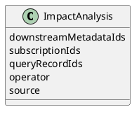

### 对外接口

| 方法 | 路径/接口 | 调用方 | 说明 |
| --- | --- | --- | --- |
| GET | `/rest/oss/inner/modelengineservice/v1/metadata/events/{eventId}` | frontend | 包含操作者和影响分析。 |

### UI 操作流程

在事件详情中查看操作者、来源、影响范围，并可跳转到受影响 metadata 或订阅。

### 数据模型

`Change` 或 `metadata_event.event_payload.impact`。
