# 07 沙箱与 dry-run

## 7.1 Spark SQL 模板

### 功能描述

Spark SQL 模板用于执行 Agent 生成的批处理 SQL，支持 source/sink 注入、preview limit 和临时路径。

### 用例

| 用例 | 说明 |
| --- | --- |
| 小区小时聚合 | 执行 `dws_cell_hourly` 聚合 SQL。 |

### 主要流程（PlantUML）

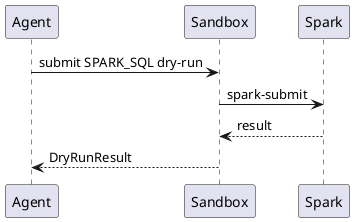

### 逻辑图（PlantUML）

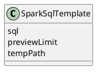

### 对外接口

| 方法 | 路径/接口 | 调用方 | 说明 |
| --- | --- | --- | --- |
| POST | `/api/sandbox/dry-runs` | frontend/Agent | `engine=SPARK_SQL`。 |

### UI 操作流程

用户在代码卡点击 dry-run，状态面板显示提交、运行、完成和预览。

### 数据模型

`DryRunRequest.engine=SPARK_SQL`。

## 7.2 Flink SQL 模板

### 功能描述

Flink SQL 模板用于流式 SQL 试跑，支持 Kafka source、窗口聚合和测试 sink。

### 用例

| 用例 | 说明 |
| --- | --- |
| 告警窗口统计 | 从 `ods_gnb_alarm` topic 做 5 分钟窗口计数。 |

### 主要流程（PlantUML）

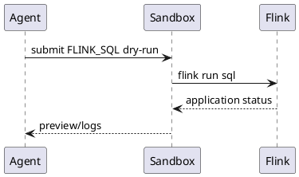

### 逻辑图（PlantUML）

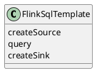

### 对外接口

| 方法 | 路径/接口 | 调用方 | 说明 |
| --- | --- | --- | --- |
| POST | `/api/sandbox/dry-runs` | frontend/Agent | `engine=FLINK_SQL`。 |

### UI 操作流程

不涉及独立页面；通过 Chat 代码卡触发。

### 数据模型

`DryRunRequest.engine=FLINK_SQL`。

## 7.3 Java Flink 模板

### 功能描述

Java Flink 模板用于 DataStream 程序试跑，包含 Maven 项目骨架、main class、Kafka source、filter、sink。

### 用例

| 用例 | 说明 |
| --- | --- |
| 弱覆盖过滤 | 过滤 `RSRP<-110` 的 UE 信号写入 HDFS。 |

### 主要流程（PlantUML）

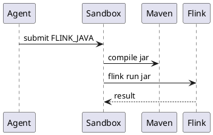

### 逻辑图（PlantUML）

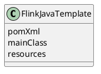

### 对外接口

| 方法 | 路径/接口 | 调用方 | 说明 |
| --- | --- | --- | --- |
| POST | `/api/sandbox/dry-runs` | frontend/Agent | `engine=FLINK_JAVA`。 |

### UI 操作流程

通过 Chat 代码卡提交，日志面板显示 Maven 编译和 YARN applicationId。

### 数据模型

`DryRunRequest.engine=FLINK_JAVA`。

## 7.4 Maven 编译

### 功能描述

Maven 编译用于 Java Flink 模板，捕获编译错误并反馈给 Agent 自动修正。

### 用例

| 用例 | 说明 |
| --- | --- |
| 编译失败重试 | 缺少 import 时 Agent 修复代码再编译。 |

### 主要流程（PlantUML）

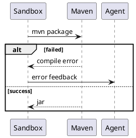

### 逻辑图（PlantUML）

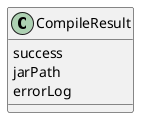

### 对外接口

| 方法 | 路径/接口 | 调用方 | 说明 |
| --- | --- | --- | --- |
| GET | `/api/sandbox/dry-runs/{runId}/logs` | frontend | 查看编译日志。 |

### UI 操作流程

dry-run 详情显示 Maven 编译阶段和错误摘要。

### 数据模型

`CompileResult` 嵌入 `DryRunResult.logs`。

## 7.5 spark-submit / flink run 提交到 YARN

### 功能描述

沙箱统一提交到 shared infra 的 YARN，不在本工程重复定义 Spark/Flink/YARN 容器。

### 用例

| 用例 | 说明 |
| --- | --- |
| Spark dry-run | spark-submit 到 YARN。 |
| Flink dry-run | flink run 到 YARN。 |

### 主要流程（PlantUML）

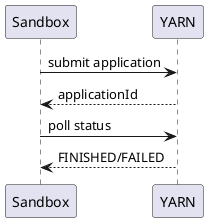

### 逻辑图（PlantUML）

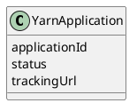

### 对外接口

| 方法 | 路径/接口 | 调用方 | 说明 |
| --- | --- | --- | --- |
| GET | `/api/sandbox/dry-runs/{runId}` | frontend/Agent | 查询运行状态和 applicationId。 |

### UI 操作流程

状态面板显示 queued、running、finished、failed，并展示 tracking URL。

### 数据模型

`DryRunResult.applicationId`、`status`、`trackingUrl`。

## 7.6 HDFS 结果回读

### 功能描述

dry-run 完成后从 HDFS 临时目录回读 preview 行，展示给 Chat 和 Pipeline。

### 用例

| 用例 | 说明 |
| --- | --- |
| 预览一行 | Spark SQL 完成后回读 1 行结果。 |

### 主要流程（PlantUML）

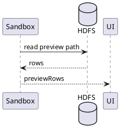

### 逻辑图（PlantUML）

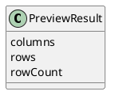

### 对外接口

| 方法 | 路径/接口 | 调用方 | 说明 |
| --- | --- | --- | --- |
| GET | `/api/sandbox/dry-runs/{runId}/preview` | frontend | 查询预览结果。 |

### UI 操作流程

dry-run 成功后结果区显示 Ant Table 和字段类型。

### 数据模型

`PreviewResult`。

## 7.7 自动重试

### 功能描述

沙箱层自动重试编译失败、SQL 语法错误和提交失败，最多 3 次。错误反馈给 Agent 修正，不计入 Agent 层 iterationCount。

### 用例

| 用例 | 说明 |
| --- | --- |
| SQL 拼写错误 | `SLECT` 被修正后重跑。 |
| Java 编译错误 | 缺少 import 后自动修正。 |

### 主要流程（PlantUML）

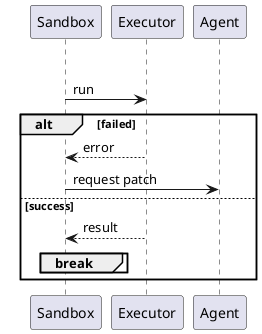

### 逻辑图（PlantUML）

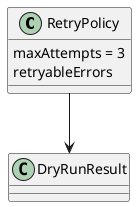

### 对外接口

| 方法 | 路径/接口 | 调用方 | 说明 |
| --- | --- | --- | --- |
| POST | `/api/sandbox/dry-runs/{runId}/retry` | frontend/Agent | 手动触发重试。 |

### UI 操作流程

自动重试时日志显示 attempt 序号和修正摘要；失败后允许用户手动重试。

### 数据模型

`DryRunResult.attempts`、`RetryPolicy`。

## 7.8 临时目录清理

### 功能描述

沙箱临时目录和编译产物按 TTL 清理，避免 HDFS 和本地工作目录膨胀。

### 用例

| 用例 | 说明 |
| --- | --- |
| 定期清理 | 清理 24 小时前的 dry-run 目录。 |

### 主要流程（PlantUML）

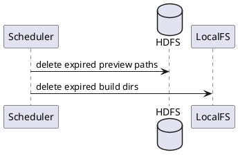

### 逻辑图（PlantUML）

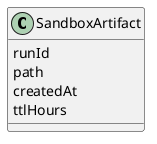

### 对外接口

| 方法 | 路径/接口 | 调用方 | 说明 |
| --- | --- | --- | --- |
| POST | `/api/sandbox/cleanup` | admin/internal scheduler | 触发清理。 |

### UI 操作流程

不涉及。

### 数据模型

`SandboxArtifact` 可保存在本地状态文件或运行记录中，首期不要求持久化到治理主库。
