# 08 订阅、查询和通知

## 8.1 数据集订阅

### 功能描述

数据集订阅表达消费方对 metadata 的使用意图和变化通知关注，可声明字段范围、用途、使用模式和通知策略。

### 用例

| 用例 | 说明 |
| --- | --- |
| Dashboard 订阅 | `rno-dashboard` 订阅 `dws_cell_hourly` 的 SINR 字段。 |

### 主要流程（PlantUML）

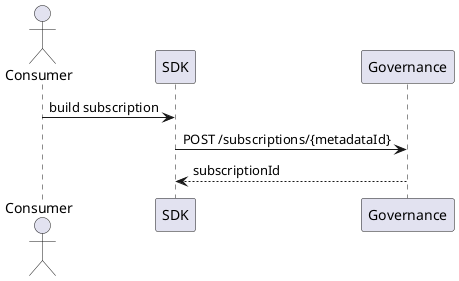

### 逻辑图（PlantUML）

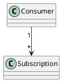

### 对外接口

| 方法 | 路径/接口 | 调用方 | 说明 |
| --- | --- | --- | --- |
| POST | `/rest/oss/inner/modelengineservice/v1/subscriptions/{metadataId}` | SDK/frontend | 创建订阅。 |

### UI 操作流程

在元数据详情点击“订阅”，填写用途、字段范围和通知策略，保存后显示订阅状态。

### 数据模型

图数据库可保存 `Consumer`、`Subscription` 节点和关系；GaussDB 兼容使用 `consumer`、`subscription`。

## 8.2 订阅查询和取消

### 功能描述

支持查询某 metadata 的订阅声明，按 consumer、environment、status 过滤；支持取消订阅。

### 用例

| 用例 | 说明 |
| --- | --- |
| 查看订阅方 | 管理员查看 `dws_cell_hourly` 被哪些服务订阅。 |
| 取消订阅 | Dashboard 不再使用该表后取消。 |

### 主要流程（PlantUML）

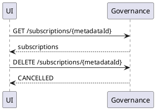

### 逻辑图（PlantUML）

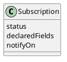

### 对外接口

| 方法 | 路径/接口 | 调用方 | 说明 |
| --- | --- | --- | --- |
| GET | `/rest/oss/inner/modelengineservice/v1/subscriptions/{metadataId}` | frontend/SDK | 查询订阅。 |
| DELETE | `/rest/oss/inner/modelengineservice/v1/subscriptions/{metadataId}` | frontend/SDK | 取消订阅。 |

### UI 操作流程

在元数据详情订阅 tab 中查看订阅；选择订阅并点击取消，填写原因。

### 数据模型

`subscription.status` 或图节点属性变为 `CANCELLED`。

## 8.3 API query

### 功能描述

API query 查询单个可查询 metadata，支持字段选择、过滤、limit，并写入查询审计。

### 用例

| 用例 | 说明 |
| --- | --- |
| 查询小区指标 | 查询 `dws_cell_hourly` 的 `cell_id`、`avg_sinr`。 |

### 主要流程（PlantUML）

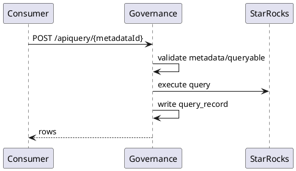

### 逻辑图（PlantUML）

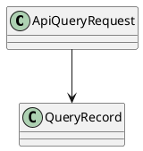

### 对外接口

| 方法 | 路径/接口 | 调用方 | 说明 |
| --- | --- | --- | --- |
| POST | `/rest/oss/inner/modelengineservice/v1/apiquery/{metadataId}` | SDK/consumer | 查询单数据集。 |

### UI 操作流程

治理后台可提供测试查询面板；业务系统通常通过 SDK 调用。

### 数据模型

`query_record` 或图查询事实节点。

## 8.4 SQL Gateway

### 功能描述

SQL Gateway 支持已注册数据集的只读 SQL 查询，拒绝未注册对象、非 SELECT 和 Kafka topic 内容查询，优先通过 StarRocks 执行。

### 用例

| 用例 | 说明 |
| --- | --- |
| 聚合查询 | `SELECT cell_id, AVG(avg_sinr) FROM dws_cell_hourly GROUP BY cell_id`。 |
| 拒绝未注册表 | SQL 引用未知表时返回错误。 |

### 主要流程（PlantUML）

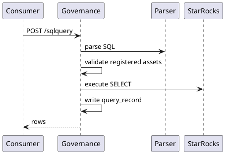

### 逻辑图（PlantUML）

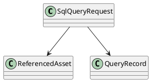

### 对外接口

| 方法 | 路径/接口 | 调用方 | 说明 |
| --- | --- | --- | --- |
| POST | `/rest/oss/inner/modelengineservice/v1/sqlquery` | SDK/consumer | 只读 SQL 查询。 |

### UI 操作流程

治理后台可提供 SQL 测试输入框，显示引用资产、结果行和 queryRecordId。

### 数据模型

`query_record.sql_text`、`referenced_asset_codes`。

## 8.5 query_record 审计

### 功能描述

query_record 表示真实运行态消费，用于回答谁实际使用了什么数据，并支撑 drift 分析。

### 用例

| 用例 | 说明 |
| --- | --- |
| 查询审计 | 查看 `rno-dashboard` 最近查询了哪些表。 |
| drift 输入 | 有查询但无订阅触发 `UNDECLARED_USAGE`。 |

### 主要流程（PlantUML）

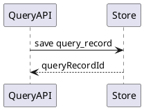

### 逻辑图（PlantUML）

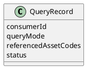

### 对外接口

| 方法 | 路径/接口 | 调用方 | 说明 |
| --- | --- | --- | --- |
| GET | `/rest/oss/inner/modelengineservice/v1/query-records` | governance UI | 查询审计记录。 |

### UI 操作流程

治理后台展示查询历史，可按 consumer、asset、status、时间过滤。

### 数据模型

图数据库可保存 `QueryRecord` 节点；GaussDB 兼容使用 `query_record`。

## 8.6 metadata_event

### 功能描述

metadata_event 或图数据库 `Change` 记录元数据变更，是通知、演进历史和审计的输入。

### 用例

| 用例 | 说明 |
| --- | --- |
| 字段新增事件 | PATCH 新增 `jitter` 后产生事件。 |
| 快照下线事件 | 启动快照缺失资产后产生下线事件。 |

### 主要流程（PlantUML）

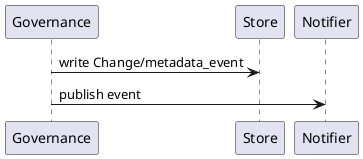

### 逻辑图（PlantUML）

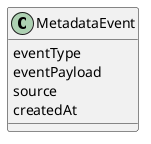

### 对外接口

| 方法 | 路径/接口 | 调用方 | 说明 |
| --- | --- | --- | --- |
| GET | `/rest/oss/inner/modelengineservice/v1/metadata/events` | frontend | 查询事件。 |

### UI 操作流程

事件在 `/schema-evolution` 中展示。

### 数据模型

图数据库 `Change` 或 GaussDB `metadata_event`。

## 8.7 subscription_notification

### 功能描述

事件匹配订阅后生成 subscription_notification，并异步投递到 Kafka。

### 用例

| 用例 | 说明 |
| --- | --- |
| schema 通知 | 订阅字段发生变化后通知消费方。 |

### 主要流程（PlantUML）

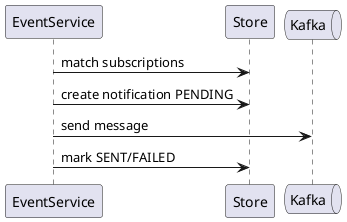

### 逻辑图（PlantUML）

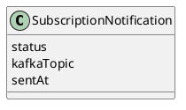

### 对外接口

| 方法 | 路径/接口 | 调用方 | 说明 |
| --- | --- | --- | --- |
| GET | `/rest/oss/inner/modelengineservice/v1/notifications` | governance UI | 查询通知状态。 |

### UI 操作流程

治理后台可查看通知发送状态和失败原因。

### 数据模型

图数据库通知节点或 GaussDB `subscription_notification`。

## 8.8 Kafka listener

### 功能描述

Java SDK listener 消费通知 topic，回调业务处理器，例如刷新缓存、重新拉取 schema、触发兼容性检查。

### 用例

| 用例 | 说明 |
| --- | --- |
| schema changed | listener 收到字段变更通知并刷新缓存。 |

### 主要流程（PlantUML）

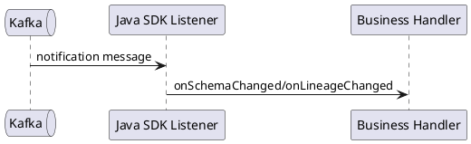

### 逻辑图（PlantUML）

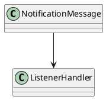

### 对外接口

| 方法 | 路径/接口 | 调用方 | 说明 |
| --- | --- | --- | --- |
| Kafka | `data-governance-notifications` | SDK listener | 通知 topic。 |

### UI 操作流程

不涉及。

### 数据模型

Kafka message 包含 notificationId、subscriptionId、metadataId、assetCode、eventType、changedFields、occurredAt。

## 8.9 drift 分析

### 功能描述

drift 对比声明态和运行态，识别声明未使用、未声明使用、声明陈旧、血缘破损和物理 schema 差异。

### 用例

| 用例 | 说明 |
| --- | --- |
| DECLARED_UNUSED | 有订阅但长期无查询。 |
| UNDECLARED_USAGE | 有 query_record 但无订阅。 |
| PHYSICAL_SCHEMA_DRIFT | 物理表字段与声明不一致。 |

### 主要流程（PlantUML）

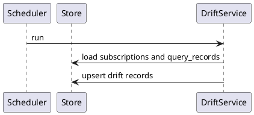

### 逻辑图（PlantUML）

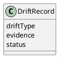

### 对外接口

| 方法 | 路径/接口 | 调用方 | 说明 |
| --- | --- | --- | --- |
| GET | `/rest/oss/inner/modelengineservice/v1/drift-records` | governance UI | 查询 drift。 |
| POST | `/rest/oss/inner/modelengineservice/v1/drift-analysis/run` | admin/scheduler | 触发分析。 |

### UI 操作流程

治理后台展示 drift 列表，支持忽略、关闭和跳转到证据。

### 数据模型

图数据库 `DriftRecord` 节点或 GaussDB `drift_record`。
