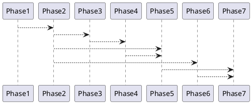

# 12 实施路线

## 1. 阶段

| 阶段 | 目标 |
| --- | --- |
| Phase 1 | Spring Boot governance-server、持久化适配层、默认图数据库接入、GaussDB 兼容 schema。 |
| Phase 2 | 元数据 register/list/detail/lineage/PATCH/DELETE，RNO 10 表注册。 |
| Phase 3 | Agent 内部 API、语义检索、DeepSeek、Chat SSE。 |
| Phase 4 | Sandbox 内部 API、Spark/Flink/Java Flink dry-run。 |
| Phase 5 | React UI：metadata、lineage、chat、pipeline、schema-evolution、health。 |
| Phase 6 | 订阅、query、notification、Kafka listener、drift。 |
| Phase 7 | 验收、覆盖检查和文档固化。 |

## 2. 依赖

## 3. 首期优先级

1. 持久化适配层先支持 graph mode。
2. GaussDB schema 和 repository 可在同一接口下补齐。
3. UI 先读后写：metadata/lineage 只读渲染，再做维护。
4. Agent 先生成 diff 和代码卡，再接沙箱。
5. 沙箱先 Spark SQL，再 Flink SQL，再 Java Flink。
