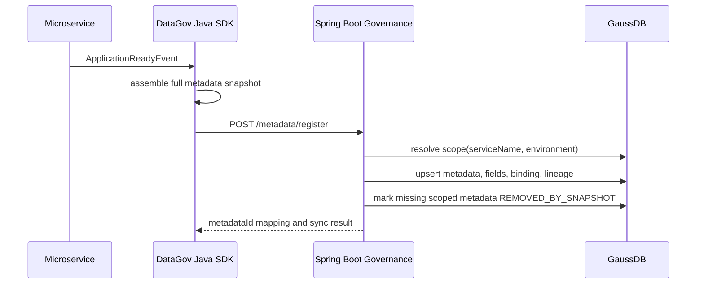
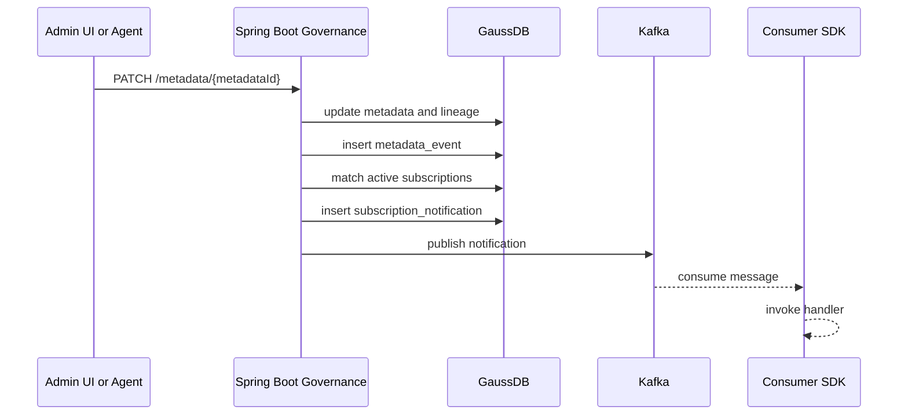
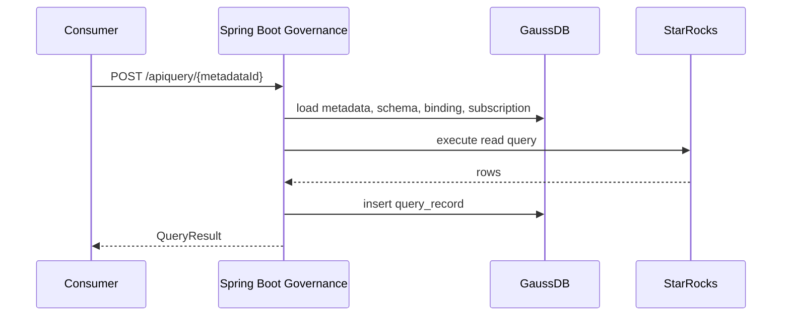

# 15. API、运行时与 SDK 详细规格

本文把 2026-06-10 文档集中的 API、数据模型、运行时、架构决策和 SDK 示例融入统一目标态。正式治理主线为 Spring Boot + GaussDB + `/rest/oss/inner/modelengineservice/v1`。

## 1. API 分类

| 维度 | 目标 | 核心能力 | 使用方 |
| --- | --- | --- | --- |
| 数据注册 | 将微服务、Flink、Spark、平台作业的元数据统一注册。 | 启动快照注册、运行时修改、取消注册、字段、绑定、血缘。 | 生产方、SDK、治理管理员。 |
| 数据发现 | 查询 metadata、schema、binding 和 lineage。 | 列表、详情、血缘、分页、过滤。 | 消费者、治理后台、Agent。 |
| 数据查询 | 查询业务数据内容。 | API 查询单数据集、SQL Gateway 查询已注册数据集。 | 上层应用、微服务、分析服务。 |
| 数据订阅 | 声明使用意图和变化通知关注。 | 创建、查询、取消订阅，声明字段范围和 notifyOn。 | 消费者、SDK。 |
| 事件通知 | 元数据变化后异步触达订阅方。 | metadata_event、subscription_notification、Kafka publish。 | 治理服务、SDK listener。 |
| Drift | 比对声明态和运行态。 | declared unused、undeclared usage、stale declaration。 | 治理后台、管理员。 |

## 2. 元数据注册 API

### 2.1 POST `/metadata/register`

完整路径：

```http
POST /rest/oss/inner/modelengineservice/v1/metadata/register
```

请求结构：

```json
{
  "producer": {
    "serviceName": "rno-profile-service",
    "serviceType": "MICROSERVICE",
    "owner": "network-team",
    "environment": "prod",
    "instanceId": "pod-rno-profile-7d8f"
  },
  "syncMode": "FULL",
  "declarationHash": "sha256:metadata-lineage-declaration",
  "metadataList": [
    {
      "assetCode": "ads_cell_profile",
      "assetName": "小区画像指标",
      "metadataType": "TABLE",
      "domain": "wireless-rno",
      "owner": "network-team",
      "description": "面向无线网络优化的小区画像指标数据集",
      "queryable": true,
      "fields": [
        {
          "fieldName": "cell_id",
          "fieldType": "string",
          "nullable": false,
          "description": "小区标识"
        },
        {
          "fieldName": "coverage_score",
          "fieldType": "double",
          "nullable": true,
          "description": "覆盖评分"
        }
      ],
      "binding": {
        "sourceType": "STARROCKS",
        "catalog": "default_catalog",
        "database": "data_gov",
        "table": "ads_cell_profile",
        "properties": {}
      },
      "lineage": {
        "upstreams": [
          {
            "assetCode": "dwd_cell_profile",
            "lineageType": "FIELD",
            "transformType": "JOB",
            "expression": "job:rno-profile-etl",
            "fieldMappings": [
              {
                "sourceField": "rsrp_avg",
                "targetField": "coverage_score",
                "expression": "case when rsrp_avg >= -95 then 100 else 60 end"
              }
            ]
          }
        ]
      }
    }
  ]
}
```

响应结构：

```json
{
  "syncScope": {
    "serviceName": "rno-profile-service",
    "environment": "prod"
  },
  "createdCount": 1,
  "updatedCount": 0,
  "unchangedCount": 0,
  "removedBySnapshotCount": 0,
  "items": [
    {
      "metadataId": "asset_001",
      "assetCode": "ads_cell_profile",
      "status": "REGISTERED"
    }
  ],
  "syncedAt": "2026-06-14T10:00:00Z"
}
```

### 2.2 校验规则

| 字段 | 规则 |
| --- | --- |
| `producer.serviceName` | 必填，1 到 128 字符。 |
| `producer.serviceType` | `MICROSERVICE`、`FLINK`、`SPARK`、`MANUAL`。 |
| `producer.environment` | 必填，建议 `dev`、`test`、`staging`、`prod`、`local`。 |
| `syncMode` | 第一阶段固定为 `FULL`。 |
| `metadataList` | 至少 1 个对象。 |
| `assetCode` | 同一 `serviceName + environment` 下唯一。 |
| `metadataType` | `TABLE`、`VIEW`、`TOPIC`。 |
| `queryable` | Kafka topic 通常为 false。 |
| `fields` | TABLE/VIEW 至少 1 个字段。 |
| `binding.table` | 必填，Kafka 时表示 topic。 |
| `fieldMappings.targetField` | 必须存在于当前 metadata fields。 |
| `fieldMappings.sourceField` | 应能解析到上游 metadata fields。 |

### 2.3 幂等规则

幂等键：

```text
service_name + environment + asset_code
```

声明变化判断：

```text
declaration_hash 或服务端规范化 JSON hash
```

重复快照：

- 不创建重复 metadata。
- 不创建重复 metadata_field。
- 不创建重复 active lineage_edge。
- 刷新 `last_synced_at` 和 `last_declared_instance_id`。

缺失处理：

- 本次快照缺失且属于同一作用域的历史 metadata，软下线为 `REMOVED_BY_SNAPSHOT`。
- 外部作用域 metadata 不处理。
- 已 `UNREGISTERED` 的对象不因快照缺失重复处理。

## 3. PATCH 和 DELETE

### 3.1 PATCH `/metadata/{metadataId}`

用途：

- 管理端修改描述、负责人、查询开关。
- Agent 确认后提交 schema/lineage 变更。
- 应急修正 binding。

请求示例：

```json
{
  "assetName": "小区画像指标 V2",
  "description": "更新后的数据集说明",
  "queryable": true,
  "fields": [
    {
      "fieldName": "coverage_score",
      "fieldType": "double",
      "nullable": true,
      "description": "覆盖评分"
    }
  ],
  "binding": {
    "catalog": "default_catalog",
    "database": "data_gov",
    "table": "ads_cell_profile_v2"
  },
  "lineage": {
    "upstreams": [
      {
        "assetCode": "dwd_cell_profile",
        "lineageType": "FIELD",
        "transformType": "JOB",
        "expression": "job:rno-profile-etl-v2",
        "fieldMappings": [
          {
            "sourceField": "rsrp_avg",
            "targetField": "coverage_score",
            "expression": "case when rsrp_avg >= -95 then 100 else 60 end"
          }
        ]
      }
    ]
  }
}
```

PATCH 语义：

- 未传字段保持不变。
- 传入 fields 时按服务端策略整体替换或字段名 upsert，策略必须在 API 文档和测试中固定。
- 传入 lineage 时替换该 metadata 的声明血缘，避免重复 active edge。
- 写入 `metadata_event`。
- 匹配订阅并生成通知。

### 3.2 DELETE `/metadata/{metadataId}`

用途：

- 数据集下线。
- 应急取消注册。
- 管理员移除错误声明。

请求：

```json
{
  "reason": "数据集下线",
  "operator": "network-team"
}
```

行为：

- `metadata.status = UNREGISTERED`。
- 写入 `unregistered_at`。
- 写入 `metadata_event`，事件类型建议 `DEPRECATION` 或 `METADATA_REMOVED`。
- 不物理删除历史查询记录、订阅记录、事件和通知。

## 4. 数据发现和血缘 API

### 4.1 GET `/metadata`

查询参数：

| 参数 | 说明 |
| --- | --- |
| `keyword` | 按编码、名称、描述搜索。 |
| `domain` | 业务域。 |
| `metadataType` | TABLE、VIEW、TOPIC。 |
| `owner` | 负责人。 |
| `status` | ACTIVE 等状态。 |
| `page` | 从 1 开始。 |
| `size` | 1 到 100。 |

响应：

```json
{
  "items": [
    {
      "metadataId": "asset_001",
      "assetCode": "ads_cell_profile",
      "assetName": "小区画像指标",
      "metadataType": "TABLE",
      "domain": "wireless-rno",
      "owner": "network-team",
      "queryable": true
    }
  ],
  "page": 1,
  "size": 20,
  "total": 1
}
```

### 4.2 GET `/metadata/{metadataId}`

响应必须包含：

- 基础 metadata。
- `schema` 字段数组。
- `binding`。
- createdAt。
- updatedAt。

binding 的 `qualifiedName` 规则：

- catalog、database、table 都有值：`catalog.database.table`。
- catalog 为空：`database.table`。
- database 为空：`table`。
- Kafka topic：topic 名称。

### 4.3 GET `/metadata/{metadataId}/lineage`

查询参数：

- `direction=up|down`。
- `depth=1..10`。

响应：

```json
{
  "metadataId": "asset_001",
  "direction": "up",
  "depth": 5,
  "nodes": [
    {"metadataId": "asset_dwd", "assetCode": "dwd_cell_profile", "assetName": "小区画像明细"},
    {"metadataId": "asset_ads", "assetCode": "ads_cell_profile", "assetName": "小区画像指标"}
  ],
  "edges": [
    {
      "sourceMetadataId": "asset_dwd",
      "sourceAssetCode": "dwd_cell_profile",
      "targetMetadataId": "asset_ads",
      "targetAssetCode": "ads_cell_profile",
      "lineageType": "FIELD",
      "direction": "up",
      "expression": "job:rno-profile-etl"
    }
  ],
  "fieldEdges": [
    {
      "sourceMetadataId": "asset_dwd",
      "sourceAssetCode": "dwd_cell_profile",
      "sourceField": "rsrp_avg",
      "targetMetadataId": "asset_ads",
      "targetAssetCode": "ads_cell_profile",
      "targetField": "coverage_score",
      "lineageType": "FIELD",
      "direction": "up",
      "expression": "case when rsrp_avg >= -95 then 100 else 60 end"
    }
  ]
}
```

## 5. 查询 API

### 5.1 产品 API 查询

```http
POST /rest/oss/inner/modelengineservice/v1/apiquery/{metadataId}
```

请求：

```json
{
  "select": ["cell_id", "coverage_score"],
  "filters": [
    {"field": "date", "op": "=", "value": "2026-06-14"}
  ],
  "orderBy": [
    {"field": "coverage_score", "direction": "DESC"}
  ],
  "limit": 100
}
```

Header：

```text
X-DataGov-Subscription-Id: sub_001
```

行为：

- 校验 metadata 存在。
- 校验 metadata queryable。
- 校验 select 和 filters 字段存在。
- 校验订阅状态。
- 改写为物理 SQL。
- 通过 StarRocks 查询。
- 写入 query_record。

### 5.2 SQL Gateway

```http
POST /rest/oss/inner/modelengineservice/v1/sqlquery
```

请求：

```json
{
  "sql": "select cell_id, coverage_score from ads_cell_profile where date = :date limit 100",
  "parameters": {"date": "2026-06-14"},
  "limit": 100,
  "consumerId": "consumer_001",
  "subscriptionId": "sub_001"
}
```

约束：

- 只允许 `SELECT` 或 `WITH ... SELECT`。
- 拒绝 DELETE、UPDATE、INSERT、MERGE、CREATE、DROP、ALTER。
- 解析 SQL 中的表名，必须能匹配 registered metadata assetCode。
- 不允许 Kafka topic 进入查询。
- 不允许 queryable=false 的 metadata。
- 生成 rewrittenSql 并记录 query_record。

## 6. 订阅 API

### 6.1 创建订阅

```http
POST /rest/oss/inner/modelengineservice/v1/subscriptions/{metadataId}
```

请求：

```json
{
  "consumer": {
    "consumerName": "rno-dashboard",
    "consumerType": "MICROSERVICE",
    "owner": "network-team",
    "environment": "prod"
  },
  "usageMode": "API_QUERY",
  "purpose": "展示小区画像指标",
  "fields": ["cell_id", "coverage_score"],
  "notifyOn": ["SCHEMA_CHANGE", "DATA_QUALITY_ALERT", "DEPRECATION"],
  "notificationStrategy": {
    "delivery": "KAFKA",
    "sdkCallback": true,
    "consumerGroup": "rno-dashboard"
  }
}
```

响应：

```json
{
  "subscriptionId": "sub_001",
  "metadataId": "asset_001",
  "assetCode": "ads_cell_profile",
  "consumerId": "consumer_001",
  "status": "ACTIVE",
  "createdAt": "2026-06-14T10:00:00Z"
}
```

### 6.2 查询订阅

支持：

- 按 consumerId。
- 按 status。
- 分页。

### 6.3 取消订阅

请求：

```json
{
  "consumerId": "consumer_001",
  "reason": "业务下线",
  "operator": "network-team"
}
```

行为：

- 将 active subscriptions 标记为 CANCELLED。
- 返回 cancelledSubscriptions。
- 后续查询用该 subscriptionId 应被拒绝。

## 7. GaussDB 表详细字段

### 7.1 `metadata`

| 字段 | 类型 | 说明 |
| --- | --- | --- |
| `metadata_id` | varchar(64) PK | 接口 `metadataId`。 |
| `asset_code` | varchar(128) | 业务稳定编码。 |
| `asset_name` | varchar(256) | 展示名称。 |
| `metadata_type` | varchar(32) | TABLE、VIEW、TOPIC。 |
| `domain` | varchar(128) | 业务域。 |
| `owner` | varchar(128) | 责任团队。 |
| `description` | text | 描述。 |
| `queryable` | boolean | 是否允许查询。 |
| `status` | varchar(32) | ACTIVE、REMOVED_BY_SNAPSHOT、UNREGISTERED。 |
| `service_name` | varchar(128) | 生产方服务。 |
| `producer_type` | varchar(32) | MICROSERVICE、FLINK、SPARK、MANUAL。 |
| `environment` | varchar(32) | 环境。 |
| `declaration_hash` | varchar(128) | 声明哈希。 |
| `last_declared_instance_id` | varchar(256) | 最近实例。 |
| `last_synced_at` | timestamp | 最近同步时间。 |
| `removed_by_snapshot_at` | timestamp | 快照软下线时间。 |
| `unregistered_at` | timestamp | 注销时间。 |
| `created_at` | timestamp | 创建时间。 |
| `updated_at` | timestamp | 更新时间。 |

唯一约束：

```sql
unique(service_name, environment, asset_code)
```

### 7.2 其他核心表

| 表 | 关键唯一性 |
| --- | --- |
| `metadata_field` | `unique(metadata_id, field_name)` |
| `metadata_binding` | 一般一个 metadata 一个 active binding，后续可扩展多 binding。 |
| `lineage_edge` | source、target、source_field、target_field、lineage_type、active scope 不应重复。 |
| `consumer` | `unique(consumer_name, environment)` |
| `subscription` | active 状态下同 metadata、consumer、usageMode 可 upsert。 |
| `query_record` | 事实表，不做业务唯一约束。 |
| `metadata_event` | 事实表，不做业务唯一约束。 |
| `subscription_notification` | event + subscription 不重复。 |
| `drift_record` | open 状态下同 drift key 不重复创建。 |

## 8. Java SDK Builder

### 8.1 注册 Builder

```java
dataGovRegistrar.asset("ads_cell_profile")
    .name("小区画像指标")
    .type(MetadataType.TABLE)
    .domain("wireless-rno")
    .owner("network-team")
    .queryable(true)
    .field("cell_id", "string", false, "小区标识")
    .field("coverage_score", "double", true, "覆盖评分")
    .binding(binding -> binding
        .sourceType(SourceType.STARROCKS)
        .catalog("default_catalog")
        .database("data_gov")
        .table("ads_cell_profile"))
    .upstream(lineage -> lineage
        .assetCode("dwd_cell_profile")
        .lineageType(LineageType.FIELD)
        .transformType(TransformType.JOB)
        .expression("job:rno-profile-etl")
        .field("rsrp_avg", "coverage_score", "case when rsrp_avg >= -95 then 100 else 60 end"))
    .register();
```

### 8.2 物理表检查和自动建表

StarRocks 示例：

```java
dataGovRegistrar.asset("ads_cell_profile")
    .field("cell_id", "varchar(64)", false, "小区标识")
    .field("coverage_score", "double", true, "覆盖评分")
    .binding(binding -> binding
        .sourceType(SourceType.STARROCKS)
        .catalog("default_catalog")
        .database("data_gov")
        .table("ads_cell_profile"))
    .physicalTable(table -> table
        .checkExists(true)
        .createIfMissing(true)
        .schemaCompatibility(SchemaCompatibility.ADDITIVE)
        .starrocks(starrocks -> starrocks
            .engine("OLAP")
            .duplicateKey("cell_id")
            .distributedByHash("cell_id", 16)))
    .register();
```

默认策略：

| 配置项 | 默认值 |
| --- | --- |
| `checkExists` | true |
| `createIfMissing` | false |
| `schemaCompatibility` | ADDITIVE |
| `failOnIncompatibleSchema` | true |
| `createSupportedSourceTypes` | STARROCKS、ICEBERG |

### 8.3 订阅 Builder

```java
dataGovSubscriptions.consumer("rno-dashboard")
    .type(ConsumerType.MICROSERVICE)
    .owner("network-team")
    .environment("prod")
    .subscribe("ads_cell_profile", sub -> sub
        .usageMode(UsageMode.API_QUERY)
        .purpose("展示小区画像指标")
        .fields("cell_id", "coverage_score")
        .notifyOn(AssetEventType.SCHEMA_CHANGE, AssetEventType.DATA_QUALITY_ALERT))
    .notification(strategy -> strategy
        .delivery(NotificationDelivery.KAFKA)
        .sdkCallback(true)
        .consumerGroup("rno-dashboard"))
    .register();
```

## 9. 运行时序

### 9.1 启动同步



### 9.2 元数据变更通知



### 9.3 查询审计



## 10. Drift 规则

| 类型 | 触发条件 | 证据 |
| --- | --- | --- |
| `DECLARED_UNUSED` | 存在 active subscription，但长期没有成功 query_record。 | subscriptionId、lastDeclaredAt、query window。 |
| `UNDECLARED_USAGE` | 存在成功 query_record，但没有 active subscription。 | queryRecordId、consumerId、assetCode。 |
| `STALE_DECLARATION` | metadata 或 subscription 长期未被启动快照刷新。 | lastSyncedAt、threshold。 |

重复分析规则：

- 同一 drift key 已有 OPEN 记录时更新 evidence 和 updatedAt，不重复创建。
- resolved 或 ignored 后再次触发可新建记录。

## 11. 错误响应

统一错误结构：

```json
{
  "errorCode": "METADATA_NOT_FOUND",
  "message": "metadata not found: asset_001",
  "traceId": "trace-...",
  "details": {
    "metadataId": "asset_001"
  }
}
```

错误码示例：

| errorCode | HTTP | 场景 |
| --- | --- | --- |
| `VALIDATION_ERROR` | 400 | 请求字段非法。 |
| `METADATA_NOT_FOUND` | 404 | metadataId 不存在。 |
| `SUBSCRIPTION_MISMATCH` | 403 | 订阅与请求不匹配。 |
| `SUBSCRIPTION_CANCELLED` | 403 | 已取消订阅继续查询。 |
| `SQL_NOT_READONLY` | 400 | SQL 非只读。 |
| `ASSET_NOT_REGISTERED` | 400 | SQL 引用未注册对象。 |
| `PHYSICAL_QUERY_FAILED` | 502 | StarRocks 或底层数据源查询失败。 |
