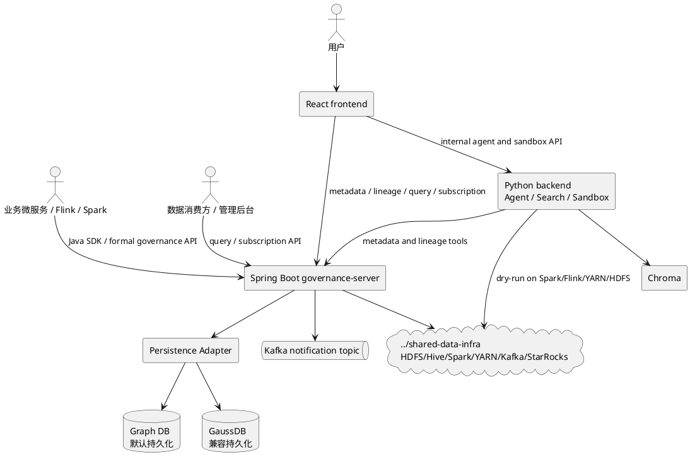

# 数据治理平台统一规格文档集

> 2026-06-15 | Status: Draft for review

本文档集合并 5 月无线 RNO 语义化服务设计、6 月数据产品治理设计和 2026-06-14 临时重写要求。5 月和 6 月旧规格已归档到 `../archive/`，当前目标态以本目录为准。

## 1. 最新目标口径

| 领域 | 目标设计 |
| --- | --- |
| 治理主服务 | Spring Boot governance-server 承载正式治理 API、运行时变更、订阅、查询审计、通知和 drift。 |
| Python 能力 | Python backend 承载 Agent、语义检索、LLM、沙箱和 dry-run，不绕过治理服务直接改主数据。 |
| 持久化层 | 保留原有图数据库实现和持久化层，默认使用图数据库；同时通过 persistence adapter 支持 GaussDB 关系模型。 |
| 图数据库模型 | 默认实现保留 `Table`、`Field`、`HAS_FIELD`、`DERIVES_FROM`、`Change` 等节点/关系语义。 |
| GaussDB 兼容模型 | 支持 `metadata`、`metadata_field`、`metadata_binding`、`lineage_edge`、订阅、查询、事件、通知和 drift 等关系表。 |
| API 前缀 | 正式治理 API 使用 `/rest/oss/inner/modelengineservice/v1`。Agent 和沙箱 API 作为平台内部 API，使用 `/api/agent/...` 和 `/api/sandbox/...`。 |
| 基础设施 | HDFS、Hive、Spark、YARN、Kafka、ZooKeeper、StarRocks、Prometheus、Grafana、GaussDB 等复用 `../shared-data-infra`。 |
| 图画布 | 目标画布统一使用 AntV X6。历史 G6 组件仅作为交互迁移来源。 |
| UI 范围 | 按 5 月完整功能树保留 `/metadata`、`/metadata/lineage`、`/chat`、`/pipeline`、`/schema-evolution`、`/health` 和 dry-run/preview 全链路。 |

## 2. 编号文档目录

| 编号 | 文档 | 内容 |
| --- | --- | --- |
| 00 | [00-merge-principles-and-architecture-decisions.md](00-merge-principles-and-architecture-decisions.md) | 合并原则、架构决策、图数据库默认与 GaussDB 兼容口径。 |
| 01 | [01-infrastructure-and-application-runtime.md](01-infrastructure-and-application-runtime.md) | 基础设施与应用运行。 |
| 02 | [02-metadata-management.md](02-metadata-management.md) | 元数据管理 `/metadata`。 |
| 03 | [03-lineage-graph.md](03-lineage-graph.md) | 血缘图 `/metadata/lineage`。 |
| 04 | [04-natural-language-chat.md](04-natural-language-chat.md) | 自然语言对话 `/chat`，包含 Agent 内部 API。 |
| 05 | [05-pipeline-visualization.md](05-pipeline-visualization.md) | Pipeline 可视化 `/pipeline`。 |
| 06 | [06-schema-evolution-history.md](06-schema-evolution-history.md) | 元数据演进历史 `/schema-evolution`。 |
| 07 | [07-sandbox-and-dry-run.md](07-sandbox-and-dry-run.md) | 沙箱与 dry-run，包含沙箱内部 API。 |
| 08 | [08-subscription-query-notification.md](08-subscription-query-notification.md) | 订阅、查询、通知和 drift。 |
| 09 | [09-domain-model-and-samples.md](09-domain-model-and-samples.md) | 无线 RNO 分层、10 张样例表、字段血缘和 YAML。 |
| 10 | [10-data-model-and-persistence.md](10-data-model-and-persistence.md) | 图数据库默认模型、GaussDB 兼容模型和持久化适配层。 |
| 11 | [11-api-contracts.md](11-api-contracts.md) | 正式治理 API 与内部 Agent/沙箱 API 总览。 |
| 12 | [12-implementation-roadmap.md](12-implementation-roadmap.md) | 实施路线。 |
| 13 | [13-acceptance-suite.md](13-acceptance-suite.md) | 验收套件。 |
| 14 | [14-source-coverage-map.md](14-source-coverage-map.md) | 来源覆盖映射。 |

## 3. 总体架构

## 4. 固定章节模板

01 至 08 每个一级功能文档按二级功能点拆章节，每个二级功能点保留以下子标题：

1. 功能描述。
2. 用例。
3. 主要流程（PlantUML）。
4. 逻辑图（PlantUML）。
5. 对外接口。
6. UI 操作流程。
7. 数据模型。

不涉及的内容保留标题并写明“不涉及”。
