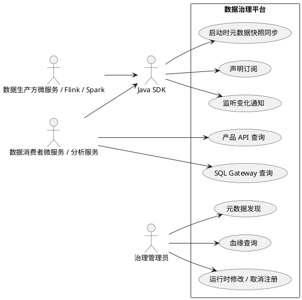
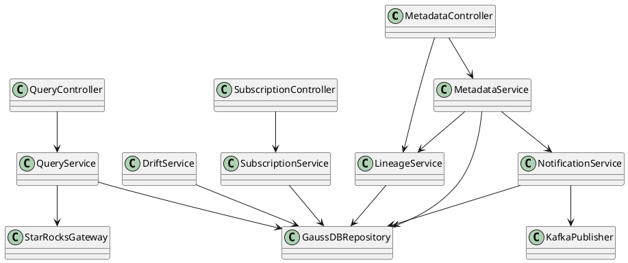
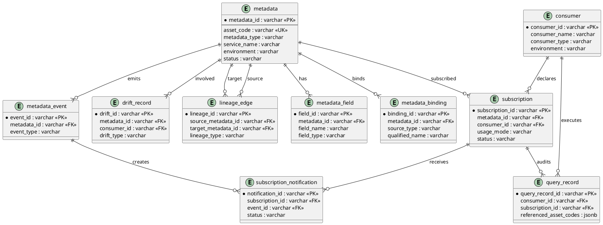
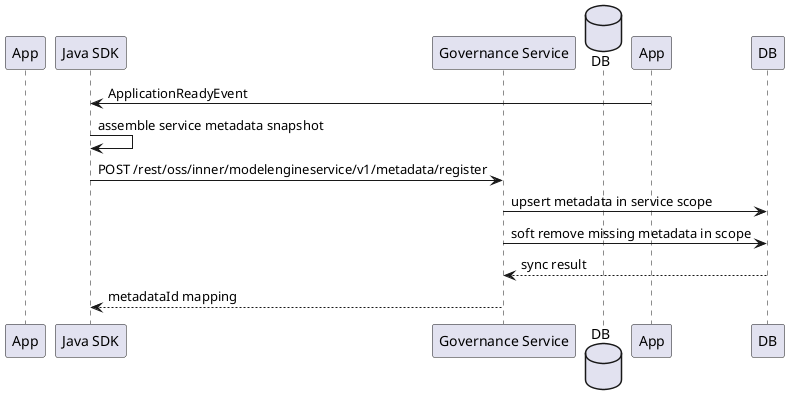
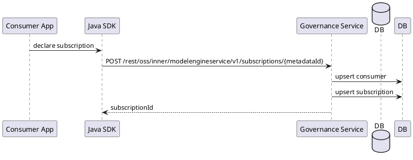
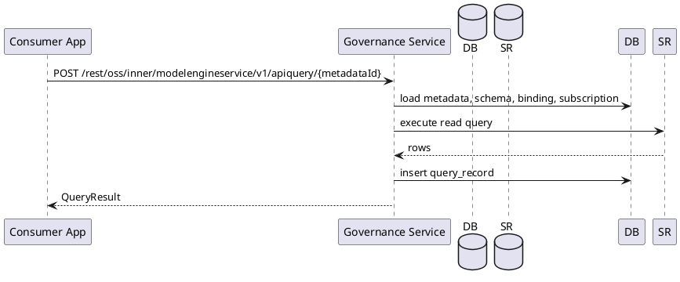
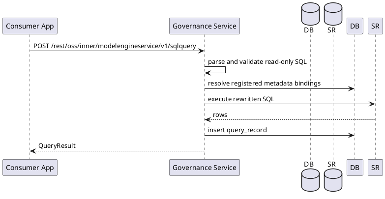
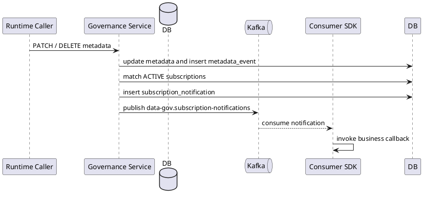
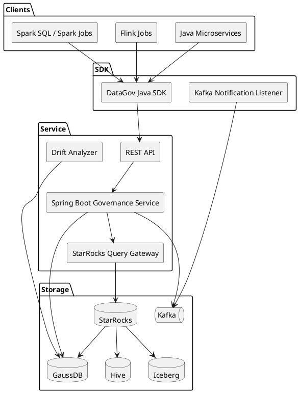
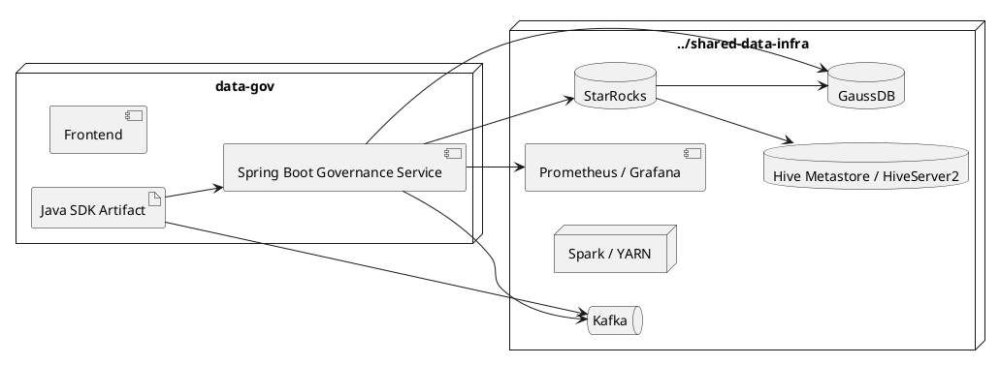

# 数据治理架构视图

本文使用 PlantUML 描述数据治理平台的用例视图、逻辑视图、数据模型视图、运行时序视图、技术视图和部署视图。

## 1. 用例视图

## 2. 逻辑视图

职责说明：

- `MetadataService` 负责启动快照同步、运行时修改、运行时取消注册、字段、物理绑定和事件生成。
- `LineageService` 负责表级和字段级血缘维护与查询。
- `SubscriptionService` 负责订阅声明、查询和取消。
- `QueryService` 负责产品 API 查询、SQL Gateway 查询和 `query_record` 写入。
- `NotificationService` 将 `metadata_event` 转换为订阅通知并发送 Kafka。
- `DriftService` 分析声明态和运行态差异。

## 3. 数据模型视图

## 4. 运行时序视图

### 4.1 启动时微服务元数据快照同步

### 4.2 订阅声明

### 4.3 产品 API 查询

### 4.4 SQL Gateway 查询

### 4.5 元数据事件通知

## 5. 技术视图

## 6. 部署视图

部署约束：

- 本工程本地只保留 backend、frontend 和应用数据卷。
- GaussDB、Hive、HDFS/YARN、Kafka、StarRocks、Spark、Prometheus、Grafana 等基础能力复用 `../shared-data-infra`。
- 基础设施修改前必须检查 `../shared-data-infra` 是否已有同类服务或 profile。
