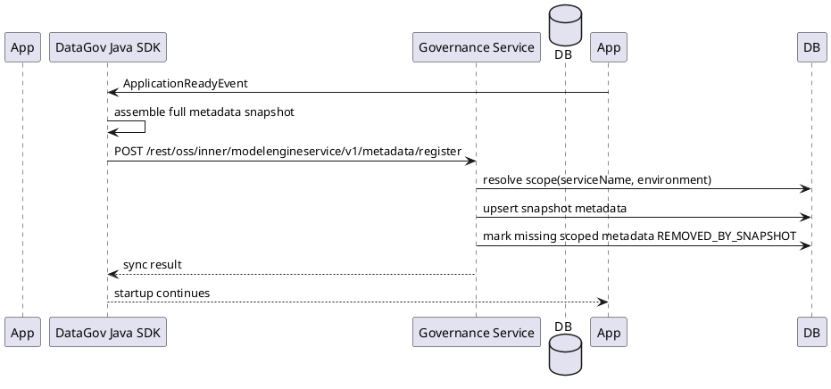
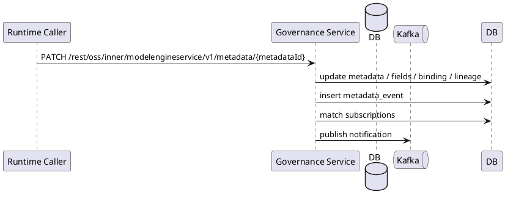
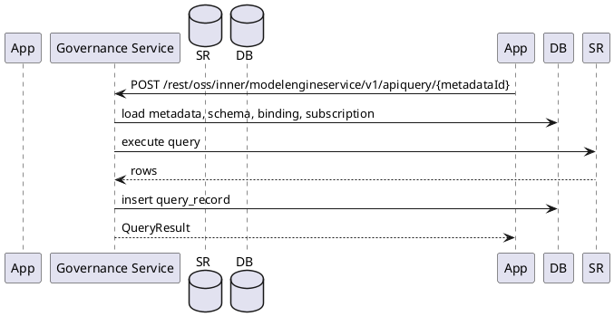

# 数据治理运行时设计

本文定义元数据注册、运行时修改、订阅、查询、通知和 drift 的运行时行为。

## 1. 核心原则

- 启动态只做微服务级完整元数据快照同步，不单独生成逐项修改和逐项删除调用。
- 启动态同步复用 `POST /rest/oss/inner/modelengineservice/v1/metadata/register`，不新增 sync 接口。
- `PATCH /rest/oss/inner/modelengineservice/v1/metadata/{metadataId}` 只用于运行时动态修改。
- `DELETE /rest/oss/inner/modelengineservice/v1/metadata/{metadataId}` 只用于运行时动态取消注册。
- 订阅用于声明态和变化通知关注，不作为真实消费事实。
- 查询记录用于表达真实运行态消费。

## 2. 启动时元数据快照同步

服务启动时，Java SDK 从代码 Builder、配置或作业声明中组装当前微服务完整元数据快照，并调用：

```http
POST /rest/oss/inner/modelengineservice/v1/metadata/register
```

服务端按 `producer.serviceName + producer.environment` 定义同步作用域，只重建该微服务在该环境下的元数据声明态。

处理规则：

| 场景 | 服务端行为 |
| --- | --- |
| 快照中存在，库中不存在 | 新增 `metadata`、字段、物理绑定和血缘。 |
| 快照中存在，库中存在且声明不同 | 更新 `metadata`、字段、物理绑定和血缘。 |
| 快照中存在，库中存在且声明相同 | 刷新 `last_synced_at`、`declaration_hash`、`last_declared_instance_id`。 |
| 快照中不存在，库中存在且归属该微服务作用域 | 软下线为 `REMOVED_BY_SNAPSHOT`。 |
| 库中存在但不归属该微服务作用域 | 不处理。 |

软下线不删除历史数据。查询记录、订阅记录、血缘审计、通知和 drift 仍保留。

## 3. 启动快照幂等性

启动快照必须幂等。治理服务或业务服务重启后重复提交同一快照，不应创建重复元数据。

幂等键：

```text
service_name + environment + asset_code
```

声明变化判断：

```text
declaration_hash
```

运行实例识别：

```text
producer.instanceId
```

`instanceId` 只用于排障和最近声明来源记录，不驱动元数据删除。

## 4. 运行时动态修改

当元数据在服务运行过程中发生动态变化时，调用：

```http
PATCH /rest/oss/inner/modelengineservice/v1/metadata/{metadataId}
```

典型场景：

- 管理端调整数据集描述、负责人、查询开关。
- 运行期发现物理绑定变化。
- 运行期生成新的字段或血缘关系。
- 应急修复错误元数据。

运行时修改应写入 `metadata_event`，事件来源为 `RUNTIME_API` 或 `ADMIN`。

## 5. 运行时动态取消注册

当数据集运行期下线或需要应急取消注册时，调用：

```http
DELETE /rest/oss/inner/modelengineservice/v1/metadata/{metadataId}
```

服务端执行软下线：

```text
status = UNREGISTERED
unregistered_at = now()
```

取消注册应写入 `metadata_event`，事件类型建议为 `DEPRECATION` 或 `METADATA_REMOVED`。

## 6. 订阅运行时

订阅接口面向单个 `metadataId`：

```http
POST   /rest/oss/inner/modelengineservice/v1/subscriptions/{metadataId}
GET    /rest/oss/inner/modelengineservice/v1/subscriptions/{metadataId}
DELETE /rest/oss/inner/modelengineservice/v1/subscriptions/{metadataId}
```

SDK 可以在业务侧提供批量声明体验，但底层按 `metadataId` 拆分为多个订阅接口调用。

订阅状态建议：

| 状态 | 说明 |
| --- | --- |
| `ACTIVE` | 当前有效声明。 |
| `CANCELLED` | 运行时显式取消。 |
| `REMOVED_BY_SNAPSHOT` | 服务启动快照中不再声明该订阅。 |

## 7. 查询运行时

产品 API 查询：

```http
POST /rest/oss/inner/modelengineservice/v1/apiquery/{metadataId}
```

SQL Gateway 查询：

```http
POST /rest/oss/inner/modelengineservice/v1/sqlquery
```

查询成功或失败都写入 `query_record`。查询记录用于回答“谁实际使用了什么数据”，并支撑 drift 分析。

## 8. 通知运行时

元数据变化写入 `metadata_event` 后，服务端按订阅的 `notify_on` 匹配通知对象，生成 `subscription_notification`，并异步发送 Kafka 消息。

Kafka topic：

```text
data-gov.subscription-notifications
```

消费方通过 Java SDK 内置 Kafka listener 接收消息，并回调业务处理器。

不提供以下接口：

- 通知拉取接口
- 通知确认接口
- 业务处理回执接口

## 9. Drift 运行时

Drift 用于发现声明态和运行态不一致。

第一期分析规则：

| Drift 类型 | 触发条件 |
| --- | --- |
| `DECLARED_UNUSED` | 存在订阅声明，但长期没有对应查询记录。 |
| `UNDECLARED_USAGE` | 存在查询记录，但没有对应订阅声明。 |
| `STALE_DECLARATION` | 元数据或订阅长期未被启动快照刷新。 |

Drift 只产生治理记录，不自动删除元数据或订阅。

## 10. 运行时序

### 10.1 微服务启动同步



### 10.2 运行时修改



### 10.3 查询审计


